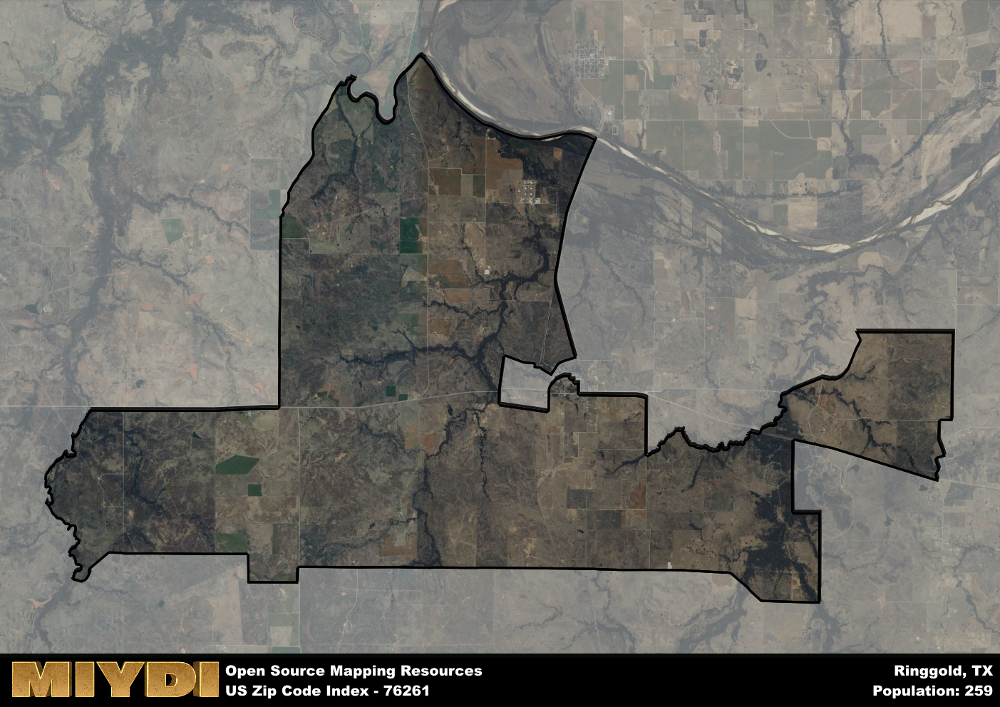

**Area Name:** Ringgold

**Zip Code:** 76261

**State:** TX

Ringgold is a part of the Wichita Falls - TX Metro Area, and makes up  of the Metro's population.  

# Ringgold: A Historic and Vibrant Zip Code Area in North Texas

Ringgold, Texas, corresponding to the zip code 76261, is a charming rural community located in Montague County in North Texas. Bordered by the towns of Stoneburg and Forestburg, Ringgold is situated within a picturesque landscape of rolling hills and lush farmland. While it is a small town, Ringgold is just a short drive away from larger cities like Bowie and Nocona, providing residents with easy access to urban amenities while maintaining its peaceful rural atmosphere.

Founded in the late 19th century, Ringgold has a rich history tied to the development of the railroad and agriculture in the region. Named after Samuel Ringgold, a hero of the Mexican-American War, the town grew as a hub for cotton production and cattle ranching. Over the years, Ringgold has preserved its small-town feel and historic buildings, offering visitors a glimpse into its past through landmarks like the Ringgold Depot and the First Christian Church.

Today, Ringgold remains a close-knit community with a strong agricultural presence. The town is home to family-owned farms and ranches, contributing to the local economy and providing fresh produce to residents. In addition to its agricultural heritage, Ringgold offers recreational opportunities such as hunting, fishing, and hiking in the nearby state parks. With a focus on preserving its history and natural beauty, Ringgold continues to attract visitors seeking a peaceful retreat in the heart of North Texas.

# Ringgold Demographics

The population of Ringgold is 259.  
Ringgold has a population density of 4.25 per square mile.  
The area of Ringgold is 61.01 square miles.  

## Ringgold AI and Census Variables

The values presented in this dataset for Ringgold are AI-optimized, streamlined, and categorized into relevant buckets for enhanced utility in AI and mapping programs. These simplified values have been optimized to facilitate efficient analysis and integration into various technological applications, offering users accessible and actionable insights into demographics within the Ringgold area.

| AI Variables for Ringgold | Value |
|-------------|-------|
| Shape Area | 229488491.378906 |
| Shape Length | 117065.710601928 |
| CBSA Federal Processing Standard Code | 48660 |

## How to use this free AI optimized Geo-Spatial Data for Ringgold, TX

This data is made freely available under the Creative Commons license, allowing for unrestricted use for any purpose. Users can access static resources directly from GitHub or leverage more advanced functionalities by utilizing the GeoJSON files. All datasets originate from official government or private sector sources and are meticulously compiled into relevant datasets within QGIS. However, the versatility of the data ensures compatibility with any mapping application.

## Data Accuracy Disclaimer
It's important to note that the data provided here may contain errors or discrepancies and should be considered as 'close enough' for business applications and AI rather than a definitive source of truth. This data is aggregated from multiple sources, some of which publish information on wildly different intervals, leading to potential inconsistencies. Additionally, certain data points may not be corrected for Covid-related changes, further impacting accuracy. Moreover, the assumption that demographic trends are consistent throughout a region may lead to discrepancies, as trends often concentrate in areas of highest population density. As a result, dense areas may be slightly underrepresented, while rural areas may be slightly overrepresented, resulting in a more conservative dataset. Furthermore, the focus primarily on areas within US Major and Minor Statistical areas means that approximately 40 million Americans living outside of these areas may not be fully represented. Lastly, the historical background and area descriptions generated using AI are susceptible to potential mistakes, so users should exercise caution when interpreting the information provided.
