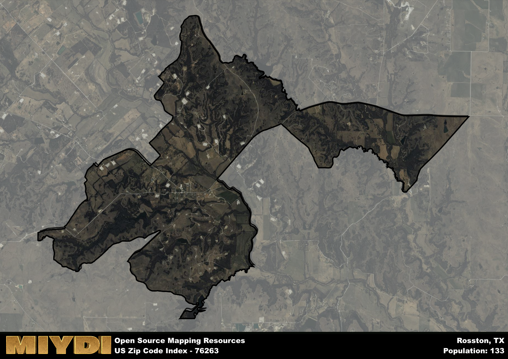

**Area Name:** Rosston

**Zip Code:** 76263

**State:** TX

Rosston is a part of the Gainesville - TX Micro Area, and makes up  of the Metro's population.  

# Rosston: A Charming Community in North Texas

Located in North Texas, Rosston is a small, unincorporated community that falls within the zip code 76263. Situated in Cooke County, Rosston is surrounded by the towns of Muenster, Era, and Saint Jo. While it is a rural area, it is within close proximity to the larger cities of Denton and Fort Worth, allowing residents easy access to urban amenities while enjoying the tranquility of country living.

Rosston has a rich historical narrative that dates back to the late 1800s when it was established as a railway stop along the Gainesville, Henrietta, and Western Railway. The town grew as a hub for agricultural activity, particularly cotton farming, and saw a population boom during the early 20th century. Today, Rosston maintains its small-town charm with historic buildings and a strong sense of community pride.

Presently, Rosston is a close-knit community that values its agricultural roots. The area is known for its farming and ranching activities, with many residents working in these industries. Rosston offers a handful of local businesses, including a general store and a few small restaurants, as well as access to outdoor recreational activities such as hiking and fishing. The town also boasts a few historic sites, such as the Rosston General Store, which provide a glimpse into its past.

# Rosston Demographics

The population of Rosston is 133.  
Rosston has a population density of 10.33 per square mile.  
The area of Rosston is 12.87 square miles.  

## Rosston AI and Census Variables

The values presented in this dataset for Rosston are AI-optimized, streamlined, and categorized into relevant buckets for enhanced utility in AI and mapping programs. These simplified values have been optimized to facilitate efficient analysis and integration into various technological applications, offering users accessible and actionable insights into demographics within the Rosston area.

| AI Variables for Rosston | Value |
|-------------|-------|
| Shape Area | 48066107.2070313 |
| Shape Length | 60728.2862540407 |
| CBSA Federal Processing Standard Code | 23620 |

## How to use this free AI optimized Geo-Spatial Data for Rosston, TX

This data is made freely available under the Creative Commons license, allowing for unrestricted use for any purpose. Users can access static resources directly from GitHub or leverage more advanced functionalities by utilizing the GeoJSON files. All datasets originate from official government or private sector sources and are meticulously compiled into relevant datasets within QGIS. However, the versatility of the data ensures compatibility with any mapping application.

## Data Accuracy Disclaimer
It's important to note that the data provided here may contain errors or discrepancies and should be considered as 'close enough' for business applications and AI rather than a definitive source of truth. This data is aggregated from multiple sources, some of which publish information on wildly different intervals, leading to potential inconsistencies. Additionally, certain data points may not be corrected for Covid-related changes, further impacting accuracy. Moreover, the assumption that demographic trends are consistent throughout a region may lead to discrepancies, as trends often concentrate in areas of highest population density. As a result, dense areas may be slightly underrepresented, while rural areas may be slightly overrepresented, resulting in a more conservative dataset. Furthermore, the focus primarily on areas within US Major and Minor Statistical areas means that approximately 40 million Americans living outside of these areas may not be fully represented. Lastly, the historical background and area descriptions generated using AI are susceptible to potential mistakes, so users should exercise caution when interpreting the information provided.
