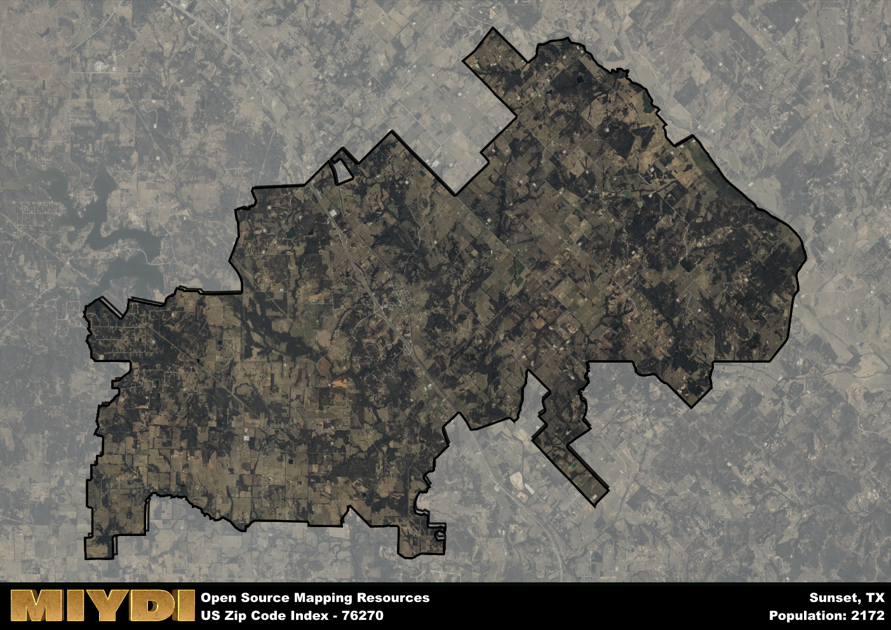

**Area Name:** Sunset

**Zip Code:** 76270

**State:** TX

Sunset is a part of the Dallas-Fort Worth-Arlington - TX Metro Area, and makes up  of the Metro's population.  

# Sunset, TX - Zip Code 76270

Located in the northern part of Texas, zip code 76270 corresponds to the charming town of Sunset. Situated within Montague County, Sunset is bordered by the cities of Bowie to the east and Nocona to the west. This zip code area is part of the larger Dallas-Fort Worth metropolitan region, with easy access to major highways connecting it to urban centers like Fort Worth and Dallas.

Sunset has a rich historical narrative that dates back to the 19th century when it was first settled by pioneers attracted to the fertile land for farming and ranching. The town experienced a period of growth with the arrival of the railroad, which facilitated trade and commerce in the area. Sunset earned its name from the breathtaking sunsets that can be observed from the rolling hills surrounding the town, adding to its unique charm and appeal.

Today, Sunset is a tight-knit community known for its agricultural heritage and small-town atmosphere. The area boasts a mix of family-owned farms and ranches, providing a livelihood for many residents. Sunset offers a range of local services, including schools, shops, and restaurants, catering to the needs of its population. Outdoor enthusiasts can enjoy recreational activities at nearby state parks and lakes, while history buffs can explore the town's historic sites, such as the Sunset Depot Museum, showcasing artifacts from its past.

# Sunset Demographics

The population of Sunset is 2172.  
Sunset has a population density of 22.15 per square mile.  
The area of Sunset is 98.07 square miles.  

## Sunset Income and Economic Data

These demographic numbers are sourced from IRS return data, providing comprehensive insights into the population dynamics and economic trends within Sunset.

**Breakdown of return types for Sunset**

The table offers insight into the composition of tax returns filed with the IRS, categorizing them into three main types. Single returns represent filings by individuals, joint returns by married couples, and head of household returns by individuals who qualify as heads of households, typically having dependents. This breakdown provides an understanding of the different filing statuses adopted by taxpayers when submitting their tax documentation.

| Return Types filed for Sunset                              | Percentage          |
|----------------------------------------------------------|---------------------|
| Single Returns                                            | 0.39 |
| Joint Returns                                             | 0.52 |
| Head Household Returns                                    | 0.07 |

The income and economic data presented here is sourced from the IRS income brackets, utilized for categorizing tax returns by income levels. This table displays income ranges for both single filers and married couples, along with the corresponding number of returns and the percentage within each bracket, providing valuable insight into the distribution of taxes across various income groups.

| Bracket Name       | Single Filer Income Range | Married Couple Range | Number of Returns | Percentage of Returns |
|--------------------|----------------------------|----------------------|-------------------|-----------------------|
| 10% Bracket        | Up to $10,275              | Up to $20,550        | 310 | 0.28% |
| 12% Bracket        | $10,276 - $41,775          | $20,551 - $83,550    | 240 | 0.22% |
| 22% Bracket        | $41,776 - $89,075          | $83,551 - $178,150   | 150 | 0.14% |
| 24% Bracket        | $89,076 - $170,050         | $178,151 - $340,100  | 130 | 0.12% |
| 32% Bracket        | $170,051 - $215,950        | $340,101 - $431,900  | 210 | 0.19% |
| 35% Bracket        | $215,951 - $539,900        | $431,901 - $647,850  | 50 | 0.05% |

### Exploring Taxpayer Diversity: A Breakdown of Different Types of Tax Returns in Sunset

The table offers insights into various types of tax returns filed, reflecting different aspects of taxpayer activities and demographics. Categories include charitable returns for donations, dependent returns for claimed dependents, educator population, elderly population, real estate returns, self-employment returns, student loan returns, and unemployment returns, providing valuable insights into taxpayer behavior and demographics.

| Sunset Filing Types                    | Count | Percentage |
|--------------------------------------|-------|------------|
| Charitable Donations                 | 80 | 0.073% |
| Dependents Claimed                   | 20 | 0.018% |
| Educator Residents                   | 0 | 0% |
| Elderly Population                   | 360 | 0.33% |
| Farming Population                   | 220 | 0.202% |
| Real Estate Transactions             | 80 | 0.073% |
| Self-Employed Individuals            | 160 | 0.147% |
| Student Loan Cases                   | 40 | 0.037% |
| Unemployment Benefit Filings         | 130 | 0.12% |

## Sunset AI and Census Variables

The values presented in this dataset for Sunset are AI-optimized, streamlined, and categorized into relevant buckets for enhanced utility in AI and mapping programs. These simplified values have been optimized to facilitate efficient analysis and integration into various technological applications, offering users accessible and actionable insights into demographics within the Sunset area.

| AI Variables for Sunset | Value |
|-------------|-------|
| Shape Area | 365808729.292969 |
| Shape Length | 143985.901185019 |
| CBSA Federal Processing Standard Code | 19100 |

## How to use this free AI optimized Geo-Spatial Data for Sunset, TX

This data is made freely available under the Creative Commons license, allowing for unrestricted use for any purpose. Users can access static resources directly from GitHub or leverage more advanced functionalities by utilizing the GeoJSON files. All datasets originate from official government or private sector sources and are meticulously compiled into relevant datasets within QGIS. However, the versatility of the data ensures compatibility with any mapping application.

## Data Accuracy Disclaimer
It's important to note that the data provided here may contain errors or discrepancies and should be considered as 'close enough' for business applications and AI rather than a definitive source of truth. This data is aggregated from multiple sources, some of which publish information on wildly different intervals, leading to potential inconsistencies. Additionally, certain data points may not be corrected for Covid-related changes, further impacting accuracy. Moreover, the assumption that demographic trends are consistent throughout a region may lead to discrepancies, as trends often concentrate in areas of highest population density. As a result, dense areas may be slightly underrepresented, while rural areas may be slightly overrepresented, resulting in a more conservative dataset. Furthermore, the focus primarily on areas within US Major and Minor Statistical areas means that approximately 40 million Americans living outside of these areas may not be fully represented. Lastly, the historical background and area descriptions generated using AI are susceptible to potential mistakes, so users should exercise caution when interpreting the information provided.
