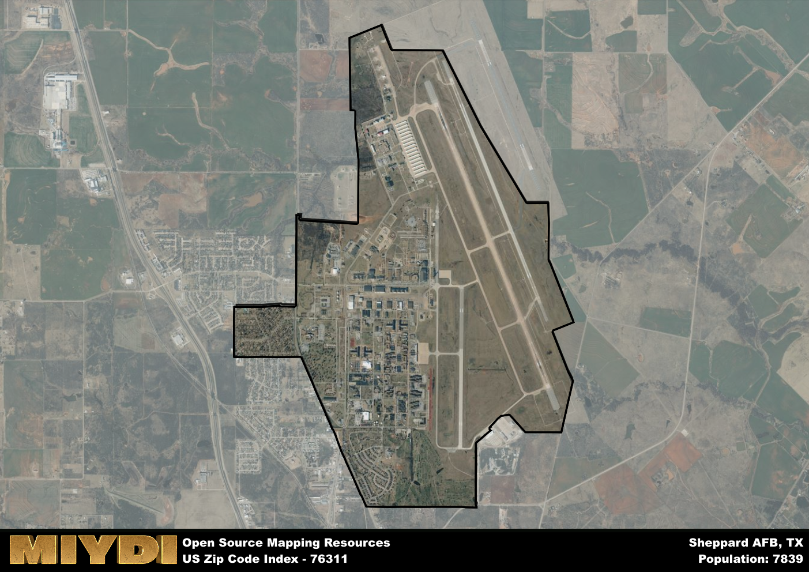

**Area Name:** Sheppard AFB

**Zip Code:** 76311

**State:** TX

Sheppard AFB is a part of the Wichita Falls - TX Metro Area, and makes up 4.85% of the Metro's population.  

# Sheppard AFB: A Vital Military Hub in Zip Code 76311

Located in the northern part of Wichita Falls, Texas, zip code 76311 encompasses the area surrounding Sheppard Air Force Base, a key military installation in the region. The zip code is bordered by the city of Burkburnett to the east and Wichita Falls to the south. As a prominent neighborhood in the Wichita Falls metropolitan area, 76311 plays a crucial role in the defense and aerospace sectors, with Sheppard AFB serving as a major training center for the United States Air Force.

The history of zip code 76311 is deeply intertwined with the establishment of Sheppard AFB during World War II. Named after Senator Morris Sheppard, the base was constructed in 1941 and has since become a cornerstone of the local community. Over the years, Sheppard AFB has played a pivotal role in training generations of airmen and supporting military operations around the world. The area has witnessed significant growth and development, evolving into a vibrant and diverse neighborhood with a strong military presence.

Today, zip code 76311 boasts a thriving economy driven by the military and aerospace industries. In addition to the various military facilities at Sheppard AFB, the area offers a range of neighborhood-specific services and amenities for residents and military personnel. From shopping centers and restaurants to parks and recreational facilities, 76311 provides a high quality of life for its residents. The neighborhood also features historical sites and museums that celebrate its military heritage, making it a unique and dynamic part of the Wichita Falls metropolitan area.

# Sheppard AFB Demographics

The population of Sheppard AFB is 7839.  
Sheppard AFB has a population density of 1302.16 per square mile.  
The area of Sheppard AFB is 6.02 square miles.  

## Sheppard AFB Income and Economic Data

These demographic numbers are sourced from IRS return data, providing comprehensive insights into the population dynamics and economic trends within Sheppard AFB.

**Breakdown of return types for Sheppard AFB**

The table offers insight into the composition of tax returns filed with the IRS, categorizing them into three main types. Single returns represent filings by individuals, joint returns by married couples, and head of household returns by individuals who qualify as heads of households, typically having dependents. This breakdown provides an understanding of the different filing statuses adopted by taxpayers when submitting their tax documentation.

| Return Types filed for Sheppard AFB                              | Percentage          |
|----------------------------------------------------------|---------------------|
| Single Returns                                            | 0.53 |
| Joint Returns                                             | 0.39 |
| Head Household Returns                                    | 0.06 |

The income and economic data presented here is sourced from the IRS income brackets, utilized for categorizing tax returns by income levels. This table displays income ranges for both single filers and married couples, along with the corresponding number of returns and the percentage within each bracket, providing valuable insight into the distribution of taxes across various income groups.

| Bracket Name       | Single Filer Income Range | Married Couple Range | Number of Returns | Percentage of Returns |
|--------------------|----------------------------|----------------------|-------------------|-----------------------|
| 10% Bracket        | Up to $10,275              | Up to $20,550        | 580 | 0.44% |
| 12% Bracket        | $10,276 - $41,775          | $20,551 - $83,550    | 360 | 0.27% |
| 22% Bracket        | $41,776 - $89,075          | $83,551 - $178,150   | 200 | 0.15% |
| 24% Bracket        | $89,076 - $170,050         | $178,151 - $340,100  | 90 | 0.07% |
| 32% Bracket        | $170,051 - $215,950        | $340,101 - $431,900  | 90 | 0.07% |
| 35% Bracket        | $215,951 - $539,900        | $431,901 - $647,850  | 0 | 0% |

### Exploring Taxpayer Diversity: A Breakdown of Different Types of Tax Returns in Sheppard AFB

The table offers insights into various types of tax returns filed, reflecting different aspects of taxpayer activities and demographics. Categories include charitable returns for donations, dependent returns for claimed dependents, educator population, elderly population, real estate returns, self-employment returns, student loan returns, and unemployment returns, providing valuable insights into taxpayer behavior and demographics.

| Sheppard AFB Filing Types                    | Count | Percentage |
|--------------------------------------|-------|------------|
| Charitable Donations                 | 0 | 0% |
| Dependents Claimed                   | 80 | 0.061% |
| Educator Residents                   | 0 | 0% |
| Elderly Population                   | 60 | 0.05% |
| Farming Population                   | 0 | 0% |
| Real Estate Transactions             | 0 | 0% |
| Self-Employed Individuals            | 50 | 0.038% |
| Student Loan Cases                   | 110 | 0.083% |
| Unemployment Benefit Filings         | 100 | 0.08% |

### Exploring Real Estate Trends: A Comprehensive Analysis of the Sheppard AFB Area and its Neighbors

This table contains an in-depth examination of the real estate market in the Sheppard AFB area. Sourced from trusted real estate market firms, this dataset provides a wealth of raw data detailing the local real estate landscape, along with comparative analyses juxtaposing the market dynamics with those of neighboring areas. Explore the intricacies of the Sheppard AFB real estate market and gain valuable insights into its relationship with adjacent regions.

| Real Estate Data for Sheppard AFB                       | Value    |
|------------------------------------------------|----------|
| Real Estate Prices to Income Ratio           | 7.192 |

This table offers essential real estate data for the Sheppard AFB area, including average and median listing prices, median days on market, and property size. It also presents ratio metrics as percentages, providing insights into how the local market compares to the surrounding region. A ratio of 100% signifies performance in line with the regional average, while values above or below indicate overperformance or underperformance, respectively, relative to expectations.

## Sheppard AFB Sports and Recreation Data

#### Annual Youth Sports Spending for Sheppard AFB

This table provides fundamental insights into the Sports and Recreation data for the Sheppard AFB area, detailing the estimated annual expenditure on Youth Athletics. This includes estimated spending by the major consumer brackets. 
| Sports Spending for Sheppard AFB| Value |
|-------------------------|-------|
| Athlete Spending Compared to the region | 73.92% |
| Total Youth Athlete Spending | 92,481 |
| Athletic Spending - Essential Focused Consumer | 07,324 |
| Athletic Spending - Typical Consumer | 41,910 |
| Athletic Spending - Affluent Consumers | 42,990 |

#### Youth Coaching Estimates for Sheppard AFB

This table presents the estimated number of coaches for the Sheppard AFB area, derived from comprehensive national coaching surveys and athletic participation rates by state. It offers valuable insights into the vital role of coaching personnel in fostering athletic development and facilitating sports participation within the local community.

| Coaching Data for Sheppard AFB | Value |
|-------------|-------|
| Total Coaches | 128 |
| Paid Coaches | 33 |
| Volunteer Coaches | 95 |

#### Youth Athlete Participation for Sheppard AFB

This table shows the estimated total number of youth athletes in the Sheppard AFB area, sourced from comprehensive national coaching surveys and athletic participation rates by state.

| Total YA Athletes in Sheppard AFB | Value |
|-------------|-------|
| Total High School Athletes | 196 |
| Total Youth Athletes | 588 |
| Total Young Adult Athletes | 392 |
| Total Athletes to Age 25 | 1175 |

#### High School Age Athletes - Breakdown by Sport for Sheppard AFB

This table shows insights regarding high school age estimated players by sport in the Sheppard AFB area, derived from national and state-level athletic participation trends. 

| HS Players by Sport in Sheppard AFB | Value |
|-------------|-------|
| Football Players | 45 |
| Basketball Players | 27 |
| Soccer Players | 22 |
| Volleyball Players | 14 |
| Baseball Players | 24 |
| Tennis Players | 12 |
| Track Athletes | 33 |
| Golf Players | 6 |
| Swimming Athletes | 6 |
| Wrestling Competitors | 6 |
| Lacrosse Players | 0 |

Estimating the number of younger athletes presents unique challenges due to their varied starting ages, typically beginning around six years old, and a gradual decline in participation rates as they age. Unlike high school-aged athletes, younger athletes are less likely to switch sports as they grow older, contributing to the stability of participation numbers within specific sports at younger ages.  

As a general trend, the total number of younger athletes is approximately three times the number of high school-aged athletes, underscoring the significant presence of youth athletes in sports programs and highlighting the importance of early engagement in athletic activities.

## Sheppard AFB AI and Census Variables

The values presented in this dataset for Sheppard AFB are AI-optimized, streamlined, and categorized into relevant buckets for enhanced utility in AI and mapping programs. These simplified values have been optimized to facilitate efficient analysis and integration into various technological applications, offering users accessible and actionable insights into demographics within the Sheppard AFB area.

| AI Variables for Sheppard AFB | Value |
|-------------|-------|
| Shape Area | 22739487.1914063 |
| Shape Length | 24378.3680570491 |
| CBSA Federal Processing Standard Code | 48660 |
| RE Income Ratio | 7.192 |
| Single Opportunity Flag | 4 |
| Single Parent Risk Flag | 4 |
| Elderly Opportunity Flag | 4 |
| Unemployment Risk | 4 |
| RE Activity Flag | 1 |

## How to use this free AI optimized Geo-Spatial Data for Sheppard AFB, TX

This data is made freely available under the Creative Commons license, allowing for unrestricted use for any purpose. Users can access static resources directly from GitHub or leverage more advanced functionalities by utilizing the GeoJSON files. All datasets originate from official government or private sector sources and are meticulously compiled into relevant datasets within QGIS. However, the versatility of the data ensures compatibility with any mapping application.

## Data Accuracy Disclaimer
It's important to note that the data provided here may contain errors or discrepancies and should be considered as 'close enough' for business applications and AI rather than a definitive source of truth. This data is aggregated from multiple sources, some of which publish information on wildly different intervals, leading to potential inconsistencies. Additionally, certain data points may not be corrected for Covid-related changes, further impacting accuracy. Moreover, the assumption that demographic trends are consistent throughout a region may lead to discrepancies, as trends often concentrate in areas of highest population density. As a result, dense areas may be slightly underrepresented, while rural areas may be slightly overrepresented, resulting in a more conservative dataset. Furthermore, the focus primarily on areas within US Major and Minor Statistical areas means that approximately 40 million Americans living outside of these areas may not be fully represented. Lastly, the historical background and area descriptions generated using AI are susceptible to potential mistakes, so users should exercise caution when interpreting the information provided.
