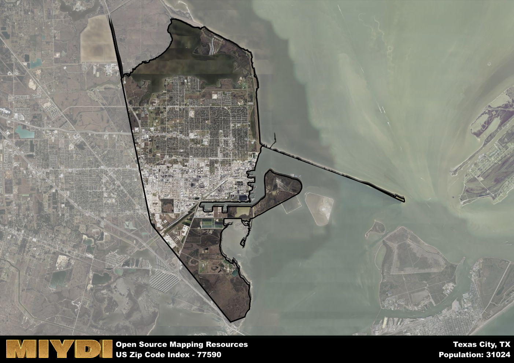

**Area Name:** Texas City

**Zip Code:** 77590

**State:** TX

Texas City is a part of the Houston-The Woodlands-Sugar Land - TX Metro Area, and makes up 0.44% of the Metro's population.

# Historic Galveston Neighborhood: Zip Code 77590

Located on Galveston Island in Texas, zip code 77590 encompasses the historic neighborhood of Old Galveston. Bordered by the Gulf of Mexico to the south, this area seamlessly integrates with the larger city of Galveston to the east and west, while being connected to the mainland via the Galveston Causeway. Old Galveston serves as a vibrant residential and commercial district within the broader metropolitan area.

Established in the early 19th century, Old Galveston has a rich historical narrative tied to the city's maritime and shipping industry. Originally settled by pioneers and entrepreneurs attracted to the island's strategic location, the area quickly grew into a bustling port city. The devastating Hurricane of 1900, which claimed thousands of lives, marked a turning point in the neighborhood's history, leading to the implementation of innovative infrastructure and safety measures.

Today, Old Galveston is a thriving community known for its eclectic mix of historic architecture, boutique shops, and waterfront attractions. The neighborhood boasts a diverse economy that includes tourism, shipping, and healthcare industries. Residents and visitors alike can enjoy a range of recreational amenities such as parks, museums, and cultural events that celebrate the area's unique heritage. Old Galveston continues to be a dynamic and resilient neighborhood within the vibrant city of Galveston.

# Texas City Demographics

The population of Texas City is 31024.
Texas City has a population density of 1071.27 per square mile.
The area of Texas City is 28.96 square miles.

## Texas City Income and Economic Data

These demographic numbers are sourced from IRS return data, providing comprehensive insights into the population dynamics and economic trends within Texas City.

**Breakdown of return types for Texas City**

The table offers insight into the composition of tax returns filed with the IRS, categorizing them into three main types. Single returns represent filings by individuals, joint returns by married couples, and head of household returns by individuals who qualify as heads of households, typically having dependents. This breakdown provides an understanding of the different filing statuses adopted by taxpayers when submitting their tax documentation.

| Return Types filed for Texas City                              | Percentage          |
|----------------------------------------------------------|---------------------|
| Single Returns                                            | 0.5 |
| Joint Returns                                             | 0.26 |
| Head Household Returns                                    | 0.23 |

The income and economic data presented here is sourced from the IRS income brackets, utilized for categorizing tax returns by income levels. This table displays income ranges for both single filers and married couples, along with the corresponding number of returns and the percentage within each bracket, providing valuable insight into the distribution of taxes across various income groups.

| Bracket Name       | Single Filer Income Range | Married Couple Range | Number of Returns | Percentage of Returns |
|--------------------|----------------------------|----------------------|-------------------|-----------------------|
| 10% Bracket        | Up to $10,275              | Up to $20,550        | 5530 | 0.41% |
| 12% Bracket        | $10,276 - $41,775          | $20,551 - $83,550    | 3880 | 0.29% |
| 22% Bracket        | $41,776 - $89,075          | $83,551 - $178,150   | 1750 | 0.13% |
| 24% Bracket        | $89,076 - $170,050         | $178,151 - $340,100  | 920 | 0.07% |
| 32% Bracket        | $170,051 - $215,950        | $340,101 - $431,900  | 1220 | 0.09% |
| 35% Bracket        | $215,951 - $539,900        | $431,901 - $647,850  | 230 | 0.02% |

### Exploring Taxpayer Diversity: A Breakdown of Different Types of Tax Returns in Texas City

The table offers insights into various types of tax returns filed, reflecting different aspects of taxpayer activities and demographics. Categories include charitable returns for donations, dependent returns for claimed dependents, educator population, elderly population, real estate returns, self-employment returns, student loan returns, and unemployment returns, providing valuable insights into taxpayer behavior and demographics.

| Texas City Filing Types                    | Count | Percentage |
|--------------------------------------|-------|------------|
| Charitable Donations                 | 430 | 0.032% |
| Dependents Claimed                   | 400 | 0.03% |
| Educator Residents                   | 220 | 0.016% |
| Elderly Population                   | 2970 | 0.22% |
| Farming Population                   | 80 | 0.006% |
| Real Estate Transactions             | 360 | 0.027% |
| Self-Employed Individuals            | 1370 | 0.101% |
| Student Loan Cases                   | 410 | 0.03% |
| Unemployment Benefit Filings         | 2700 | 0.2% |

### Exploring Real Estate Trends: A Comprehensive Analysis of the Texas City Area and its Neighbors

This table contains an in-depth examination of the real estate market in the Texas City area. Sourced from trusted real estate market firms, this dataset provides a wealth of raw data detailing the local real estate landscape, along with comparative analyses juxtaposing the market dynamics with those of neighboring areas. Explore the intricacies of the Texas City real estate market and gain valuable insights into its relationship with adjacent regions.

| Real Estate Data for Texas City                       | Value    |
|------------------------------------------------|----------|
| Average Listing Price for Texas City               | 300579 |
| Median Listing Price for Texas City                | 249675 |
| Median Days on Market for Texas City               | 51 |
| Median Listing Price per Square Foot for Texas City| 46 |
| Median Square Feet for Texas City                  | 1793 |
| Real Estate Prices to Income Ratio           | 94.66% |
| Price per Square Foot Ratio                  | 79.93% |
| Price Median Ratio                           | 65.47% |
| Market Sales Speed Ratio                     | 121.6% |

This table offers essential real estate data for the Texas City area, including average and median listing prices, median days on market, and property size. It also presents ratio metrics as percentages, providing insights into how the local market compares to the surrounding region. A ratio of 100% signifies performance in line with the regional average, while values above or below indicate overperformance or underperformance, respectively, relative to expectations.

## Texas City Sports and Recreation Data

#### Annual Youth Sports Spending for Texas City

This table provides fundamental insights into the Sports and Recreation data for the Texas City area, detailing the estimated annual expenditure on Youth Athletics. This includes estimated spending by the major consumer brackets.
| Sports Spending for Texas City| Value |
|-------------------------|-------|
| Athlete Spending Compared to the region | 88.59% |
| Total Youth Athlete Spending | ,415,659 |
| Athletic Spending - Essential Focused Consumer | 29,899 |
| Athletic Spending - Typical Consumer | 74,576 |
| Athletic Spending - Affluent Consumers | ,810,168 |

#### Youth Coaching Estimates for Texas City

This table presents the estimated number of coaches for the Texas City area, derived from comprehensive national coaching surveys and athletic participation rates by state. It offers valuable insights into the vital role of coaching personnel in fostering athletic development and facilitating sports participation within the local community.

| Coaching Data for Texas City | Value |
|-------------|-------|
| Total Coaches | 508 |
| Paid Coaches | 132 |
| Volunteer Coaches | 376 |

#### Youth Athlete Participation for Texas City

This table shows the estimated total number of youth athletes in the Texas City area, sourced from comprehensive national coaching surveys and athletic participation rates by state.

| Total YA Athletes in Texas City | Value |
|-------------|-------|
| Total High School Athletes | 775 |
| Total Youth Athletes | 2326 |
| Total Young Adult Athletes | 1551 |
| Total Athletes to Age 25 | 4652 |

#### High School Age Athletes - Breakdown by Sport for Texas City

This table shows insights regarding high school age estimated players by sport in the Texas City area, derived from national and state-level athletic participation trends.

| HS Players by Sport in Texas City | Value |
|-------------|-------|
| Football Players | 178 |
| Basketball Players | 109 |
| Soccer Players | 85 |
| Volleyball Players | 54 |
| Baseball Players | 93 |
| Tennis Players | 47 |
| Track Athletes | 132 |
| Golf Players | 23 |
| Swimming Athletes | 23 |
| Wrestling Competitors | 23 |
| Lacrosse Players | 0 |

Estimating the number of younger athletes presents unique challenges due to their varied starting ages, typically beginning around six years old, and a gradual decline in participation rates as they age. Unlike high school-aged athletes, younger athletes are less likely to switch sports as they grow older, contributing to the stability of participation numbers within specific sports at younger ages.

As a general trend, the total number of younger athletes is approximately three times the number of high school-aged athletes, underscoring the significant presence of youth athletes in sports programs and highlighting the importance of early engagement in athletic activities.

## Texas City AI and Census Variables

The values presented in this dataset for Texas City are AI-optimized, streamlined, and categorized into relevant buckets for enhanced utility in AI and mapping programs. These simplified values have been optimized to facilitate efficient analysis and integration into various technological applications, offering users accessible and actionable insights into demographics within the Texas City area.

| AI Variables for Texas City | Value |
|-------------|-------|
| Shape Area | 99140537.984375 |
| Shape Length | 106464.790242818 |
| CBSA Federal Processing Standard Code | 26420 |
| RE Price per Square Foot Ratio | 79.93% |
| RE Price Average Ratio | 63.55% |
| RE Speed Ratio | 121.6% |
| RE Income Ratio | 94.66% |
| Single Opportunity Flag | 4 |
| Single Parent Risk Flag | 6 |
| Elderly Opportunity Flag | 6 |
| Farm Opportunity Flag | 4 |
| Unemployment Risk | 6 |
| Educator Opportunity Flag | 2 |
| RE Affordability Index Flag | 2 |
| Income Bracket Flag | 2 |
| RE Income Flag | 3 |
| RE Median Square Footage Price Flag | 3 |
| RE Median Square Footage Size Flag | 4 |
| RE Activity Flag | 6 |
| Poverty Line Risk Flag | 2 |

## How to use this free AI optimized Geo-Spatial Data for Texas City, TX

This data is made freely available under the Creative Commons license, allowing for unrestricted use for any purpose. Users can access static resources directly from GitHub or leverage more advanced functionalities by utilizing the GeoJSON files. All datasets originate from official government or private sector sources and are meticulously compiled into relevant datasets within QGIS. However, the versatility of the data ensures compatibility with any mapping application.