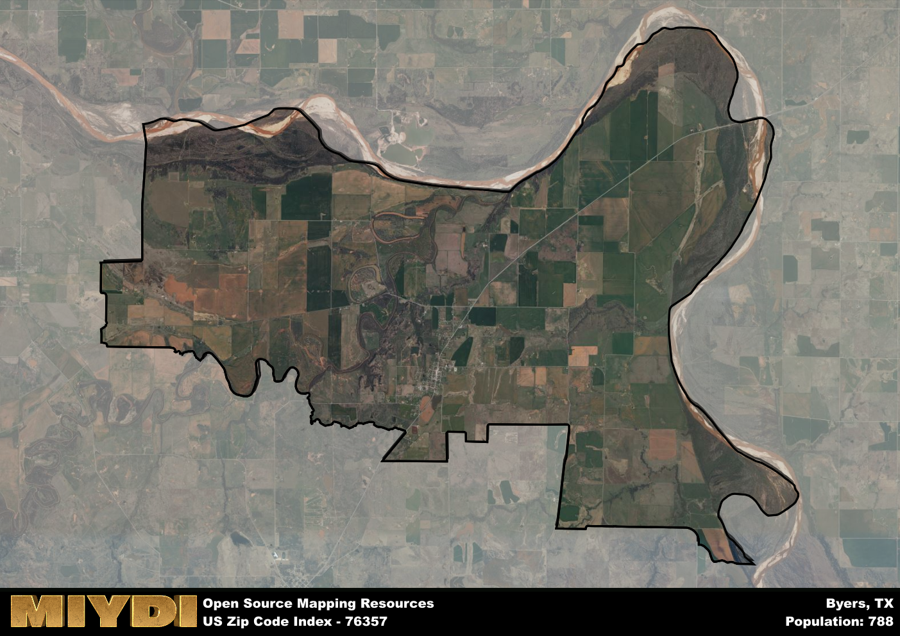

**Area Name:** Byers

**Zip Code:** 76357

**State:** TX

Byers is a part of the Wichita Falls - TX Metro Area, and makes up  of the Metro's population.  

# Byers, TX 76357: A Historic Small Town in North Texas  

Located in North Texas, Byers, TX 76357 is a small town situated within Clay County. The zip code area is bordered by rural landscapes and is approximately 30 miles northeast of Wichita Falls. Byers is a close-knit community that thrives on its rural charm, while also being within a reasonable driving distance from larger cities such as Dallas and Fort Worth. The area is known for its picturesque views and peaceful surroundings, making it an attractive destination for those seeking a slower pace of life.

Byers has a rich historical narrative that dates back to its establishment in the late 19th century. The town was named after a prominent local landowner, and its growth was fueled by the arrival of the railroad in the early 20th century. The area saw a boom in population and economic activity during this time, with agriculture playing a vital role in shaping its identity. Over the years, Byers has maintained its small-town feel, with residents proud of its heritage and sense of community.

Today, Byers, TX 76357 is a thriving community that continues to embrace its agricultural roots. The town is home to a variety of local businesses, including farms, ranches, and small shops that cater to the needs of residents. In addition to its economic activities, Byers offers a range of recreational amenities, such as parks, walking trails, and community events that bring residents together. The area also boasts a few historic sites that showcase its past, preserving its heritage for future generations to appreciate and enjoy.

# Byers Demographics

The population of Byers is 788.  
Byers has a population density of 14.18 per square mile.  
The area of Byers is 55.58 square miles.  

## Byers Income and Economic Data

These demographic numbers are sourced from IRS return data, providing comprehensive insights into the population dynamics and economic trends within Byers.

**Breakdown of return types for Byers**

The table offers insight into the composition of tax returns filed with the IRS, categorizing them into three main types. Single returns represent filings by individuals, joint returns by married couples, and head of household returns by individuals who qualify as heads of households, typically having dependents. This breakdown provides an understanding of the different filing statuses adopted by taxpayers when submitting their tax documentation.

| Return Types filed for Byers                              | Percentage          |
|----------------------------------------------------------|---------------------|
| Single Returns                                            | 0.37 |
| Joint Returns                                             | 0.48 |
| Head Household Returns                                    | 0.07 |

The income and economic data presented here is sourced from the IRS income brackets, utilized for categorizing tax returns by income levels. This table displays income ranges for both single filers and married couples, along with the corresponding number of returns and the percentage within each bracket, providing valuable insight into the distribution of taxes across various income groups.

| Bracket Name       | Single Filer Income Range | Married Couple Range | Number of Returns | Percentage of Returns |
|--------------------|----------------------------|----------------------|-------------------|-----------------------|
| 10% Bracket        | Up to $10,275              | Up to $20,550        | 80 | 0.3% |
| 12% Bracket        | $10,276 - $41,775          | $20,551 - $83,550    | 80 | 0.3% |
| 22% Bracket        | $41,776 - $89,075          | $83,551 - $178,150   | 40 | 0.15% |
| 24% Bracket        | $89,076 - $170,050         | $178,151 - $340,100  | 30 | 0.11% |
| 32% Bracket        | $170,051 - $215,950        | $340,101 - $431,900  | 40 | 0.15% |
| 35% Bracket        | $215,951 - $539,900        | $431,901 - $647,850  | 0 | 0% |

### Exploring Taxpayer Diversity: A Breakdown of Different Types of Tax Returns in Byers

The table offers insights into various types of tax returns filed, reflecting different aspects of taxpayer activities and demographics. Categories include charitable returns for donations, dependent returns for claimed dependents, educator population, elderly population, real estate returns, self-employment returns, student loan returns, and unemployment returns, providing valuable insights into taxpayer behavior and demographics.

| Byers Filing Types                    | Count | Percentage |
|--------------------------------------|-------|------------|
| Charitable Donations                 | 0 | 0% |
| Dependents Claimed                   | 0 | 0% |
| Educator Residents                   | 0 | 0% |
| Elderly Population                   | 80 | 0.3% |
| Farming Population                   | 30 | 0.111% |
| Real Estate Transactions             | 0 | 0% |
| Self-Employed Individuals            | 20 | 0.074% |
| Student Loan Cases                   | 0 | 0% |
| Unemployment Benefit Filings         | 30 | 0.11% |

## Byers AI and Census Variables

The values presented in this dataset for Byers are AI-optimized, streamlined, and categorized into relevant buckets for enhanced utility in AI and mapping programs. These simplified values have been optimized to facilitate efficient analysis and integration into various technological applications, offering users accessible and actionable insights into demographics within the Byers area.

| AI Variables for Byers | Value |
|-------------|-------|
| Shape Area | 210411643.125 |
| Shape Length | 94201.6797704591 |
| CBSA Federal Processing Standard Code | 48660 |

## How to use this free AI optimized Geo-Spatial Data for Byers, TX

This data is made freely available under the Creative Commons license, allowing for unrestricted use for any purpose. Users can access static resources directly from GitHub or leverage more advanced functionalities by utilizing the GeoJSON files. All datasets originate from official government or private sector sources and are meticulously compiled into relevant datasets within QGIS. However, the versatility of the data ensures compatibility with any mapping application.

## Data Accuracy Disclaimer
It's important to note that the data provided here may contain errors or discrepancies and should be considered as 'close enough' for business applications and AI rather than a definitive source of truth. This data is aggregated from multiple sources, some of which publish information on wildly different intervals, leading to potential inconsistencies. Additionally, certain data points may not be corrected for Covid-related changes, further impacting accuracy. Moreover, the assumption that demographic trends are consistent throughout a region may lead to discrepancies, as trends often concentrate in areas of highest population density. As a result, dense areas may be slightly underrepresented, while rural areas may be slightly overrepresented, resulting in a more conservative dataset. Furthermore, the focus primarily on areas within US Major and Minor Statistical areas means that approximately 40 million Americans living outside of these areas may not be fully represented. Lastly, the historical background and area descriptions generated using AI are susceptible to potential mistakes, so users should exercise caution when interpreting the information provided.
