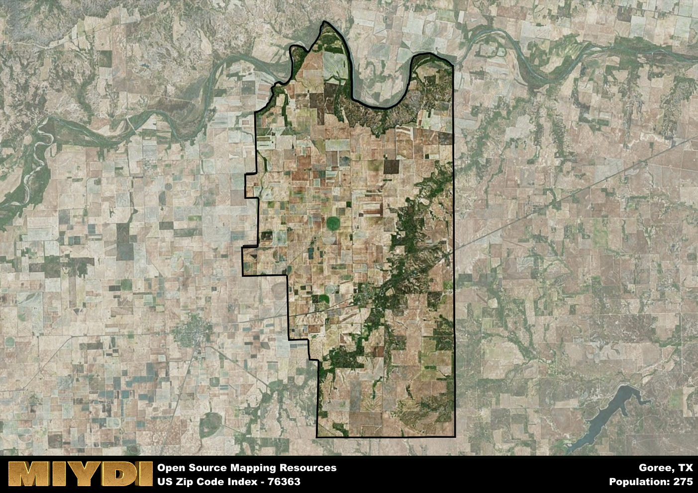

**Area Name:** Goree

**Zip Code:** 76363

**State:** TX

# Goree: A Historic Community in Zip Code 76363

Located in the heart of Texas, zip code 76363 encompasses the small community of Goree. Situated within the larger metropolitan area, Goree is surrounded by vast stretches of farmland and is in close proximity to cities such as Wichita Falls and Abilene. The area is characterized by its rural landscape, with a tight-knit community that values its historical roots and connection to the land.

Goree has a rich history dating back to its establishment in the late 19th century. Named after Samuel H. Goree, a prominent figure in Texas history, the area grew as a hub for agriculture and ranching. Over the years, Goree has maintained its small-town charm while adapting to modern times, preserving its heritage through local museums and historical landmarks that tell the story of its past.

Today, Goree remains an active agricultural community, with farming and ranching playing a vital role in the local economy. The area offers a peaceful and serene environment for residents, with access to essential services such as schools, churches, and community centers. Outdoor enthusiasts can enjoy the natural beauty of the surrounding countryside, while history buffs can explore the town's historic sites, making Goree a place where the past meets the present.

# Goree Demographics

The population of Goree is 275.  
Goree has a population density of 3.74 per square mile.  
The area of Goree is 73.62 square miles.  

## Goree Income and Economic Data

These demographic numbers are sourced from IRS return data, providing comprehensive insights into the population dynamics and economic trends within Goree.

**Breakdown of return types for Goree**

The table offers insight into the composition of tax returns filed with the IRS, categorizing them into three main types. Single returns represent filings by individuals, joint returns by married couples, and head of household returns by individuals who qualify as heads of households, typically having dependents. This breakdown provides an understanding of the different filing statuses adopted by taxpayers when submitting their tax documentation.

| Return Types filed for Goree                              | Percentage          |
|----------------------------------------------------------|---------------------|
| Single Returns                                            | 0.5 |
| Joint Returns                                             | 0.33 |
| Head Household Returns                                    | 0 |

The income and economic data presented here is sourced from the IRS income brackets, utilized for categorizing tax returns by income levels. This table displays income ranges for both single filers and married couples, along with the corresponding number of returns and the percentage within each bracket, providing valuable insight into the distribution of taxes across various income groups.

| Bracket Name       | Single Filer Income Range | Married Couple Range | Number of Returns | Percentage of Returns |
|--------------------|----------------------------|----------------------|-------------------|-----------------------|
| 10% Bracket        | Up to $10,275              | Up to $20,550        | 50 | 0.42% |
| 12% Bracket        | $10,276 - $41,775          | $20,551 - $83,550    | 50 | 0.42% |
| 22% Bracket        | $41,776 - $89,075          | $83,551 - $178,150   | 0 | 0% |
| 24% Bracket        | $89,076 - $170,050         | $178,151 - $340,100  | 20 | 0.17% |
| 32% Bracket        | $170,051 - $215,950        | $340,101 - $431,900  | 0 | 0% |
| 35% Bracket        | $215,951 - $539,900        | $431,901 - $647,850  | 0 | 0% |

### Exploring Taxpayer Diversity: A Breakdown of Different Types of Tax Returns in Goree

The table offers insights into various types of tax returns filed, reflecting different aspects of taxpayer activities and demographics. Categories include charitable returns for donations, dependent returns for claimed dependents, educator population, elderly population, real estate returns, self-employment returns, student loan returns, and unemployment returns, providing valuable insights into taxpayer behavior and demographics.

| Goree Filing Types                    | Count | Percentage |
|--------------------------------------|-------|------------|
| Charitable Donations                 | 0 | 0% |
| Dependents Claimed                   | 0 | 0% |
| Educator Residents                   | 0 | 0% |
| Elderly Population                   | 30 | 0.25% |
| Farming Population                   | 0 | 0% |
| Real Estate Transactions             | 0 | 0% |
| Self-Employed Individuals            | 0 | 0% |
| Student Loan Cases                   | 0 | 0% |
| Unemployment Benefit Filings         | 0 | 0% |

## Goree AI and Census Variables

The values presented in this dataset for Goree are AI-optimized, streamlined, and categorized into relevant buckets for enhanced utility in AI and mapping programs. These simplified values have been optimized to facilitate efficient analysis and integration into various technological applications, offering users accessible and actionable insights into demographics within the Goree area.

| AI Variables for Goree | Value |
|-------------|-------|
| Shape Area | 274909540.078125 |
| Shape Length | 86113.4763118135 |

## How to use this free AI optimized Geo-Spatial Data for Goree, TX

This data is made freely available under the Creative Commons license, allowing for unrestricted use for any purpose. Users can access static resources directly from GitHub or leverage more advanced functionalities by utilizing the GeoJSON files. All datasets originate from official government or private sector sources and are meticulously compiled into relevant datasets within QGIS. However, the versatility of the data ensures compatibility with any mapping application.

## Data Accuracy Disclaimer
It's important to note that the data provided here may contain errors or discrepancies and should be considered as 'close enough' for business applications and AI rather than a definitive source of truth. This data is aggregated from multiple sources, some of which publish information on wildly different intervals, leading to potential inconsistencies. Additionally, certain data points may not be corrected for Covid-related changes, further impacting accuracy. Moreover, the assumption that demographic trends are consistent throughout a region may lead to discrepancies, as trends often concentrate in areas of highest population density. As a result, dense areas may be slightly underrepresented, while rural areas may be slightly overrepresented, resulting in a more conservative dataset. Furthermore, the focus primarily on areas within US Major and Minor Statistical areas means that approximately 40 million Americans living outside of these areas may not be fully represented. Lastly, the historical background and area descriptions generated using AI are susceptible to potential mistakes, so users should exercise caution when interpreting the information provided.
