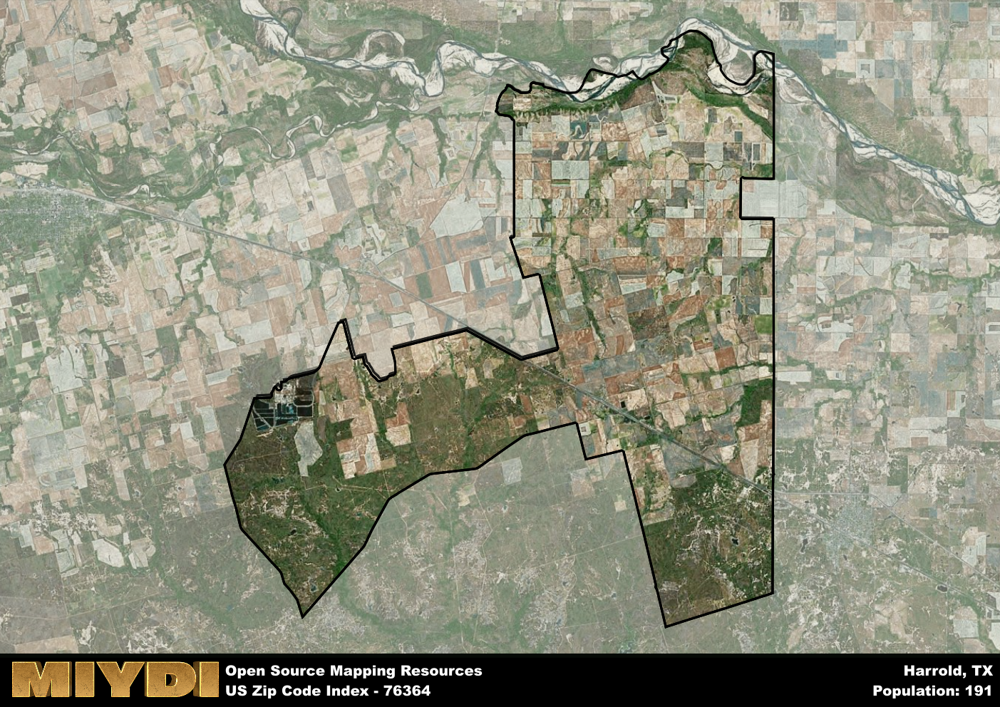

**Area Name:** Harrold

**Zip Code:** 76364

**State:** TX

Harrold is a part of the Vernon - TX Micro Area, and makes up  of the Metro's population.  

# Harrold: A Quaint Community in North Central Texas  

Harrold, corresponding to zip code 76364, is a small rural community located in North Central Texas. Situated in Wilbarger County, Harrold is bordered by vast fields and farmlands, with Wichita Falls to the east and Vernon to the west. Despite its rural setting, Harrold is only a short drive away from major population centers, allowing residents to enjoy the tranquility of country living while having access to urban amenities.  

Founded in the late 19th century, Harrold began as a railroad town along the Fort Worth and Denver Railway. Named after railroad executive Harrold, the town quickly grew as settlers were drawn to the area for its fertile land and promising opportunities. Over the years, Harrold has maintained its small-town charm and strong sense of community, with many families tracing their roots back several generations. The town's rich history is evident in its well-preserved historic buildings and landmarks that serve as a reminder of its humble beginnings.  

Today, Harrold remains a close-knit community with a focus on agriculture and ranching. The town's economy is largely driven by farming activities, with local businesses catering to the needs of residents and visitors alike. Harrold offers a range of services, including schools, churches, and small businesses, creating a self-sustaining environment for its residents. In addition to its agricultural roots, Harrold boasts several recreational amenities such as parks and outdoor spaces, making it an ideal destination for nature enthusiasts. With its blend of history, community spirit, and natural beauty, Harrold continues to thrive as a hidden gem in North Central Texas.  

# Harrold Demographics

The population of Harrold is 191.  
Harrold has a population density of 1.7 per square mile.  
The area of Harrold is 112.04 square miles.  

## Harrold AI and Census Variables

The values presented in this dataset for Harrold are AI-optimized, streamlined, and categorized into relevant buckets for enhanced utility in AI and mapping programs. These simplified values have been optimized to facilitate efficient analysis and integration into various technological applications, offering users accessible and actionable insights into demographics within the Harrold area.

| AI Variables for Harrold | Value |
|-------------|-------|
| Shape Area | 424263817.582031 |
| Shape Length | 139524.378754765 |
| CBSA Federal Processing Standard Code | 46900 |

## How to use this free AI optimized Geo-Spatial Data for Harrold, TX

This data is made freely available under the Creative Commons license, allowing for unrestricted use for any purpose. Users can access static resources directly from GitHub or leverage more advanced functionalities by utilizing the GeoJSON files. All datasets originate from official government or private sector sources and are meticulously compiled into relevant datasets within QGIS. However, the versatility of the data ensures compatibility with any mapping application.

## Data Accuracy Disclaimer
It's important to note that the data provided here may contain errors or discrepancies and should be considered as 'close enough' for business applications and AI rather than a definitive source of truth. This data is aggregated from multiple sources, some of which publish information on wildly different intervals, leading to potential inconsistencies. Additionally, certain data points may not be corrected for Covid-related changes, further impacting accuracy. Moreover, the assumption that demographic trends are consistent throughout a region may lead to discrepancies, as trends often concentrate in areas of highest population density. As a result, dense areas may be slightly underrepresented, while rural areas may be slightly overrepresented, resulting in a more conservative dataset. Furthermore, the focus primarily on areas within US Major and Minor Statistical areas means that approximately 40 million Americans living outside of these areas may not be fully represented. Lastly, the historical background and area descriptions generated using AI are susceptible to potential mistakes, so users should exercise caution when interpreting the information provided.
