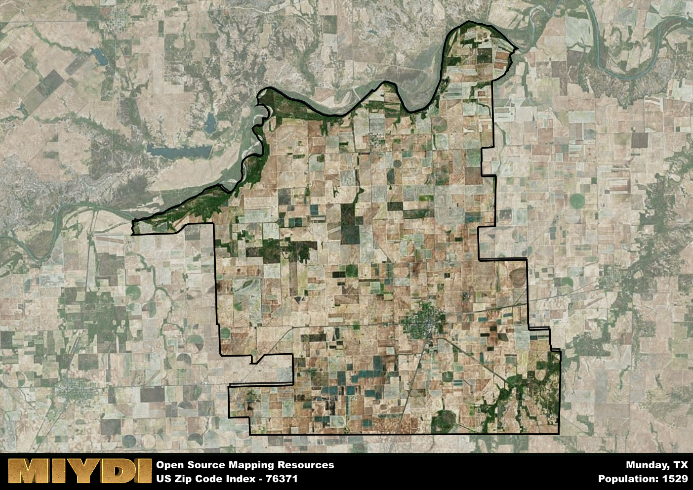

**Area Name:** Munday

**Zip Code:** 76371

**State:** TX

# Munday: A Small Town Gem in Zip Code 76371

Located in the heart of Knox County, the zip code 76371 area corresponds to the charming town of Munday. Situated in North Central Texas, Munday is surrounded by vast open plains and is in close proximity to major cities such as Wichita Falls and Abilene. The town serves as a peaceful retreat from the hustle and bustle of urban life while still maintaining easy access to larger population centers.

Munday has a rich historical background dating back to its founding in the late 19th century. Originally a stop on the Fort Worth and Denver City Railway, the town quickly grew as settlers were drawn to its fertile land and promising opportunities for agriculture. The town was officially incorporated in 1924 and was named after the Munday family, prominent early settlers in the area. Over the years, Munday has retained its small-town charm and tight-knit community spirit.

Today, Munday continues to thrive as a hub for agricultural activities, with farming and ranching playing a significant role in the local economy. The town offers a range of services to its residents, including schools, healthcare facilities, and local businesses. Munday also boasts recreational amenities such as parks, sports facilities, and community events that bring residents together. Historic sites like the Munday Depot Museum preserve the town's heritage and offer insight into its past. Overall, Munday remains a hidden gem in North Central Texas, offering a peaceful and welcoming environment for residents and visitors alike.

# Munday Demographics

The population of Munday is 1529.  
Munday has a population density of 15.68 per square mile.  
The area of Munday is 97.53 square miles.  

## Munday Income and Economic Data

These demographic numbers are sourced from IRS return data, providing comprehensive insights into the population dynamics and economic trends within Munday.

**Breakdown of return types for Munday**

The table offers insight into the composition of tax returns filed with the IRS, categorizing them into three main types. Single returns represent filings by individuals, joint returns by married couples, and head of household returns by individuals who qualify as heads of households, typically having dependents. This breakdown provides an understanding of the different filing statuses adopted by taxpayers when submitting their tax documentation.

| Return Types filed for Munday                              | Percentage          |
|----------------------------------------------------------|---------------------|
| Single Returns                                            | 0.42 |
| Joint Returns                                             | 0.41 |
| Head Household Returns                                    | 0.15 |

The income and economic data presented here is sourced from the IRS income brackets, utilized for categorizing tax returns by income levels. This table displays income ranges for both single filers and married couples, along with the corresponding number of returns and the percentage within each bracket, providing valuable insight into the distribution of taxes across various income groups.

| Bracket Name       | Single Filer Income Range | Married Couple Range | Number of Returns | Percentage of Returns |
|--------------------|----------------------------|----------------------|-------------------|-----------------------|
| 10% Bracket        | Up to $10,275              | Up to $20,550        | 230 | 0.35% |
| 12% Bracket        | $10,276 - $41,775          | $20,551 - $83,550    | 190 | 0.29% |
| 22% Bracket        | $41,776 - $89,075          | $83,551 - $178,150   | 100 | 0.15% |
| 24% Bracket        | $89,076 - $170,050         | $178,151 - $340,100  | 60 | 0.09% |
| 32% Bracket        | $170,051 - $215,950        | $340,101 - $431,900  | 60 | 0.09% |
| 35% Bracket        | $215,951 - $539,900        | $431,901 - $647,850  | 20 | 0.03% |

### Exploring Taxpayer Diversity: A Breakdown of Different Types of Tax Returns in Munday

The table offers insights into various types of tax returns filed, reflecting different aspects of taxpayer activities and demographics. Categories include charitable returns for donations, dependent returns for claimed dependents, educator population, elderly population, real estate returns, self-employment returns, student loan returns, and unemployment returns, providing valuable insights into taxpayer behavior and demographics.

| Munday Filing Types                    | Count | Percentage |
|--------------------------------------|-------|------------|
| Charitable Donations                 | 0 | 0% |
| Dependents Claimed                   | 20 | 0.03% |
| Educator Residents                   | 30 | 0.045% |
| Elderly Population                   | 200 | 0.3% |
| Farming Population                   | 70 | 0.106% |
| Real Estate Transactions             | 0 | 0% |
| Self-Employed Individuals            | 90 | 0.136% |
| Student Loan Cases                   | 0 | 0% |
| Unemployment Benefit Filings         | 50 | 0.08% |

## Munday AI and Census Variables

The values presented in this dataset for Munday are AI-optimized, streamlined, and categorized into relevant buckets for enhanced utility in AI and mapping programs. These simplified values have been optimized to facilitate efficient analysis and integration into various technological applications, offering users accessible and actionable insights into demographics within the Munday area.

| AI Variables for Munday | Value |
|-------------|-------|
| Shape Area | 364010579.332031 |
| Shape Length | 117107.177269232 |

## How to use this free AI optimized Geo-Spatial Data for Munday, TX

This data is made freely available under the Creative Commons license, allowing for unrestricted use for any purpose. Users can access static resources directly from GitHub or leverage more advanced functionalities by utilizing the GeoJSON files. All datasets originate from official government or private sector sources and are meticulously compiled into relevant datasets within QGIS. However, the versatility of the data ensures compatibility with any mapping application.

## Data Accuracy Disclaimer
It's important to note that the data provided here may contain errors or discrepancies and should be considered as 'close enough' for business applications and AI rather than a definitive source of truth. This data is aggregated from multiple sources, some of which publish information on wildly different intervals, leading to potential inconsistencies. Additionally, certain data points may not be corrected for Covid-related changes, further impacting accuracy. Moreover, the assumption that demographic trends are consistent throughout a region may lead to discrepancies, as trends often concentrate in areas of highest population density. As a result, dense areas may be slightly underrepresented, while rural areas may be slightly overrepresented, resulting in a more conservative dataset. Furthermore, the focus primarily on areas within US Major and Minor Statistical areas means that approximately 40 million Americans living outside of these areas may not be fully represented. Lastly, the historical background and area descriptions generated using AI are susceptible to potential mistakes, so users should exercise caution when interpreting the information provided.
