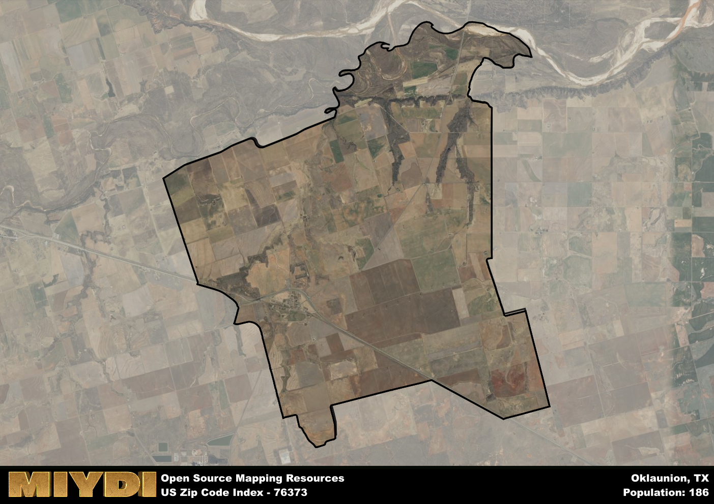

**Area Name:** Oklaunion

**Zip Code:** 76373

**State:** TX

Oklaunion is a part of the Vernon - TX Micro Area, and makes up  of the Metro's population.  

# Oklaunion: A Historic Community in North Texas  

Located in North Texas, the zip code 76373 encompasses the small community of Oklaunion. Situated in Wilbarger County, Oklaunion is bordered by the cities of Vernon to the west and Electra to the east. The area plays a significant role in connecting these two larger urban centers and serves as a residential and commercial hub for the surrounding rural population.

Oklaunion has a rich history dating back to its establishment as a railroad town in the late 19th century. The community thrived as a result of its strategic location along the railway, attracting settlers and businesses looking to take advantage of the transportation opportunities. The name "Oklaunion" is derived from the Choctaw word for "red people," reflecting the diverse cultural heritage of the area. Over the years, Oklaunion has evolved into a close-knit community with a strong sense of identity and pride in its past.

Today, Oklaunion continues to be a vibrant community with a mix of residential and commercial properties. The area is home to a variety of small businesses, including local shops and restaurants that cater to both residents and visitors. In addition to its economic activities, Oklaunion boasts several parks and recreational facilities for outdoor enthusiasts. Residents and tourists alike can explore the area's historical sites, such as the old railway station and other landmarks that showcase Oklaunion's unique heritage.

# Oklaunion Demographics

The population of Oklaunion is 186.  
Oklaunion has a population density of 4.98 per square mile.  
The area of Oklaunion is 37.38 square miles.  

## Oklaunion AI and Census Variables

The values presented in this dataset for Oklaunion are AI-optimized, streamlined, and categorized into relevant buckets for enhanced utility in AI and mapping programs. These simplified values have been optimized to facilitate efficient analysis and integration into various technological applications, offering users accessible and actionable insights into demographics within the Oklaunion area.

| AI Variables for Oklaunion | Value |
|-------------|-------|
| Shape Area | 141709936.242188 |
| Shape Length | 65250.5424803389 |
| CBSA Federal Processing Standard Code | 46900 |

## How to use this free AI optimized Geo-Spatial Data for Oklaunion, TX

This data is made freely available under the Creative Commons license, allowing for unrestricted use for any purpose. Users can access static resources directly from GitHub or leverage more advanced functionalities by utilizing the GeoJSON files. All datasets originate from official government or private sector sources and are meticulously compiled into relevant datasets within QGIS. However, the versatility of the data ensures compatibility with any mapping application.

## Data Accuracy Disclaimer
It's important to note that the data provided here may contain errors or discrepancies and should be considered as 'close enough' for business applications and AI rather than a definitive source of truth. This data is aggregated from multiple sources, some of which publish information on wildly different intervals, leading to potential inconsistencies. Additionally, certain data points may not be corrected for Covid-related changes, further impacting accuracy. Moreover, the assumption that demographic trends are consistent throughout a region may lead to discrepancies, as trends often concentrate in areas of highest population density. As a result, dense areas may be slightly underrepresented, while rural areas may be slightly overrepresented, resulting in a more conservative dataset. Furthermore, the focus primarily on areas within US Major and Minor Statistical areas means that approximately 40 million Americans living outside of these areas may not be fully represented. Lastly, the historical background and area descriptions generated using AI are susceptible to potential mistakes, so users should exercise caution when interpreting the information provided.
