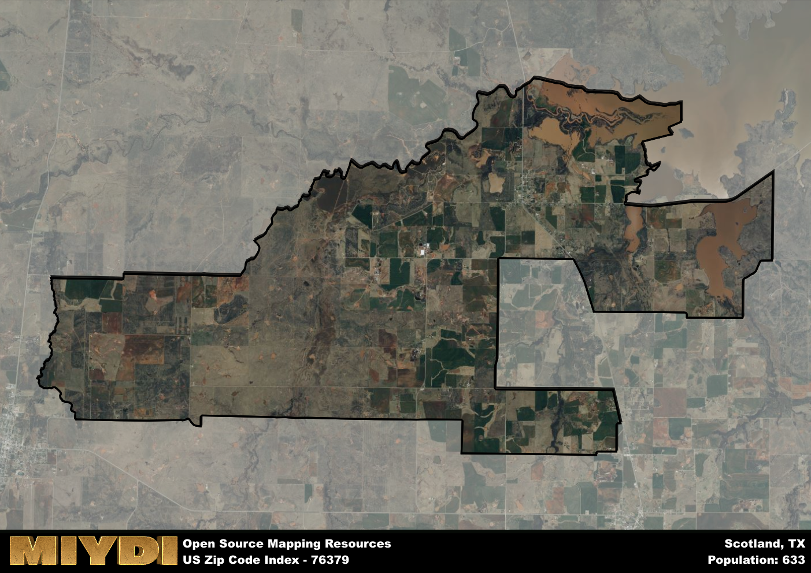

**Area Name:** Scotland

**Zip Code:** 76379

**State:** TX

Scotland is a part of the Wichita Falls - TX Metro Area, and makes up  of the Metro's population.  

# Scotland, TX - Zip Code 76379

Located in the northeastern part of Texas, zip code 76379 encompasses the charming neighborhood of Scotland within the larger metropolitan area. Situated within close proximity to Wichita Falls, Scotland enjoys a blend of rural tranquility and urban convenience. Bordered by rolling hills and farmland, this zip code area provides a peaceful retreat while still being connected to major transportation routes and amenities.

Established in the mid-19th century by Scottish immigrants, the area of Scotland has a rich historical background that is reflected in its name and cultural heritage. Over the years, the community has grown and developed, becoming known for its welcoming atmosphere and strong sense of community. The residents of Scotland take pride in their heritage and traditions, which are evident in local events and celebrations that take place throughout the year.

Presently, Scotland boasts a mix of agricultural activities and small businesses that cater to the needs of its residents. The area is known for its locally-owned shops and restaurants, providing a unique shopping and dining experience. With several parks and recreational facilities in the vicinity, residents and visitors alike can enjoy outdoor activities and leisure pursuits. Scotland also features historical sites that offer a glimpse into its past, adding to the charm and character of this vibrant neighborhood in northeastern Texas.

# Scotland Demographics

The population of Scotland is 633.  
Scotland has a population density of 14.83 per square mile.  
The area of Scotland is 42.69 square miles.  

## Scotland Income and Economic Data

These demographic numbers are sourced from IRS return data, providing comprehensive insights into the population dynamics and economic trends within Scotland.

**Breakdown of return types for Scotland**

The table offers insight into the composition of tax returns filed with the IRS, categorizing them into three main types. Single returns represent filings by individuals, joint returns by married couples, and head of household returns by individuals who qualify as heads of households, typically having dependents. This breakdown provides an understanding of the different filing statuses adopted by taxpayers when submitting their tax documentation.

| Return Types filed for Scotland                              | Percentage          |
|----------------------------------------------------------|---------------------|
| Single Returns                                            | 0.44 |
| Joint Returns                                             | 0.48 |
| Head Household Returns                                    | 0.12 |

The income and economic data presented here is sourced from the IRS income brackets, utilized for categorizing tax returns by income levels. This table displays income ranges for both single filers and married couples, along with the corresponding number of returns and the percentage within each bracket, providing valuable insight into the distribution of taxes across various income groups.

| Bracket Name       | Single Filer Income Range | Married Couple Range | Number of Returns | Percentage of Returns |
|--------------------|----------------------------|----------------------|-------------------|-----------------------|
| 10% Bracket        | Up to $10,275              | Up to $20,550        | 70 | 0.28% |
| 12% Bracket        | $10,276 - $41,775          | $20,551 - $83,550    | 50 | 0.2% |
| 22% Bracket        | $41,776 - $89,075          | $83,551 - $178,150   | 50 | 0.2% |
| 24% Bracket        | $89,076 - $170,050         | $178,151 - $340,100  | 30 | 0.12% |
| 32% Bracket        | $170,051 - $215,950        | $340,101 - $431,900  | 50 | 0.2% |
| 35% Bracket        | $215,951 - $539,900        | $431,901 - $647,850  | 0 | 0% |

### Exploring Taxpayer Diversity: A Breakdown of Different Types of Tax Returns in Scotland

The table offers insights into various types of tax returns filed, reflecting different aspects of taxpayer activities and demographics. Categories include charitable returns for donations, dependent returns for claimed dependents, educator population, elderly population, real estate returns, self-employment returns, student loan returns, and unemployment returns, providing valuable insights into taxpayer behavior and demographics.

| Scotland Filing Types                    | Count | Percentage |
|--------------------------------------|-------|------------|
| Charitable Donations                 | 0 | 0% |
| Dependents Claimed                   | 0 | 0% |
| Educator Residents                   | 0 | 0% |
| Elderly Population                   | 60 | 0.24% |
| Farming Population                   | 50 | 0.2% |
| Real Estate Transactions             | 0 | 0% |
| Self-Employed Individuals            | 40 | 0.16% |
| Student Loan Cases                   | 0 | 0% |
| Unemployment Benefit Filings         | 20 | 0.08% |

## Scotland AI and Census Variables

The values presented in this dataset for Scotland are AI-optimized, streamlined, and categorized into relevant buckets for enhanced utility in AI and mapping programs. These simplified values have been optimized to facilitate efficient analysis and integration into various technological applications, offering users accessible and actionable insights into demographics within the Scotland area.

| AI Variables for Scotland | Value |
|-------------|-------|
| Shape Area | 159910530.242188 |
| Shape Length | 92948.0594295968 |
| CBSA Federal Processing Standard Code | 48660 |

## How to use this free AI optimized Geo-Spatial Data for Scotland, TX

This data is made freely available under the Creative Commons license, allowing for unrestricted use for any purpose. Users can access static resources directly from GitHub or leverage more advanced functionalities by utilizing the GeoJSON files. All datasets originate from official government or private sector sources and are meticulously compiled into relevant datasets within QGIS. However, the versatility of the data ensures compatibility with any mapping application.

## Data Accuracy Disclaimer
It's important to note that the data provided here may contain errors or discrepancies and should be considered as 'close enough' for business applications and AI rather than a definitive source of truth. This data is aggregated from multiple sources, some of which publish information on wildly different intervals, leading to potential inconsistencies. Additionally, certain data points may not be corrected for Covid-related changes, further impacting accuracy. Moreover, the assumption that demographic trends are consistent throughout a region may lead to discrepancies, as trends often concentrate in areas of highest population density. As a result, dense areas may be slightly underrepresented, while rural areas may be slightly overrepresented, resulting in a more conservative dataset. Furthermore, the focus primarily on areas within US Major and Minor Statistical areas means that approximately 40 million Americans living outside of these areas may not be fully represented. Lastly, the historical background and area descriptions generated using AI are susceptible to potential mistakes, so users should exercise caution when interpreting the information provided.
