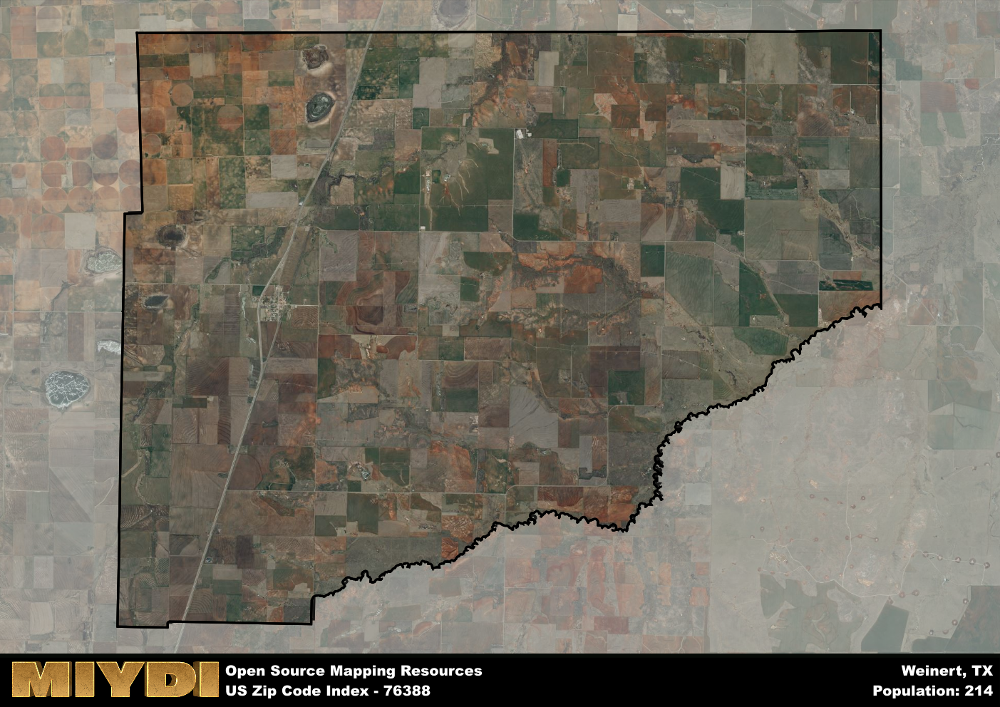

**Area Name:** Weinert

**Zip Code:** 76388

**State:** TX

# Weinert: A Historic Gem in North Central Texas

Located within the zip code 76388, Weinert is a charming rural community situated in north central Texas. Bordered by the towns of Munday and Goree, Weinert is part of the larger Knox County and is approximately 40 miles east of Wichita Falls. The area is known for its vast farmlands, rolling hills, and friendly community atmosphere. Weinert serves as a peaceful retreat from the hustle and bustle of nearby urban centers.

Weinert has a rich historical background dating back to the early 20th century when it was established as a railroad town along the Wichita Valley Railway. Named after a local landowner, Weinert quickly became a hub for agriculture and commerce in the region. Over the years, the town has maintained its small-town charm while adapting to modern times. Residents take pride in preserving the town's heritage and traditions, making Weinert a unique blend of past and present.

Today, Weinert continues to thrive as a close-knit community with a strong focus on agriculture and ranching. The area boasts a variety of local businesses, including family-owned farms, ranches, and specialty shops. Residents and visitors alike can enjoy outdoor activities such as hunting, fishing, and hiking in the picturesque countryside. Weinert is also home to several historic sites, including the Weinert Depot Museum, which showcases the town's railroad history. With its scenic beauty and rich heritage, Weinert remains a hidden gem in the heart of Texas.

# Weinert Demographics

The population of Weinert is 214.  
Weinert has a population density of 1.6 per square mile.  
The area of Weinert is 134.14 square miles.  

## Weinert AI and Census Variables

The values presented in this dataset for Weinert are AI-optimized, streamlined, and categorized into relevant buckets for enhanced utility in AI and mapping programs. These simplified values have been optimized to facilitate efficient analysis and integration into various technological applications, offering users accessible and actionable insights into demographics within the Weinert area.

| AI Variables for Weinert | Value |
|-------------|-------|
| Shape Area | 498966203.949219 |
| Shape Length | 113351.528824859 |

## How to use this free AI optimized Geo-Spatial Data for Weinert, TX

This data is made freely available under the Creative Commons license, allowing for unrestricted use for any purpose. Users can access static resources directly from GitHub or leverage more advanced functionalities by utilizing the GeoJSON files. All datasets originate from official government or private sector sources and are meticulously compiled into relevant datasets within QGIS. However, the versatility of the data ensures compatibility with any mapping application.

## Data Accuracy Disclaimer
It's important to note that the data provided here may contain errors or discrepancies and should be considered as 'close enough' for business applications and AI rather than a definitive source of truth. This data is aggregated from multiple sources, some of which publish information on wildly different intervals, leading to potential inconsistencies. Additionally, certain data points may not be corrected for Covid-related changes, further impacting accuracy. Moreover, the assumption that demographic trends are consistent throughout a region may lead to discrepancies, as trends often concentrate in areas of highest population density. As a result, dense areas may be slightly underrepresented, while rural areas may be slightly overrepresented, resulting in a more conservative dataset. Furthermore, the focus primarily on areas within US Major and Minor Statistical areas means that approximately 40 million Americans living outside of these areas may not be fully represented. Lastly, the historical background and area descriptions generated using AI are susceptible to potential mistakes, so users should exercise caution when interpreting the information provided.
