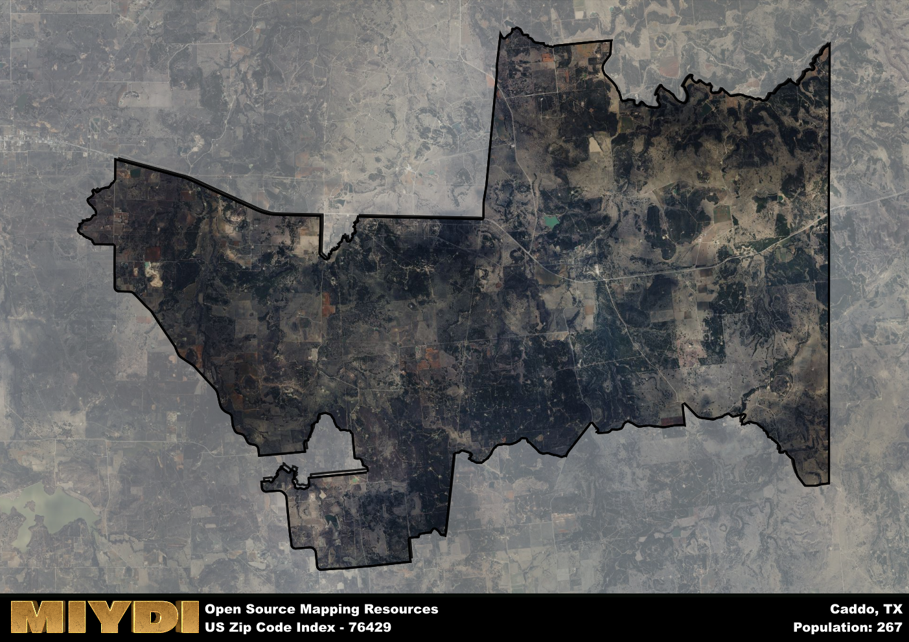

**Area Name:** Caddo

**Zip Code:** 76429

**State:** TX

Caddo is a part of the Mineral Wells - TX Micro Area, and makes up  of the Metro's population.  

# Exploring the Neighborhood of Caddo in Zip Code 76429  

Located in north-central Texas, zip code 76429 encompasses the charming neighborhood of Caddo. Bordered by rolling hills and scenic landscapes, Caddo is situated within close proximity to the bustling city of Mineral Wells. This zip code area serves as a peaceful residential enclave that enjoys easy access to major transportation routes, making it a convenient and desirable location for residents seeking a tranquil setting with urban amenities just a short drive away.

Caddo has a rich historical narrative dating back to the early settlement of the region. Named after the indigenous Caddo tribe that once inhabited the area, this neighborhood has evolved from a small frontier town to a thriving community known for its friendly atmosphere and tight-knit community spirit. Throughout the years, Caddo has maintained its rural charm while adapting to modern developments, preserving its heritage while embracing progress.

Today, Caddo offers a variety of local businesses, including quaint shops and cozy cafes that cater to residents and visitors alike. The area boasts recreational opportunities such as parks and hiking trails, providing outdoor enthusiasts with plenty of options to explore nature. Additionally, Caddo is home to several historic sites that showcase its heritage, inviting visitors to learn about the neighborhood's past. With a strong sense of community and a vibrant local culture, Caddo in zip code 76429 continues to thrive as a hidden gem in the heart of Texas.

# Caddo Demographics

The population of Caddo is 267.  
Caddo has a population density of 2.72 per square mile.  
The area of Caddo is 98.14 square miles.  

## Caddo AI and Census Variables

The values presented in this dataset for Caddo are AI-optimized, streamlined, and categorized into relevant buckets for enhanced utility in AI and mapping programs. These simplified values have been optimized to facilitate efficient analysis and integration into various technological applications, offering users accessible and actionable insights into demographics within the Caddo area.

| AI Variables for Caddo | Value |
|-------------|-------|
| Shape Area | 360030508.226563 |
| Shape Length | 134673.255158931 |
| CBSA Federal Processing Standard Code | 33420 |

## How to use this free AI optimized Geo-Spatial Data for Caddo, TX

This data is made freely available under the Creative Commons license, allowing for unrestricted use for any purpose. Users can access static resources directly from GitHub or leverage more advanced functionalities by utilizing the GeoJSON files. All datasets originate from official government or private sector sources and are meticulously compiled into relevant datasets within QGIS. However, the versatility of the data ensures compatibility with any mapping application.

## Data Accuracy Disclaimer
It's important to note that the data provided here may contain errors or discrepancies and should be considered as 'close enough' for business applications and AI rather than a definitive source of truth. This data is aggregated from multiple sources, some of which publish information on wildly different intervals, leading to potential inconsistencies. Additionally, certain data points may not be corrected for Covid-related changes, further impacting accuracy. Moreover, the assumption that demographic trends are consistent throughout a region may lead to discrepancies, as trends often concentrate in areas of highest population density. As a result, dense areas may be slightly underrepresented, while rural areas may be slightly overrepresented, resulting in a more conservative dataset. Furthermore, the focus primarily on areas within US Major and Minor Statistical areas means that approximately 40 million Americans living outside of these areas may not be fully represented. Lastly, the historical background and area descriptions generated using AI are susceptible to potential mistakes, so users should exercise caution when interpreting the information provided.
