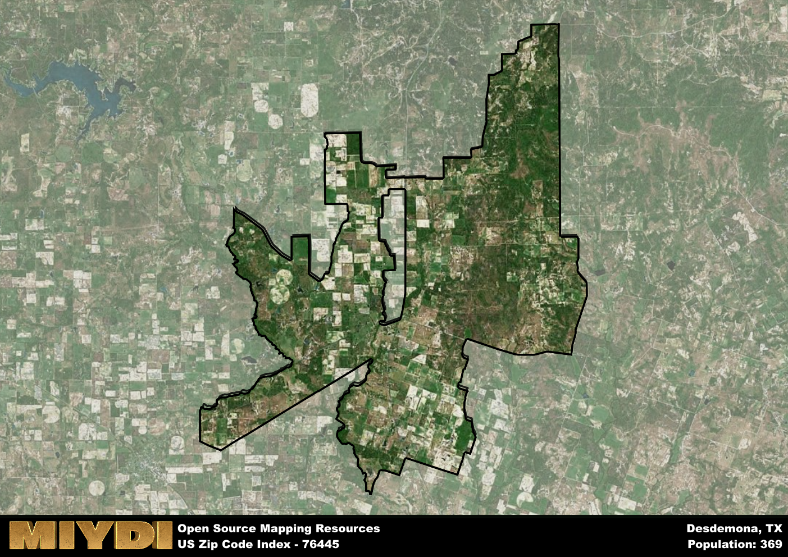

**Area Name:** Desdemona

**Zip Code:** 76445

**State:** TX

Desdemona is a part of the Stephenville - TX Micro Area, and makes up  of the Metro's population.  

# Desdemona: A Historic Gem in Rural Texas

Desdemona, located in the 76445 zip code area, is a small community situated in Eastland County, Texas. Surrounded by vast prairies and farmland, Desdemona is approximately 30 miles southwest of the city of Eastland and 100 miles west of Fort Worth. Despite its rural setting, Desdemona is well-connected to nearby towns through State Highway 16, making it a convenient stop for travelers exploring the heart of Texas.

Originally settled in the late 19th century, Desdemona was named after the heroine in William Shakespeare's tragedy, "Othello." The town experienced a period of growth during the early 1900s when coal mining became a significant economic activity in the area. Today, Desdemona retains its small-town charm with historic buildings lining its streets, serving as a reminder of its coal mining past. The local community takes pride in preserving the town's heritage and celebrating its unique history.

Presently, Desdemona is a close-knit community that values its agricultural roots. The town is home to a mix of family-owned farms and ranches, contributing to the local economy. Residents and visitors alike can enjoy the tranquility of the countryside, with opportunities for outdoor recreation such as fishing and hunting in the nearby lakes and forests. Desdemona also hosts annual events that showcase its rich cultural heritage, attracting visitors from neighboring towns. With its scenic landscapes and historical charm, Desdemona stands out as a hidden gem in rural Texas.

# Desdemona Demographics

The population of Desdemona is 369.  
Desdemona has a population density of 5.95 per square mile.  
The area of Desdemona is 62.05 square miles.  

## Desdemona Income and Economic Data

These demographic numbers are sourced from IRS return data, providing comprehensive insights into the population dynamics and economic trends within Desdemona.

**Breakdown of return types for Desdemona**

The table offers insight into the composition of tax returns filed with the IRS, categorizing them into three main types. Single returns represent filings by individuals, joint returns by married couples, and head of household returns by individuals who qualify as heads of households, typically having dependents. This breakdown provides an understanding of the different filing statuses adopted by taxpayers when submitting their tax documentation.

| Return Types filed for Desdemona                              | Percentage          |
|----------------------------------------------------------|---------------------|
| Single Returns                                            | 0.44 |
| Joint Returns                                             | 0.44 |
| Head Household Returns                                    | 0 |

The income and economic data presented here is sourced from the IRS income brackets, utilized for categorizing tax returns by income levels. This table displays income ranges for both single filers and married couples, along with the corresponding number of returns and the percentage within each bracket, providing valuable insight into the distribution of taxes across various income groups.

| Bracket Name       | Single Filer Income Range | Married Couple Range | Number of Returns | Percentage of Returns |
|--------------------|----------------------------|----------------------|-------------------|-----------------------|
| 10% Bracket        | Up to $10,275              | Up to $20,550        | 60 | 0.38% |
| 12% Bracket        | $10,276 - $41,775          | $20,551 - $83,550    | 40 | 0.25% |
| 22% Bracket        | $41,776 - $89,075          | $83,551 - $178,150   | 40 | 0.25% |
| 24% Bracket        | $89,076 - $170,050         | $178,151 - $340,100  | 0 | 0% |
| 32% Bracket        | $170,051 - $215,950        | $340,101 - $431,900  | 20 | 0.13% |
| 35% Bracket        | $215,951 - $539,900        | $431,901 - $647,850  | 0 | 0% |

### Exploring Taxpayer Diversity: A Breakdown of Different Types of Tax Returns in Desdemona

The table offers insights into various types of tax returns filed, reflecting different aspects of taxpayer activities and demographics. Categories include charitable returns for donations, dependent returns for claimed dependents, educator population, elderly population, real estate returns, self-employment returns, student loan returns, and unemployment returns, providing valuable insights into taxpayer behavior and demographics.

| Desdemona Filing Types                    | Count | Percentage |
|--------------------------------------|-------|------------|
| Charitable Donations                 | 0 | 0% |
| Dependents Claimed                   | 0 | 0% |
| Educator Residents                   | 0 | 0% |
| Elderly Population                   | 50 | 0.31% |
| Farming Population                   | 50 | 0.313% |
| Real Estate Transactions             | 0 | 0% |
| Self-Employed Individuals            | 20 | 0.125% |
| Student Loan Cases                   | 0 | 0% |
| Unemployment Benefit Filings         | 0 | 0% |

## Desdemona AI and Census Variables

The values presented in this dataset for Desdemona are AI-optimized, streamlined, and categorized into relevant buckets for enhanced utility in AI and mapping programs. These simplified values have been optimized to facilitate efficient analysis and integration into various technological applications, offering users accessible and actionable insights into demographics within the Desdemona area.

| AI Variables for Desdemona | Value |
|-------------|-------|
| Shape Area | 225529524.492188 |
| Shape Length | 138685.472578331 |
| CBSA Federal Processing Standard Code | 44500 |

## How to use this free AI optimized Geo-Spatial Data for Desdemona, TX

This data is made freely available under the Creative Commons license, allowing for unrestricted use for any purpose. Users can access static resources directly from GitHub or leverage more advanced functionalities by utilizing the GeoJSON files. All datasets originate from official government or private sector sources and are meticulously compiled into relevant datasets within QGIS. However, the versatility of the data ensures compatibility with any mapping application.

## Data Accuracy Disclaimer
It's important to note that the data provided here may contain errors or discrepancies and should be considered as 'close enough' for business applications and AI rather than a definitive source of truth. This data is aggregated from multiple sources, some of which publish information on wildly different intervals, leading to potential inconsistencies. Additionally, certain data points may not be corrected for Covid-related changes, further impacting accuracy. Moreover, the assumption that demographic trends are consistent throughout a region may lead to discrepancies, as trends often concentrate in areas of highest population density. As a result, dense areas may be slightly underrepresented, while rural areas may be slightly overrepresented, resulting in a more conservative dataset. Furthermore, the focus primarily on areas within US Major and Minor Statistical areas means that approximately 40 million Americans living outside of these areas may not be fully represented. Lastly, the historical background and area descriptions generated using AI are susceptible to potential mistakes, so users should exercise caution when interpreting the information provided.
