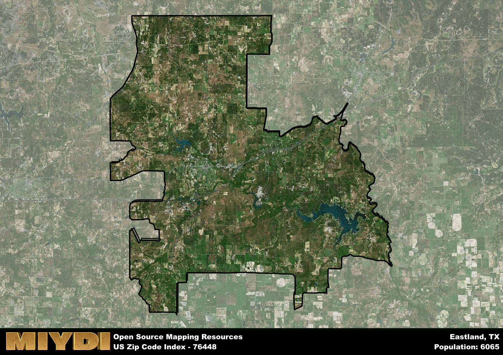

**Area Name:** Eastland

**Zip Code:** 76448

**State:** TX

# Exploring Eastland: A Historic and Vibrant Neighborhood in Zip Code 76448

Situated in the heart of Eastland County, zip code 76448 encompasses the charming neighborhood of Eastland, Texas. Bordered by rolling hills and vast farmlands, Eastland seamlessly integrates with the larger city of Eastland and neighboring towns like Ranger and Carbon. As part of the Dallas-Fort Worth metroplex, Eastland serves as a bustling hub for both residents and visitors seeking a mix of small-town charm and urban convenience.

Eastland has a rich historical narrative that dates back to the mid-19th century when settlers established the area as a center for ranching and agriculture. The town experienced rapid growth during the Texas oil boom, attracting new industries and residents looking for economic opportunities. Throughout the years, Eastland has preserved its historic architecture and landmarks, such as the Eastland County Courthouse and the Old Rip Park, which serve as reminders of its storied past.

Today, Eastland thrives as a diverse community with a strong emphasis on agriculture, retail, and healthcare services. Residents and visitors can enjoy a variety of recreational activities, including fishing at Lake Leon, hiking along the Leon River, and exploring the vibrant downtown area filled with local shops and restaurants. With a mix of historic charm and modern amenities, Eastland continues to be a dynamic neighborhood that captures the essence of Texas heritage and hospitality.

# Eastland Demographics

The population of Eastland is 6065.  
Eastland has a population density of 43.11 per square mile.  
The area of Eastland is 140.68 square miles.  

## Eastland Income and Economic Data

These demographic numbers are sourced from IRS return data, providing comprehensive insights into the population dynamics and economic trends within Eastland.

**Breakdown of return types for Eastland**

The table offers insight into the composition of tax returns filed with the IRS, categorizing them into three main types. Single returns represent filings by individuals, joint returns by married couples, and head of household returns by individuals who qualify as heads of households, typically having dependents. This breakdown provides an understanding of the different filing statuses adopted by taxpayers when submitting their tax documentation.

| Return Types filed for Eastland                              | Percentage          |
|----------------------------------------------------------|---------------------|
| Single Returns                                            | 0.44 |
| Joint Returns                                             | 0.44 |
| Head Household Returns                                    | 0.11 |

The income and economic data presented here is sourced from the IRS income brackets, utilized for categorizing tax returns by income levels. This table displays income ranges for both single filers and married couples, along with the corresponding number of returns and the percentage within each bracket, providing valuable insight into the distribution of taxes across various income groups.

| Bracket Name       | Single Filer Income Range | Married Couple Range | Number of Returns | Percentage of Returns |
|--------------------|----------------------------|----------------------|-------------------|-----------------------|
| 10% Bracket        | Up to $10,275              | Up to $20,550        | 940 | 0.38% |
| 12% Bracket        | $10,276 - $41,775          | $20,551 - $83,550    | 650 | 0.26% |
| 22% Bracket        | $41,776 - $89,075          | $83,551 - $178,150   | 340 | 0.14% |
| 24% Bracket        | $89,076 - $170,050         | $178,151 - $340,100  | 200 | 0.08% |
| 32% Bracket        | $170,051 - $215,950        | $340,101 - $431,900  | 290 | 0.12% |
| 35% Bracket        | $215,951 - $539,900        | $431,901 - $647,850  | 80 | 0.03% |

### Exploring Taxpayer Diversity: A Breakdown of Different Types of Tax Returns in Eastland

The table offers insights into various types of tax returns filed, reflecting different aspects of taxpayer activities and demographics. Categories include charitable returns for donations, dependent returns for claimed dependents, educator population, elderly population, real estate returns, self-employment returns, student loan returns, and unemployment returns, providing valuable insights into taxpayer behavior and demographics.

| Eastland Filing Types                    | Count | Percentage |
|--------------------------------------|-------|------------|
| Charitable Donations                 | 70 | 0.028% |
| Dependents Claimed                   | 50 | 0.02% |
| Educator Residents                   | 50 | 0.02% |
| Elderly Population                   | 770 | 0.31% |
| Farming Population                   | 180 | 0.072% |
| Real Estate Transactions             | 70 | 0.028% |
| Self-Employed Individuals            | 330 | 0.132% |
| Student Loan Cases                   | 100 | 0.04% |
| Unemployment Benefit Filings         | 260 | 0.1% |

## Eastland AI and Census Variables

The values presented in this dataset for Eastland are AI-optimized, streamlined, and categorized into relevant buckets for enhanced utility in AI and mapping programs. These simplified values have been optimized to facilitate efficient analysis and integration into various technological applications, offering users accessible and actionable insights into demographics within the Eastland area.

| AI Variables for Eastland | Value |
|-------------|-------|
| Shape Area | 512565347.109375 |
| Shape Length | 159140.354290029 |

## How to use this free AI optimized Geo-Spatial Data for Eastland, TX

This data is made freely available under the Creative Commons license, allowing for unrestricted use for any purpose. Users can access static resources directly from GitHub or leverage more advanced functionalities by utilizing the GeoJSON files. All datasets originate from official government or private sector sources and are meticulously compiled into relevant datasets within QGIS. However, the versatility of the data ensures compatibility with any mapping application.

## Data Accuracy Disclaimer
It's important to note that the data provided here may contain errors or discrepancies and should be considered as 'close enough' for business applications and AI rather than a definitive source of truth. This data is aggregated from multiple sources, some of which publish information on wildly different intervals, leading to potential inconsistencies. Additionally, certain data points may not be corrected for Covid-related changes, further impacting accuracy. Moreover, the assumption that demographic trends are consistent throughout a region may lead to discrepancies, as trends often concentrate in areas of highest population density. As a result, dense areas may be slightly underrepresented, while rural areas may be slightly overrepresented, resulting in a more conservative dataset. Furthermore, the focus primarily on areas within US Major and Minor Statistical areas means that approximately 40 million Americans living outside of these areas may not be fully represented. Lastly, the historical background and area descriptions generated using AI are susceptible to potential mistakes, so users should exercise caution when interpreting the information provided.
