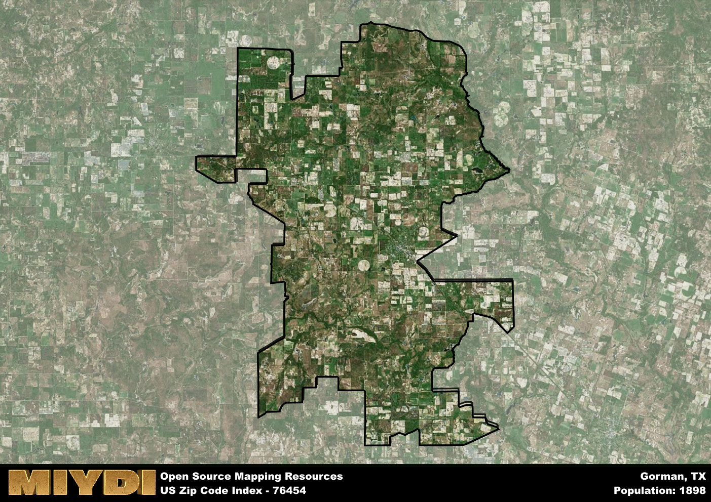

**Area Name:** Gorman

**Zip Code:** 76454

**State:** TX

# Gorman: A Historic and Thriving Community in Zip Code 76454

Located in Eastland County, Texas, the zip code 76454 area corresponds to the charming town of Gorman. Situated within the Dallas-Fort Worth metropolitan area, Gorman is surrounded by rural landscapes and is approximately a two-hour drive from the bustling city centers. The town is easily accessible via major highways and offers a tranquil escape from the urban hustle and bustle.

Established in the late 19th century, Gorman has a rich history rooted in agriculture and ranching. The town was named after James A. Gorman, a prominent local landowner and businessman. Over the years, Gorman has evolved into a close-knit community with a strong sense of pride in its heritage. The town's historic downtown area features well-preserved buildings that harken back to its early days, providing visitors with a glimpse into its past.

Today, Gorman is a thriving community with a diverse economy that includes agriculture, small businesses, and services catering to residents and visitors alike. The town offers a range of amenities such as parks, recreational facilities, and locally-owned shops and restaurants. Residents enjoy a high quality of life in Gorman, with affordable housing options and a strong sense of community spirit. The town also boasts cultural and historic sites that celebrate its unique identity, making it a hidden gem within the larger urban fabric of the Dallas-Fort Worth metroplex.

# Gorman Demographics

The population of Gorman is 1898.  
Gorman has a population density of 17.25 per square mile.  
The area of Gorman is 110.04 square miles.  

## Gorman Income and Economic Data

These demographic numbers are sourced from IRS return data, providing comprehensive insights into the population dynamics and economic trends within Gorman.

**Breakdown of return types for Gorman**

The table offers insight into the composition of tax returns filed with the IRS, categorizing them into three main types. Single returns represent filings by individuals, joint returns by married couples, and head of household returns by individuals who qualify as heads of households, typically having dependents. This breakdown provides an understanding of the different filing statuses adopted by taxpayers when submitting their tax documentation.

| Return Types filed for Gorman                              | Percentage          |
|----------------------------------------------------------|---------------------|
| Single Returns                                            | 0.44 |
| Joint Returns                                             | 0.44 |
| Head Household Returns                                    | 0.12 |

The income and economic data presented here is sourced from the IRS income brackets, utilized for categorizing tax returns by income levels. This table displays income ranges for both single filers and married couples, along with the corresponding number of returns and the percentage within each bracket, providing valuable insight into the distribution of taxes across various income groups.

| Bracket Name       | Single Filer Income Range | Married Couple Range | Number of Returns | Percentage of Returns |
|--------------------|----------------------------|----------------------|-------------------|-----------------------|
| 10% Bracket        | Up to $10,275              | Up to $20,550        | 240 | 0.35% |
| 12% Bracket        | $10,276 - $41,775          | $20,551 - $83,550    | 220 | 0.32% |
| 22% Bracket        | $41,776 - $89,075          | $83,551 - $178,150   | 110 | 0.16% |
| 24% Bracket        | $89,076 - $170,050         | $178,151 - $340,100  | 50 | 0.07% |
| 32% Bracket        | $170,051 - $215,950        | $340,101 - $431,900  | 60 | 0.09% |
| 35% Bracket        | $215,951 - $539,900        | $431,901 - $647,850  | 0 | 0% |

### Exploring Taxpayer Diversity: A Breakdown of Different Types of Tax Returns in Gorman

The table offers insights into various types of tax returns filed, reflecting different aspects of taxpayer activities and demographics. Categories include charitable returns for donations, dependent returns for claimed dependents, educator population, elderly population, real estate returns, self-employment returns, student loan returns, and unemployment returns, providing valuable insights into taxpayer behavior and demographics.

| Gorman Filing Types                    | Count | Percentage |
|--------------------------------------|-------|------------|
| Charitable Donations                 | 0 | 0% |
| Dependents Claimed                   | 0 | 0% |
| Educator Residents                   | 0 | 0% |
| Elderly Population                   | 210 | 0.31% |
| Farming Population                   | 120 | 0.176% |
| Real Estate Transactions             | 0 | 0% |
| Self-Employed Individuals            | 130 | 0.191% |
| Student Loan Cases                   | 0 | 0% |
| Unemployment Benefit Filings         | 60 | 0.09% |

## Gorman AI and Census Variables

The values presented in this dataset for Gorman are AI-optimized, streamlined, and categorized into relevant buckets for enhanced utility in AI and mapping programs. These simplified values have been optimized to facilitate efficient analysis and integration into various technological applications, offering users accessible and actionable insights into demographics within the Gorman area.

| AI Variables for Gorman | Value |
|-------------|-------|
| Shape Area | 399381243.960938 |
| Shape Length | 147187.333645909 |

## How to use this free AI optimized Geo-Spatial Data for Gorman, TX

This data is made freely available under the Creative Commons license, allowing for unrestricted use for any purpose. Users can access static resources directly from GitHub or leverage more advanced functionalities by utilizing the GeoJSON files. All datasets originate from official government or private sector sources and are meticulously compiled into relevant datasets within QGIS. However, the versatility of the data ensures compatibility with any mapping application.

## Data Accuracy Disclaimer
It's important to note that the data provided here may contain errors or discrepancies and should be considered as 'close enough' for business applications and AI rather than a definitive source of truth. This data is aggregated from multiple sources, some of which publish information on wildly different intervals, leading to potential inconsistencies. Additionally, certain data points may not be corrected for Covid-related changes, further impacting accuracy. Moreover, the assumption that demographic trends are consistent throughout a region may lead to discrepancies, as trends often concentrate in areas of highest population density. As a result, dense areas may be slightly underrepresented, while rural areas may be slightly overrepresented, resulting in a more conservative dataset. Furthermore, the focus primarily on areas within US Major and Minor Statistical areas means that approximately 40 million Americans living outside of these areas may not be fully represented. Lastly, the historical background and area descriptions generated using AI are susceptible to potential mistakes, so users should exercise caution when interpreting the information provided.
