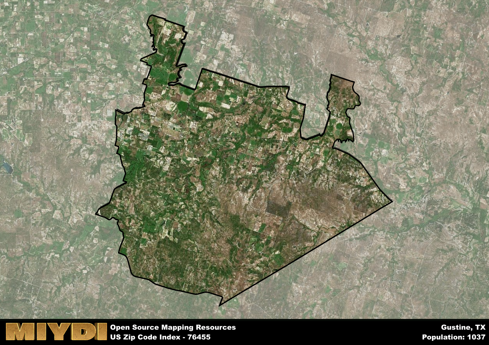

**Area Name:** Gustine

**Zip Code:** 76455

**State:** TX

# Gustine: A Unique Community in Central Texas

Located in central Texas, the zip code 76455 encompasses the small town of Gustine. Situated within Comanche County, Gustine is surrounded by rural landscapes and farmland, making it a peaceful retreat from the hustle and bustle of nearby cities. Despite its tranquil setting, Gustine is easily accessible from major population centers such as Dallas and Fort Worth, allowing residents to enjoy the best of both worlds - small-town charm with urban conveniences just a short drive away.

Gustine has a rich history dating back to its settlement in the late 1800s. Originally established as a farming community, Gustine grew rapidly thanks to the fertile soil and favorable climate of the region. The town was named after Gustavus Adolphus Fischer, a prominent landowner and early settler in the area. Over the years, Gustine has maintained its agricultural roots while also embracing modern developments, creating a unique blend of tradition and progress that defines its character today.

Today, Gustine is a close-knit community with a strong sense of pride in its heritage. The town's economy is primarily based on agriculture, with many residents working in farming and ranching. Gustine offers a range of neighborhood-specific services, including local shops, restaurants, and schools, making it a self-sustaining community. In addition to its economic activities, Gustine boasts several recreational amenities and cultural sites, such as parks, museums, and historic buildings, which showcase the town's rich history and vibrant community spirit.

# Gustine Demographics

The population of Gustine is 1037.  
Gustine has a population density of 8.33 per square mile.  
The area of Gustine is 124.49 square miles.  

## Gustine Income and Economic Data

These demographic numbers are sourced from IRS return data, providing comprehensive insights into the population dynamics and economic trends within Gustine.

**Breakdown of return types for Gustine**

The table offers insight into the composition of tax returns filed with the IRS, categorizing them into three main types. Single returns represent filings by individuals, joint returns by married couples, and head of household returns by individuals who qualify as heads of households, typically having dependents. This breakdown provides an understanding of the different filing statuses adopted by taxpayers when submitting their tax documentation.

| Return Types filed for Gustine                              | Percentage          |
|----------------------------------------------------------|---------------------|
| Single Returns                                            | 0.36 |
| Joint Returns                                             | 0.47 |
| Head Household Returns                                    | 0.11 |

The income and economic data presented here is sourced from the IRS income brackets, utilized for categorizing tax returns by income levels. This table displays income ranges for both single filers and married couples, along with the corresponding number of returns and the percentage within each bracket, providing valuable insight into the distribution of taxes across various income groups.

| Bracket Name       | Single Filer Income Range | Married Couple Range | Number of Returns | Percentage of Returns |
|--------------------|----------------------------|----------------------|-------------------|-----------------------|
| 10% Bracket        | Up to $10,275              | Up to $20,550        | 130 | 0.36% |
| 12% Bracket        | $10,276 - $41,775          | $20,551 - $83,550    | 110 | 0.31% |
| 22% Bracket        | $41,776 - $89,075          | $83,551 - $178,150   | 50 | 0.14% |
| 24% Bracket        | $89,076 - $170,050         | $178,151 - $340,100  | 30 | 0.08% |
| 32% Bracket        | $170,051 - $215,950        | $340,101 - $431,900  | 40 | 0.11% |
| 35% Bracket        | $215,951 - $539,900        | $431,901 - $647,850  | 0 | 0% |

### Exploring Taxpayer Diversity: A Breakdown of Different Types of Tax Returns in Gustine

The table offers insights into various types of tax returns filed, reflecting different aspects of taxpayer activities and demographics. Categories include charitable returns for donations, dependent returns for claimed dependents, educator population, elderly population, real estate returns, self-employment returns, student loan returns, and unemployment returns, providing valuable insights into taxpayer behavior and demographics.

| Gustine Filing Types                    | Count | Percentage |
|--------------------------------------|-------|------------|
| Charitable Donations                 | 0 | 0% |
| Dependents Claimed                   | 0 | 0% |
| Educator Residents                   | 0 | 0% |
| Elderly Population                   | 120 | 0.33% |
| Farming Population                   | 70 | 0.194% |
| Real Estate Transactions             | 0 | 0% |
| Self-Employed Individuals            | 50 | 0.139% |
| Student Loan Cases                   | 0 | 0% |
| Unemployment Benefit Filings         | 20 | 0.06% |

## Gustine AI and Census Variables

The values presented in this dataset for Gustine are AI-optimized, streamlined, and categorized into relevant buckets for enhanced utility in AI and mapping programs. These simplified values have been optimized to facilitate efficient analysis and integration into various technological applications, offering users accessible and actionable insights into demographics within the Gustine area.

| AI Variables for Gustine | Value |
|-------------|-------|
| Shape Area | 447892949.960938 |
| Shape Length | 133582.815801107 |

## How to use this free AI optimized Geo-Spatial Data for Gustine, TX

This data is made freely available under the Creative Commons license, allowing for unrestricted use for any purpose. Users can access static resources directly from GitHub or leverage more advanced functionalities by utilizing the GeoJSON files. All datasets originate from official government or private sector sources and are meticulously compiled into relevant datasets within QGIS. However, the versatility of the data ensures compatibility with any mapping application.

## Data Accuracy Disclaimer
It's important to note that the data provided here may contain errors or discrepancies and should be considered as 'close enough' for business applications and AI rather than a definitive source of truth. This data is aggregated from multiple sources, some of which publish information on wildly different intervals, leading to potential inconsistencies. Additionally, certain data points may not be corrected for Covid-related changes, further impacting accuracy. Moreover, the assumption that demographic trends are consistent throughout a region may lead to discrepancies, as trends often concentrate in areas of highest population density. As a result, dense areas may be slightly underrepresented, while rural areas may be slightly overrepresented, resulting in a more conservative dataset. Furthermore, the focus primarily on areas within US Major and Minor Statistical areas means that approximately 40 million Americans living outside of these areas may not be fully represented. Lastly, the historical background and area descriptions generated using AI are susceptible to potential mistakes, so users should exercise caution when interpreting the information provided.
