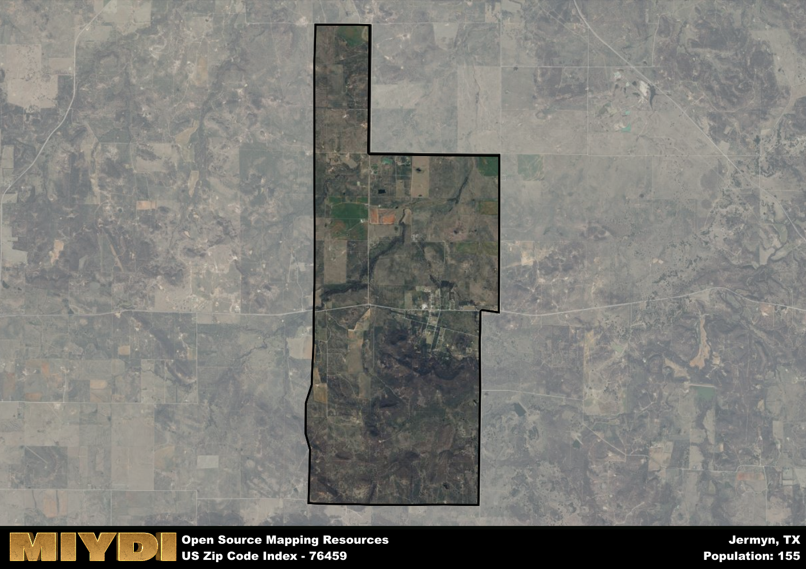

**Area Name:** Jermyn

**Zip Code:** 76459

**State:** TX

# Discover the Charming Neighborhood of Jermyn, Texas

Located within the zip code 76459, Jermyn is a small, tight-knit community nestled in the heart of Texas. Bordered by rolling hills and lush greenery, this neighborhood seamlessly integrates with the larger metropolitan area of Graham, providing residents with a serene escape from the hustle and bustle of city life. Jermyn is conveniently located just a short drive away from major population centers such as Fort Worth, allowing residents to easily access urban amenities while still enjoying the peaceful atmosphere of a close-knit community.

Originally settled in the late 19th century, Jermyn has a rich historical narrative that continues to shape its identity today. Named after an early settler, Jermyn has grown from a small farming community into a thriving residential area with a strong sense of heritage. Throughout its history, Jermyn has weathered economic shifts and changes in industry, but has remained resilient, preserving its unique character and charm. Today, visitors to Jermyn can explore historic sites such as the Jermyn Schoolhouse, which offers a glimpse into the neighborhood's past.

Presently, Jermyn is a vibrant community with a diverse economy that is supported by local businesses and agricultural activities. Residents can enjoy a variety of neighborhood-specific services, including quaint shops and restaurants that showcase the area's local flavor. For outdoor enthusiasts, Jermyn offers ample recreational opportunities, from hiking trails to fishing spots along the nearby Brazos River. With a strong sense of community spirit and a rich tapestry of cultural and historic sites, Jermyn stands out as a hidden gem within the larger urban fabric of Texas.

# Jermyn Demographics

The population of Jermyn is 155.  
Jermyn has a population density of 10.24 per square mile.  
The area of Jermyn is 15.13 square miles.  

## Jermyn AI and Census Variables

The values presented in this dataset for Jermyn are AI-optimized, streamlined, and categorized into relevant buckets for enhanced utility in AI and mapping programs. These simplified values have been optimized to facilitate efficient analysis and integration into various technological applications, offering users accessible and actionable insights into demographics within the Jermyn area.

| AI Variables for Jermyn | Value |
|-------------|-------|
| Shape Area | 56220617.3828125 |
| Shape Length | 38054.1044042729 |

## How to use this free AI optimized Geo-Spatial Data for Jermyn, TX

This data is made freely available under the Creative Commons license, allowing for unrestricted use for any purpose. Users can access static resources directly from GitHub or leverage more advanced functionalities by utilizing the GeoJSON files. All datasets originate from official government or private sector sources and are meticulously compiled into relevant datasets within QGIS. However, the versatility of the data ensures compatibility with any mapping application.

## Data Accuracy Disclaimer
It's important to note that the data provided here may contain errors or discrepancies and should be considered as 'close enough' for business applications and AI rather than a definitive source of truth. This data is aggregated from multiple sources, some of which publish information on wildly different intervals, leading to potential inconsistencies. Additionally, certain data points may not be corrected for Covid-related changes, further impacting accuracy. Moreover, the assumption that demographic trends are consistent throughout a region may lead to discrepancies, as trends often concentrate in areas of highest population density. As a result, dense areas may be slightly underrepresented, while rural areas may be slightly overrepresented, resulting in a more conservative dataset. Furthermore, the focus primarily on areas within US Major and Minor Statistical areas means that approximately 40 million Americans living outside of these areas may not be fully represented. Lastly, the historical background and area descriptions generated using AI are susceptible to potential mistakes, so users should exercise caution when interpreting the information provided.
