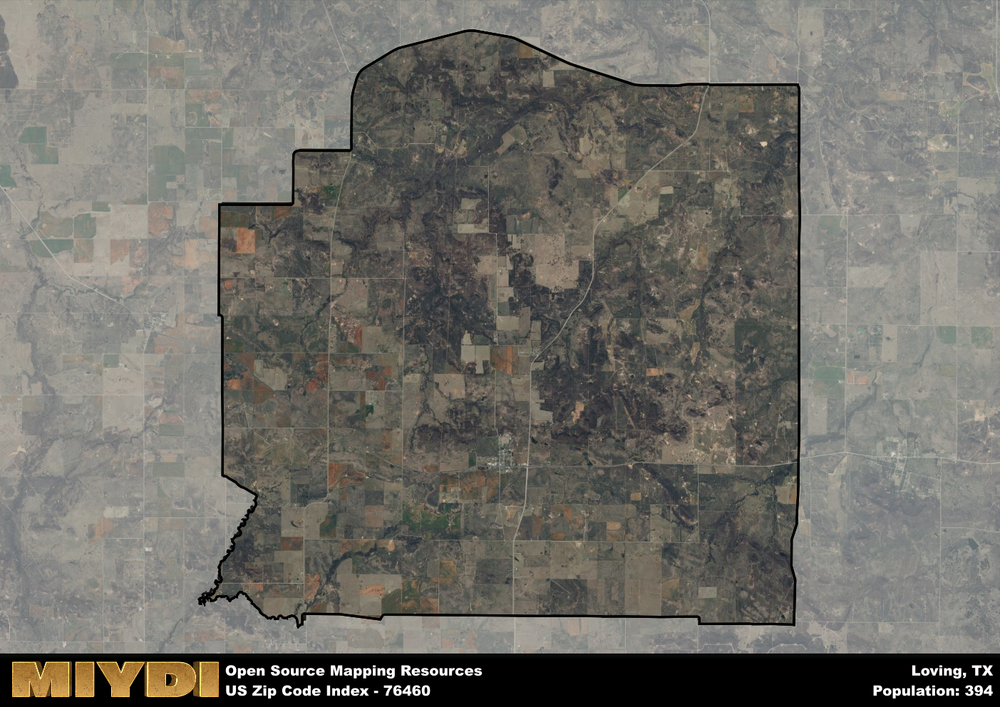

**Area Name:** Loving

**Zip Code:** 76460

**State:** TX

# Loving, TX 76460: A Charming Neighborhood in North Texas

Located in the heart of North Texas, the zip code 76460 area corresponds to the charming neighborhood of Loving. Situated within close proximity to major cities such as Fort Worth and Dallas, Loving seamlessly integrates with the larger urban fabric while maintaining its distinct small-town charm. The area is bordered by rolling countryside and is a popular residential choice for those seeking a peaceful retreat from the bustling city life.

Loving has a rich historical narrative that dates back to its establishment as a rural community in the late 19th century. Initially founded as a farming settlement, Loving experienced steady growth thanks to the development of transportation infrastructure in the region. The area was named after an early settler, and its history is marked by the resilience and hard work of its residents. Over the years, Loving has evolved into a close-knit community that values its heritage and traditions.

Today, Loving offers a mix of residential neighborhoods, small businesses, and recreational amenities that cater to its diverse population. The area's economy is primarily driven by agriculture and small businesses, providing residents with employment opportunities and a strong sense of community. Loving boasts well-maintained parks, local shops, and historic sites that celebrate its past. With its friendly atmosphere and convenient location, Loving continues to be a sought-after neighborhood in North Texas.

# Loving Demographics

The population of Loving is 394.  
Loving has a population density of 4.34 per square mile.  
The area of Loving is 90.71 square miles.  

## Loving Income and Economic Data

These demographic numbers are sourced from IRS return data, providing comprehensive insights into the population dynamics and economic trends within Loving.

**Breakdown of return types for Loving**

The table offers insight into the composition of tax returns filed with the IRS, categorizing them into three main types. Single returns represent filings by individuals, joint returns by married couples, and head of household returns by individuals who qualify as heads of households, typically having dependents. This breakdown provides an understanding of the different filing statuses adopted by taxpayers when submitting their tax documentation.

| Return Types filed for Loving                              | Percentage          |
|----------------------------------------------------------|---------------------|
| Single Returns                                            | 0.41 |
| Joint Returns                                             | 0.59 |
| Head Household Returns                                    | 0 |

The income and economic data presented here is sourced from the IRS income brackets, utilized for categorizing tax returns by income levels. This table displays income ranges for both single filers and married couples, along with the corresponding number of returns and the percentage within each bracket, providing valuable insight into the distribution of taxes across various income groups.

| Bracket Name       | Single Filer Income Range | Married Couple Range | Number of Returns | Percentage of Returns |
|--------------------|----------------------------|----------------------|-------------------|-----------------------|
| 10% Bracket        | Up to $10,275              | Up to $20,550        | 60 | 0.35% |
| 12% Bracket        | $10,276 - $41,775          | $20,551 - $83,550    | 40 | 0.24% |
| 22% Bracket        | $41,776 - $89,075          | $83,551 - $178,150   | 40 | 0.24% |
| 24% Bracket        | $89,076 - $170,050         | $178,151 - $340,100  | 0 | 0% |
| 32% Bracket        | $170,051 - $215,950        | $340,101 - $431,900  | 30 | 0.18% |
| 35% Bracket        | $215,951 - $539,900        | $431,901 - $647,850  | 0 | 0% |

### Exploring Taxpayer Diversity: A Breakdown of Different Types of Tax Returns in Loving

The table offers insights into various types of tax returns filed, reflecting different aspects of taxpayer activities and demographics. Categories include charitable returns for donations, dependent returns for claimed dependents, educator population, elderly population, real estate returns, self-employment returns, student loan returns, and unemployment returns, providing valuable insights into taxpayer behavior and demographics.

| Loving Filing Types                    | Count | Percentage |
|--------------------------------------|-------|------------|
| Charitable Donations                 | 0 | 0% |
| Dependents Claimed                   | 0 | 0% |
| Educator Residents                   | 0 | 0% |
| Elderly Population                   | 70 | 0.41% |
| Farming Population                   | 40 | 0.235% |
| Real Estate Transactions             | 0 | 0% |
| Self-Employed Individuals            | 30 | 0.176% |
| Student Loan Cases                   | 0 | 0% |
| Unemployment Benefit Filings         | 0 | 0% |

## Loving AI and Census Variables

The values presented in this dataset for Loving are AI-optimized, streamlined, and categorized into relevant buckets for enhanced utility in AI and mapping programs. These simplified values have been optimized to facilitate efficient analysis and integration into various technological applications, offering users accessible and actionable insights into demographics within the Loving area.

| AI Variables for Loving | Value |
|-------------|-------|
| Shape Area | 337165841.046875 |
| Shape Length | 81464.999736141 |

## How to use this free AI optimized Geo-Spatial Data for Loving, TX

This data is made freely available under the Creative Commons license, allowing for unrestricted use for any purpose. Users can access static resources directly from GitHub or leverage more advanced functionalities by utilizing the GeoJSON files. All datasets originate from official government or private sector sources and are meticulously compiled into relevant datasets within QGIS. However, the versatility of the data ensures compatibility with any mapping application.

## Data Accuracy Disclaimer
It's important to note that the data provided here may contain errors or discrepancies and should be considered as 'close enough' for business applications and AI rather than a definitive source of truth. This data is aggregated from multiple sources, some of which publish information on wildly different intervals, leading to potential inconsistencies. Additionally, certain data points may not be corrected for Covid-related changes, further impacting accuracy. Moreover, the assumption that demographic trends are consistent throughout a region may lead to discrepancies, as trends often concentrate in areas of highest population density. As a result, dense areas may be slightly underrepresented, while rural areas may be slightly overrepresented, resulting in a more conservative dataset. Furthermore, the focus primarily on areas within US Major and Minor Statistical areas means that approximately 40 million Americans living outside of these areas may not be fully represented. Lastly, the historical background and area descriptions generated using AI are susceptible to potential mistakes, so users should exercise caution when interpreting the information provided.
