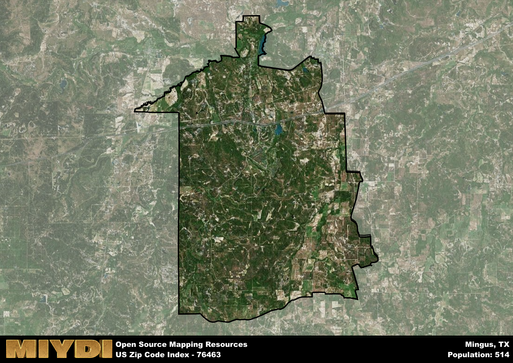

**Area Name:** Mingus

**Zip Code:** 76463

**State:** TX

Mingus is a part of the Stephenville - TX Micro Area, and makes up  of the Metro's population.  

# Mingus: A Historic Gem in Palo Pinto County

Mingus, corresponding to the zip code 76463, is a small unincorporated community located in Palo Pinto County, Texas. Situated approximately 70 miles west of Fort Worth, Mingus is bordered by the cities of Gordon to the north and Strawn to the south. The area is characterized by vast open spaces, rolling hills, and a close-knit community that prides itself on its rural charm. Despite its small size, Mingus plays an integral role in the region's agricultural economy and serves as a peaceful retreat from the nearby urban centers.

Founded in the late 19th century, Mingus has a rich historical legacy that dates back to its early days as a railroad town. The community was named after a local rancher and quickly grew into a bustling hub for cattle ranching and agriculture. Over the years, Mingus has weathered economic challenges and natural disasters, but its resilient spirit has allowed it to maintain its unique identity. Today, Mingus retains much of its historic charm, with well-preserved buildings and landmarks that offer a glimpse into its storied past.

Present-day Mingus is a blend of old-world charm and modern convenience. The area is home to a mix of family-owned businesses, farmsteads, and recreational opportunities that cater to both residents and visitors alike. Mingus boasts a thriving agricultural sector, with many farms and ranches producing crops and livestock for the local markets. In addition to its economic activities, Mingus offers a range of recreational amenities, including parks, hiking trails, and fishing spots. The community also takes pride in its historic sites, such as the Mingus Cemetery and the Mingus Baptist Church, which serve as reminders of its enduring heritage.

# Mingus Demographics

The population of Mingus is 514.  
Mingus has a population density of 6.4 per square mile.  
The area of Mingus is 80.25 square miles.  

## Mingus Income and Economic Data

These demographic numbers are sourced from IRS return data, providing comprehensive insights into the population dynamics and economic trends within Mingus.

**Breakdown of return types for Mingus**

The table offers insight into the composition of tax returns filed with the IRS, categorizing them into three main types. Single returns represent filings by individuals, joint returns by married couples, and head of household returns by individuals who qualify as heads of households, typically having dependents. This breakdown provides an understanding of the different filing statuses adopted by taxpayers when submitting their tax documentation.

| Return Types filed for Mingus                              | Percentage          |
|----------------------------------------------------------|---------------------|
| Single Returns                                            | 0.45 |
| Joint Returns                                             | 0.4 |
| Head Household Returns                                    | 0.1 |

The income and economic data presented here is sourced from the IRS income brackets, utilized for categorizing tax returns by income levels. This table displays income ranges for both single filers and married couples, along with the corresponding number of returns and the percentage within each bracket, providing valuable insight into the distribution of taxes across various income groups.

| Bracket Name       | Single Filer Income Range | Married Couple Range | Number of Returns | Percentage of Returns |
|--------------------|----------------------------|----------------------|-------------------|-----------------------|
| 10% Bracket        | Up to $10,275              | Up to $20,550        | 90 | 0.45% |
| 12% Bracket        | $10,276 - $41,775          | $20,551 - $83,550    | 50 | 0.25% |
| 22% Bracket        | $41,776 - $89,075          | $83,551 - $178,150   | 40 | 0.2% |
| 24% Bracket        | $89,076 - $170,050         | $178,151 - $340,100  | 0 | 0% |
| 32% Bracket        | $170,051 - $215,950        | $340,101 - $431,900  | 20 | 0.1% |
| 35% Bracket        | $215,951 - $539,900        | $431,901 - $647,850  | 0 | 0% |

### Exploring Taxpayer Diversity: A Breakdown of Different Types of Tax Returns in Mingus

The table offers insights into various types of tax returns filed, reflecting different aspects of taxpayer activities and demographics. Categories include charitable returns for donations, dependent returns for claimed dependents, educator population, elderly population, real estate returns, self-employment returns, student loan returns, and unemployment returns, providing valuable insights into taxpayer behavior and demographics.

| Mingus Filing Types                    | Count | Percentage |
|--------------------------------------|-------|------------|
| Charitable Donations                 | 0 | 0% |
| Dependents Claimed                   | 0 | 0% |
| Educator Residents                   | 0 | 0% |
| Elderly Population                   | 50 | 0.25% |
| Farming Population                   | 30 | 0.15% |
| Real Estate Transactions             | 0 | 0% |
| Self-Employed Individuals            | 30 | 0.15% |
| Student Loan Cases                   | 0 | 0% |
| Unemployment Benefit Filings         | 0 | 0% |

## Mingus AI and Census Variables

The values presented in this dataset for Mingus are AI-optimized, streamlined, and categorized into relevant buckets for enhanced utility in AI and mapping programs. These simplified values have been optimized to facilitate efficient analysis and integration into various technological applications, offering users accessible and actionable insights into demographics within the Mingus area.

| AI Variables for Mingus | Value |
|-------------|-------|
| Shape Area | 292809152.261719 |
| Shape Length | 95364.7920138602 |
| CBSA Federal Processing Standard Code | 44500 |

## How to use this free AI optimized Geo-Spatial Data for Mingus, TX

This data is made freely available under the Creative Commons license, allowing for unrestricted use for any purpose. Users can access static resources directly from GitHub or leverage more advanced functionalities by utilizing the GeoJSON files. All datasets originate from official government or private sector sources and are meticulously compiled into relevant datasets within QGIS. However, the versatility of the data ensures compatibility with any mapping application.

## Data Accuracy Disclaimer
It's important to note that the data provided here may contain errors or discrepancies and should be considered as 'close enough' for business applications and AI rather than a definitive source of truth. This data is aggregated from multiple sources, some of which publish information on wildly different intervals, leading to potential inconsistencies. Additionally, certain data points may not be corrected for Covid-related changes, further impacting accuracy. Moreover, the assumption that demographic trends are consistent throughout a region may lead to discrepancies, as trends often concentrate in areas of highest population density. As a result, dense areas may be slightly underrepresented, while rural areas may be slightly overrepresented, resulting in a more conservative dataset. Furthermore, the focus primarily on areas within US Major and Minor Statistical areas means that approximately 40 million Americans living outside of these areas may not be fully represented. Lastly, the historical background and area descriptions generated using AI are susceptible to potential mistakes, so users should exercise caution when interpreting the information provided.
