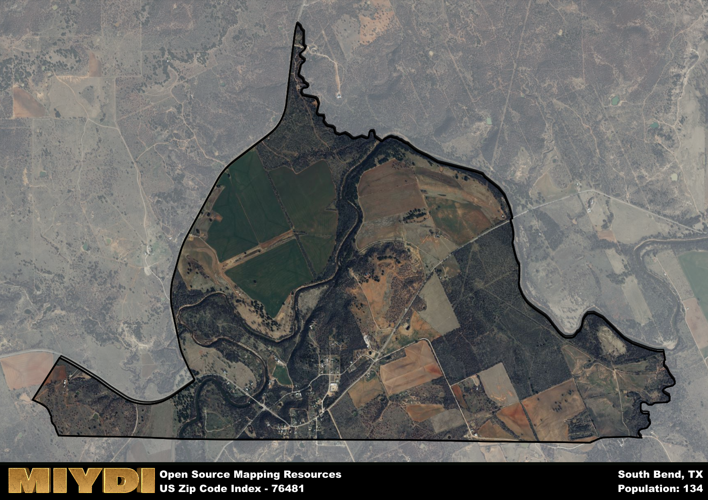

**Area Name:** South Bend

**Zip Code:** 76481

**State:** TX

# South Bend, TX - Zip Code 76481

Located in the heart of Texas, the zip code area 76481 corresponds to the charming neighborhood of South Bend. Situated within close proximity to the bustling city of Fort Worth, South Bend seamlessly integrates with the larger metropolitan context while maintaining its own unique identity. Bordered by scenic countryside and flourishing farmlands, South Bend offers residents a peaceful retreat from the urban hustle and bustle.

Originally settled in the mid-19th century by pioneers seeking fertile land for agriculture, South Bend has a rich historical narrative. The area experienced rapid growth during the railroad expansion, attracting new settlers and businesses. As a result, South Bend emerged as a vital hub for trade and commerce in the region. Over the years, the neighborhood has evolved into a tight-knit community, preserving its heritage while embracing modern developments.

Today, South Bend thrives as a vibrant community with a diverse economy. Local businesses cater to the needs of residents, offering a variety of services and products. The neighborhood boasts well-maintained parks and recreational facilities, providing ample opportunities for outdoor activities. Visitors can explore historic sites and cultural landmarks that showcase South Bend's unique character. With its picturesque surroundings and welcoming atmosphere, South Bend continues to be a sought-after destination for those seeking a peaceful and prosperous way of life.

# South Bend Demographics

The population of South Bend is 134.  
South Bend has a population density of 30.04 per square mile.  
The area of South Bend is 4.46 square miles.  

## South Bend AI and Census Variables

The values presented in this dataset for South Bend are AI-optimized, streamlined, and categorized into relevant buckets for enhanced utility in AI and mapping programs. These simplified values have been optimized to facilitate efficient analysis and integration into various technological applications, offering users accessible and actionable insights into demographics within the South Bend area.

| AI Variables for South Bend | Value |
|-------------|-------|
| Shape Area | 16467857.9375 |
| Shape Length | 23709.4238219972 |

## How to use this free AI optimized Geo-Spatial Data for South Bend, TX

This data is made freely available under the Creative Commons license, allowing for unrestricted use for any purpose. Users can access static resources directly from GitHub or leverage more advanced functionalities by utilizing the GeoJSON files. All datasets originate from official government or private sector sources and are meticulously compiled into relevant datasets within QGIS. However, the versatility of the data ensures compatibility with any mapping application.

## Data Accuracy Disclaimer
It's important to note that the data provided here may contain errors or discrepancies and should be considered as 'close enough' for business applications and AI rather than a definitive source of truth. This data is aggregated from multiple sources, some of which publish information on wildly different intervals, leading to potential inconsistencies. Additionally, certain data points may not be corrected for Covid-related changes, further impacting accuracy. Moreover, the assumption that demographic trends are consistent throughout a region may lead to discrepancies, as trends often concentrate in areas of highest population density. As a result, dense areas may be slightly underrepresented, while rural areas may be slightly overrepresented, resulting in a more conservative dataset. Furthermore, the focus primarily on areas within US Major and Minor Statistical areas means that approximately 40 million Americans living outside of these areas may not be fully represented. Lastly, the historical background and area descriptions generated using AI are susceptible to potential mistakes, so users should exercise caution when interpreting the information provided.
