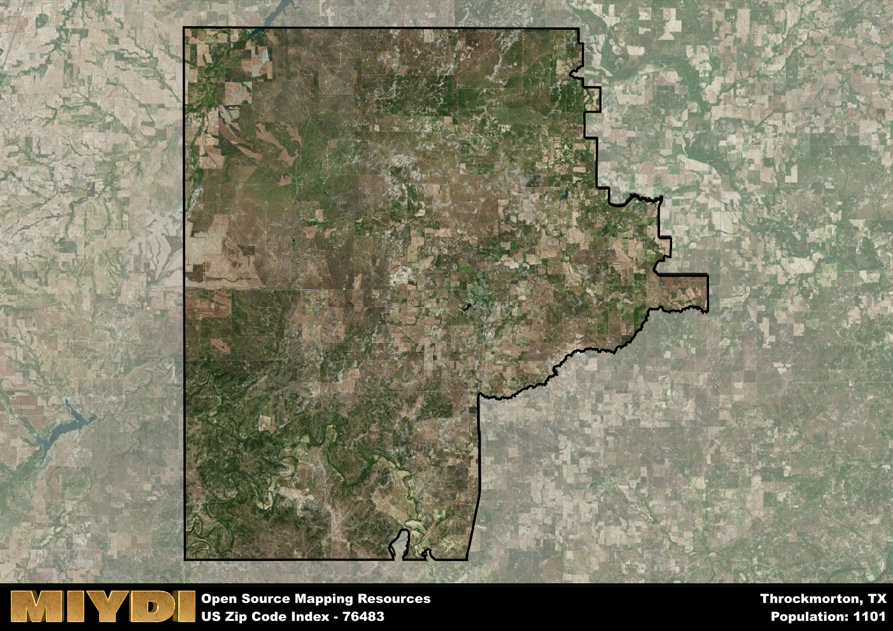

**Area Name:** Throckmorton

**Zip Code:** 76483

**State:** TX

# Throckmorton: A Historic Community in 76483  

Located in North Central Texas, Throckmorton is a small community within the zip code 76483. The area is bordered by the city of Throckmorton to the east, Woodson to the west, and Elbert to the north. Throckmorton is situated approximately 70 miles west of Wichita Falls and 130 miles northwest of Fort Worth, making it a rural enclave within a larger metropolitan context. Despite its proximity to larger cities, Throckmorton maintains its small-town charm and close-knit community feel.

Throckmorton has a rich historical narrative dating back to the mid-19th century when it was established as a trading post along the Fort Belknap Trail. The area experienced growth with the arrival of the Texas and Pacific Railway in the late 1800s, attracting settlers and businesses to the region. Throckmorton was officially incorporated in 1890 and named after Dr. William Throckmorton, a prominent local physician. The town has preserved its historic downtown area, showcasing architecture from the early 20th century and serving as a reminder of its past.

Today, Throckmorton is a vibrant community with a mix of agricultural and commercial activities. The area is known for its ranching and farming industries, with cattle ranches and cotton fields dotting the landscape. Throckmorton offers essential services such as schools, medical facilities, and local businesses to meet the needs of its residents. The town also boasts recreational amenities including parks, golf courses, and community events that bring residents together. Visitors can explore historic sites like the Throckmorton County Courthouse, which stands as a testament to the area's enduring heritage.

# Throckmorton Demographics

The population of Throckmorton is 1101.  
Throckmorton has a population density of 1.62 per square mile.  
The area of Throckmorton is 680.35 square miles.  

## Throckmorton Income and Economic Data

These demographic numbers are sourced from IRS return data, providing comprehensive insights into the population dynamics and economic trends within Throckmorton.

**Breakdown of return types for Throckmorton**

The table offers insight into the composition of tax returns filed with the IRS, categorizing them into three main types. Single returns represent filings by individuals, joint returns by married couples, and head of household returns by individuals who qualify as heads of households, typically having dependents. This breakdown provides an understanding of the different filing statuses adopted by taxpayers when submitting their tax documentation.

| Return Types filed for Throckmorton                              | Percentage          |
|----------------------------------------------------------|---------------------|
| Single Returns                                            | 0.39 |
| Joint Returns                                             | 0.45 |
| Head Household Returns                                    | 0.11 |

The income and economic data presented here is sourced from the IRS income brackets, utilized for categorizing tax returns by income levels. This table displays income ranges for both single filers and married couples, along with the corresponding number of returns and the percentage within each bracket, providing valuable insight into the distribution of taxes across various income groups.

| Bracket Name       | Single Filer Income Range | Married Couple Range | Number of Returns | Percentage of Returns |
|--------------------|----------------------------|----------------------|-------------------|-----------------------|
| 10% Bracket        | Up to $10,275              | Up to $20,550        | 140 | 0.32% |
| 12% Bracket        | $10,276 - $41,775          | $20,551 - $83,550    | 100 | 0.23% |
| 22% Bracket        | $41,776 - $89,075          | $83,551 - $178,150   | 90 | 0.2% |
| 24% Bracket        | $89,076 - $170,050         | $178,151 - $340,100  | 50 | 0.11% |
| 32% Bracket        | $170,051 - $215,950        | $340,101 - $431,900  | 60 | 0.14% |
| 35% Bracket        | $215,951 - $539,900        | $431,901 - $647,850  | 0 | 0% |

### Exploring Taxpayer Diversity: A Breakdown of Different Types of Tax Returns in Throckmorton

The table offers insights into various types of tax returns filed, reflecting different aspects of taxpayer activities and demographics. Categories include charitable returns for donations, dependent returns for claimed dependents, educator population, elderly population, real estate returns, self-employment returns, student loan returns, and unemployment returns, providing valuable insights into taxpayer behavior and demographics.

| Throckmorton Filing Types                    | Count | Percentage |
|--------------------------------------|-------|------------|
| Charitable Donations                 | 0 | 0% |
| Dependents Claimed                   | 0 | 0% |
| Educator Residents                   | 0 | 0% |
| Elderly Population                   | 150 | 0.34% |
| Farming Population                   | 80 | 0.182% |
| Real Estate Transactions             | 0 | 0% |
| Self-Employed Individuals            | 90 | 0.205% |
| Student Loan Cases                   | 0 | 0% |
| Unemployment Benefit Filings         | 20 | 0.05% |

## Throckmorton AI and Census Variables

The values presented in this dataset for Throckmorton are AI-optimized, streamlined, and categorized into relevant buckets for enhanced utility in AI and mapping programs. These simplified values have been optimized to facilitate efficient analysis and integration into various technological applications, offering users accessible and actionable insights into demographics within the Throckmorton area.

| AI Variables for Throckmorton | Value |
|-------------|-------|
| Shape Area | 2523103440.17188 |
| Shape Length | 271920.78751442 |

## How to use this free AI optimized Geo-Spatial Data for Throckmorton, TX

This data is made freely available under the Creative Commons license, allowing for unrestricted use for any purpose. Users can access static resources directly from GitHub or leverage more advanced functionalities by utilizing the GeoJSON files. All datasets originate from official government or private sector sources and are meticulously compiled into relevant datasets within QGIS. However, the versatility of the data ensures compatibility with any mapping application.

## Data Accuracy Disclaimer
It's important to note that the data provided here may contain errors or discrepancies and should be considered as 'close enough' for business applications and AI rather than a definitive source of truth. This data is aggregated from multiple sources, some of which publish information on wildly different intervals, leading to potential inconsistencies. Additionally, certain data points may not be corrected for Covid-related changes, further impacting accuracy. Moreover, the assumption that demographic trends are consistent throughout a region may lead to discrepancies, as trends often concentrate in areas of highest population density. As a result, dense areas may be slightly underrepresented, while rural areas may be slightly overrepresented, resulting in a more conservative dataset. Furthermore, the focus primarily on areas within US Major and Minor Statistical areas means that approximately 40 million Americans living outside of these areas may not be fully represented. Lastly, the historical background and area descriptions generated using AI are susceptible to potential mistakes, so users should exercise caution when interpreting the information provided.
