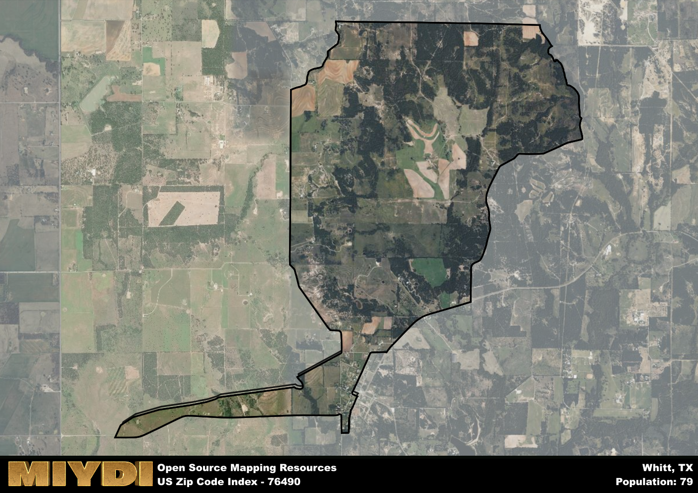

**Area Name:** Whitt

**Zip Code:** 76490

**State:** TX

Whitt is a part of the Dallas-Fort Worth-Arlington - TX Metro Area, and makes up  of the Metro's population.  

# Whitt: A Charming Community in Zip Code 76490

Located in Parker County, Texas, the zip code 76490 encompasses the quaint neighborhood of Whitt. Situated within close proximity to major cities such as Fort Worth and Weatherford, Whitt offers a peaceful retreat from the hustle and bustle of urban life. Surrounded by rolling hills and picturesque landscapes, the area provides a serene environment for residents while still maintaining convenient access to essential amenities and services in nearby metropolitan areas.

Originally settled in the late 1800s, Whitt has a rich historical background that dates back to the days of the Texas frontier. The area flourished as a farming and ranching community, attracting settlers seeking fertile land and new opportunities. Over the years, Whitt has evolved into a close-knit community with a strong sense of pride in its heritage. The name "Whitt" is believed to have been derived from an early settler or landowner, adding a personal touch to the area's identity.

Today, Whitt remains a charming community with a blend of rural charm and modern conveniences. The area is known for its agricultural activities, including cattle ranching and farming. Residents and visitors alike can enjoy the peaceful surroundings and participate in outdoor recreational activities such as hiking, fishing, and camping. Local businesses and services cater to the needs of the community, while historic sites and landmarks offer insight into Whitt's past. With its tranquil setting and welcoming atmosphere, Whitt continues to be a hidden gem within the larger metropolitan context of Parker County.

# Whitt Demographics

The population of Whitt is 79.  
Whitt has a population density of 14.47 per square mile.  
The area of Whitt is 5.46 square miles.  

## Whitt AI and Census Variables

The values presented in this dataset for Whitt are AI-optimized, streamlined, and categorized into relevant buckets for enhanced utility in AI and mapping programs. These simplified values have been optimized to facilitate efficient analysis and integration into various technological applications, offering users accessible and actionable insights into demographics within the Whitt area.

| AI Variables for Whitt | Value |
|-------------|-------|
| Shape Area | 20165946.1328125 |
| Shape Length | 27796.337142398 |
| CBSA Federal Processing Standard Code | 19100 |

## How to use this free AI optimized Geo-Spatial Data for Whitt, TX

This data is made freely available under the Creative Commons license, allowing for unrestricted use for any purpose. Users can access static resources directly from GitHub or leverage more advanced functionalities by utilizing the GeoJSON files. All datasets originate from official government or private sector sources and are meticulously compiled into relevant datasets within QGIS. However, the versatility of the data ensures compatibility with any mapping application.

## Data Accuracy Disclaimer
It's important to note that the data provided here may contain errors or discrepancies and should be considered as 'close enough' for business applications and AI rather than a definitive source of truth. This data is aggregated from multiple sources, some of which publish information on wildly different intervals, leading to potential inconsistencies. Additionally, certain data points may not be corrected for Covid-related changes, further impacting accuracy. Moreover, the assumption that demographic trends are consistent throughout a region may lead to discrepancies, as trends often concentrate in areas of highest population density. As a result, dense areas may be slightly underrepresented, while rural areas may be slightly overrepresented, resulting in a more conservative dataset. Furthermore, the focus primarily on areas within US Major and Minor Statistical areas means that approximately 40 million Americans living outside of these areas may not be fully represented. Lastly, the historical background and area descriptions generated using AI are susceptible to potential mistakes, so users should exercise caution when interpreting the information provided.
