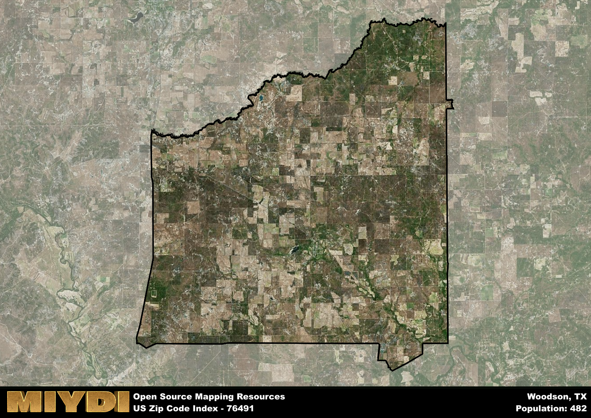

**Area Name:** Woodson

**Zip Code:** 76491

**State:** TX

# Woodson: A Charming Neighborhood in Texas  
Woodson, Texas, located within the 76491 zip code, is a quaint neighborhood nestled in the heart of the Lone Star State. The area is bordered by the city of Graham to the north and the town of Breckenridge to the south, making it a part of the larger metropolitan area of the region. Woodson seamlessly integrates with these surrounding districts, providing a peaceful residential enclave for its residents while offering easy access to nearby urban centers for work and entertainment.

Originally settled in the late 19th century, Woodson was named after a local landowner and has since grown into a close-knit community with a rich historical heritage. The neighborhood saw its fair share of growth during the oil boom of the early 20th century, attracting new residents and businesses to the area. Over time, Woodson has maintained its small-town charm while embracing modern developments, creating a unique blend of old-world charm and contemporary amenities that define its character today.

Today, Woodson offers a mix of residential housing, local businesses, and recreational opportunities for its residents. The neighborhood boasts a strong sense of community, with family-owned shops and restaurants lining its streets. Residents can enjoy outdoor activities at the nearby parks and recreational areas, immersing themselves in the natural beauty of the Texas landscape. Woodson also features several historic sites that showcase its past, adding to the neighborhood's allure as a charming and welcoming place to call home in Texas.

# Woodson Demographics

The population of Woodson is 482.  
Woodson has a population density of 3.02 per square mile.  
The area of Woodson is 159.84 square miles.  

## Woodson Income and Economic Data

These demographic numbers are sourced from IRS return data, providing comprehensive insights into the population dynamics and economic trends within Woodson.

**Breakdown of return types for Woodson**

The table offers insight into the composition of tax returns filed with the IRS, categorizing them into three main types. Single returns represent filings by individuals, joint returns by married couples, and head of household returns by individuals who qualify as heads of households, typically having dependents. This breakdown provides an understanding of the different filing statuses adopted by taxpayers when submitting their tax documentation.

| Return Types filed for Woodson                              | Percentage          |
|----------------------------------------------------------|---------------------|
| Single Returns                                            | 0.33 |
| Joint Returns                                             | 0.5 |
| Head Household Returns                                    | 0 |

The income and economic data presented here is sourced from the IRS income brackets, utilized for categorizing tax returns by income levels. This table displays income ranges for both single filers and married couples, along with the corresponding number of returns and the percentage within each bracket, providing valuable insight into the distribution of taxes across various income groups.

| Bracket Name       | Single Filer Income Range | Married Couple Range | Number of Returns | Percentage of Returns |
|--------------------|----------------------------|----------------------|-------------------|-----------------------|
| 10% Bracket        | Up to $10,275              | Up to $20,550        | 60 | 0.33% |
| 12% Bracket        | $10,276 - $41,775          | $20,551 - $83,550    | 40 | 0.22% |
| 22% Bracket        | $41,776 - $89,075          | $83,551 - $178,150   | 50 | 0.28% |
| 24% Bracket        | $89,076 - $170,050         | $178,151 - $340,100  | 0 | 0% |
| 32% Bracket        | $170,051 - $215,950        | $340,101 - $431,900  | 30 | 0.17% |
| 35% Bracket        | $215,951 - $539,900        | $431,901 - $647,850  | 0 | 0% |

### Exploring Taxpayer Diversity: A Breakdown of Different Types of Tax Returns in Woodson

The table offers insights into various types of tax returns filed, reflecting different aspects of taxpayer activities and demographics. Categories include charitable returns for donations, dependent returns for claimed dependents, educator population, elderly population, real estate returns, self-employment returns, student loan returns, and unemployment returns, providing valuable insights into taxpayer behavior and demographics.

| Woodson Filing Types                    | Count | Percentage |
|--------------------------------------|-------|------------|
| Charitable Donations                 | 0 | 0% |
| Dependents Claimed                   | 0 | 0% |
| Educator Residents                   | 0 | 0% |
| Elderly Population                   | 70 | 0.39% |
| Farming Population                   | 30 | 0.167% |
| Real Estate Transactions             | 0 | 0% |
| Self-Employed Individuals            | 30 | 0.167% |
| Student Loan Cases                   | 0 | 0% |
| Unemployment Benefit Filings         | 0 | 0% |

## Woodson AI and Census Variables

The values presented in this dataset for Woodson are AI-optimized, streamlined, and categorized into relevant buckets for enhanced utility in AI and mapping programs. These simplified values have been optimized to facilitate efficient analysis and integration into various technological applications, offering users accessible and actionable insights into demographics within the Woodson area.

| AI Variables for Woodson | Value |
|-------------|-------|
| Shape Area | 590771647.277344 |
| Shape Length | 127217.002301591 |

## How to use this free AI optimized Geo-Spatial Data for Woodson, TX

This data is made freely available under the Creative Commons license, allowing for unrestricted use for any purpose. Users can access static resources directly from GitHub or leverage more advanced functionalities by utilizing the GeoJSON files. All datasets originate from official government or private sector sources and are meticulously compiled into relevant datasets within QGIS. However, the versatility of the data ensures compatibility with any mapping application.

## Data Accuracy Disclaimer
It's important to note that the data provided here may contain errors or discrepancies and should be considered as 'close enough' for business applications and AI rather than a definitive source of truth. This data is aggregated from multiple sources, some of which publish information on wildly different intervals, leading to potential inconsistencies. Additionally, certain data points may not be corrected for Covid-related changes, further impacting accuracy. Moreover, the assumption that demographic trends are consistent throughout a region may lead to discrepancies, as trends often concentrate in areas of highest population density. As a result, dense areas may be slightly underrepresented, while rural areas may be slightly overrepresented, resulting in a more conservative dataset. Furthermore, the focus primarily on areas within US Major and Minor Statistical areas means that approximately 40 million Americans living outside of these areas may not be fully represented. Lastly, the historical background and area descriptions generated using AI are susceptible to potential mistakes, so users should exercise caution when interpreting the information provided.
