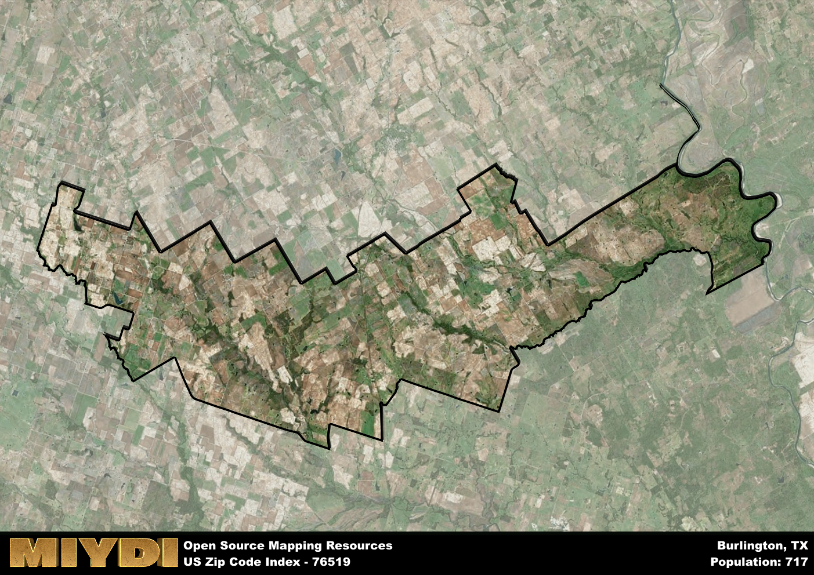

**Area Name:** Burlington

**Zip Code:** 76519

**State:** TX

Burlington is a part of the Killeen-Temple - TX Metro Area, and makes up  of the Metro's population.  

# Burlington: A Charming Neighborhood in Central Texas  

Located in central Texas, the zip code 76519 corresponds to the charming neighborhood of Burlington. Situated within close proximity to major cities like Austin and Round Rock, Burlington is a thriving community that seamlessly integrates with the larger urban fabric of the region. The area is bordered by lush greenery and rolling hills, providing residents with a serene and picturesque setting to call home.

Burlington has a rich historical narrative that dates back to its early settlement by pioneers in the 19th century. The area saw rapid growth with the arrival of the railroad, which brought new opportunities for commerce and trade. Over the years, Burlington has evolved into a bustling residential community while still maintaining its small-town charm. The name "Burlington" pays homage to the area's roots and serves as a reminder of its historical significance.

Today, Burlington is a thriving neighborhood with a diverse economy that includes agriculture, small businesses, and a growing tech industry. Residents enjoy access to a variety of neighborhood-specific services, including local shops, restaurants, and community centers. The area also boasts numerous recreational amenities, such as parks, hiking trails, and sports facilities, making it an ideal place for outdoor enthusiasts. Cultural and historic sites, such as museums and heritage landmarks, add to the unique character of Burlington, making it a sought-after destination within the central Texas region.

# Burlington Demographics

The population of Burlington is 717.  
Burlington has a population density of 6.96 per square mile.  
The area of Burlington is 102.99 square miles.  

## Burlington Income and Economic Data

These demographic numbers are sourced from IRS return data, providing comprehensive insights into the population dynamics and economic trends within Burlington.

**Breakdown of return types for Burlington**

The table offers insight into the composition of tax returns filed with the IRS, categorizing them into three main types. Single returns represent filings by individuals, joint returns by married couples, and head of household returns by individuals who qualify as heads of households, typically having dependents. This breakdown provides an understanding of the different filing statuses adopted by taxpayers when submitting their tax documentation.

| Return Types filed for Burlington                              | Percentage          |
|----------------------------------------------------------|---------------------|
| Single Returns                                            | 0.42 |
| Joint Returns                                             | 0.46 |
| Head Household Returns                                    | 0.12 |

The income and economic data presented here is sourced from the IRS income brackets, utilized for categorizing tax returns by income levels. This table displays income ranges for both single filers and married couples, along with the corresponding number of returns and the percentage within each bracket, providing valuable insight into the distribution of taxes across various income groups.

| Bracket Name       | Single Filer Income Range | Married Couple Range | Number of Returns | Percentage of Returns |
|--------------------|----------------------------|----------------------|-------------------|-----------------------|
| 10% Bracket        | Up to $10,275              | Up to $20,550        | 80 | 0.31% |
| 12% Bracket        | $10,276 - $41,775          | $20,551 - $83,550    | 60 | 0.23% |
| 22% Bracket        | $41,776 - $89,075          | $83,551 - $178,150   | 50 | 0.19% |
| 24% Bracket        | $89,076 - $170,050         | $178,151 - $340,100  | 20 | 0.08% |
| 32% Bracket        | $170,051 - $215,950        | $340,101 - $431,900  | 50 | 0.19% |
| 35% Bracket        | $215,951 - $539,900        | $431,901 - $647,850  | 0 | 0% |

### Exploring Taxpayer Diversity: A Breakdown of Different Types of Tax Returns in Burlington

The table offers insights into various types of tax returns filed, reflecting different aspects of taxpayer activities and demographics. Categories include charitable returns for donations, dependent returns for claimed dependents, educator population, elderly population, real estate returns, self-employment returns, student loan returns, and unemployment returns, providing valuable insights into taxpayer behavior and demographics.

| Burlington Filing Types                    | Count | Percentage |
|--------------------------------------|-------|------------|
| Charitable Donations                 | 0 | 0% |
| Dependents Claimed                   | 0 | 0% |
| Educator Residents                   | 0 | 0% |
| Elderly Population                   | 80 | 0.31% |
| Farming Population                   | 60 | 0.231% |
| Real Estate Transactions             | 0 | 0% |
| Self-Employed Individuals            | 50 | 0.192% |
| Student Loan Cases                   | 0 | 0% |
| Unemployment Benefit Filings         | 0 | 0% |

## Burlington AI and Census Variables

The values presented in this dataset for Burlington are AI-optimized, streamlined, and categorized into relevant buckets for enhanced utility in AI and mapping programs. These simplified values have been optimized to facilitate efficient analysis and integration into various technological applications, offering users accessible and actionable insights into demographics within the Burlington area.

| AI Variables for Burlington | Value |
|-------------|-------|
| Shape Area | 364188961.421875 |
| Shape Length | 168086.261703723 |
| CBSA Federal Processing Standard Code | 28660 |

## How to use this free AI optimized Geo-Spatial Data for Burlington, TX

This data is made freely available under the Creative Commons license, allowing for unrestricted use for any purpose. Users can access static resources directly from GitHub or leverage more advanced functionalities by utilizing the GeoJSON files. All datasets originate from official government or private sector sources and are meticulously compiled into relevant datasets within QGIS. However, the versatility of the data ensures compatibility with any mapping application.

## Data Accuracy Disclaimer
It's important to note that the data provided here may contain errors or discrepancies and should be considered as 'close enough' for business applications and AI rather than a definitive source of truth. This data is aggregated from multiple sources, some of which publish information on wildly different intervals, leading to potential inconsistencies. Additionally, certain data points may not be corrected for Covid-related changes, further impacting accuracy. Moreover, the assumption that demographic trends are consistent throughout a region may lead to discrepancies, as trends often concentrate in areas of highest population density. As a result, dense areas may be slightly underrepresented, while rural areas may be slightly overrepresented, resulting in a more conservative dataset. Furthermore, the focus primarily on areas within US Major and Minor Statistical areas means that approximately 40 million Americans living outside of these areas may not be fully represented. Lastly, the historical background and area descriptions generated using AI are susceptible to potential mistakes, so users should exercise caution when interpreting the information provided.
