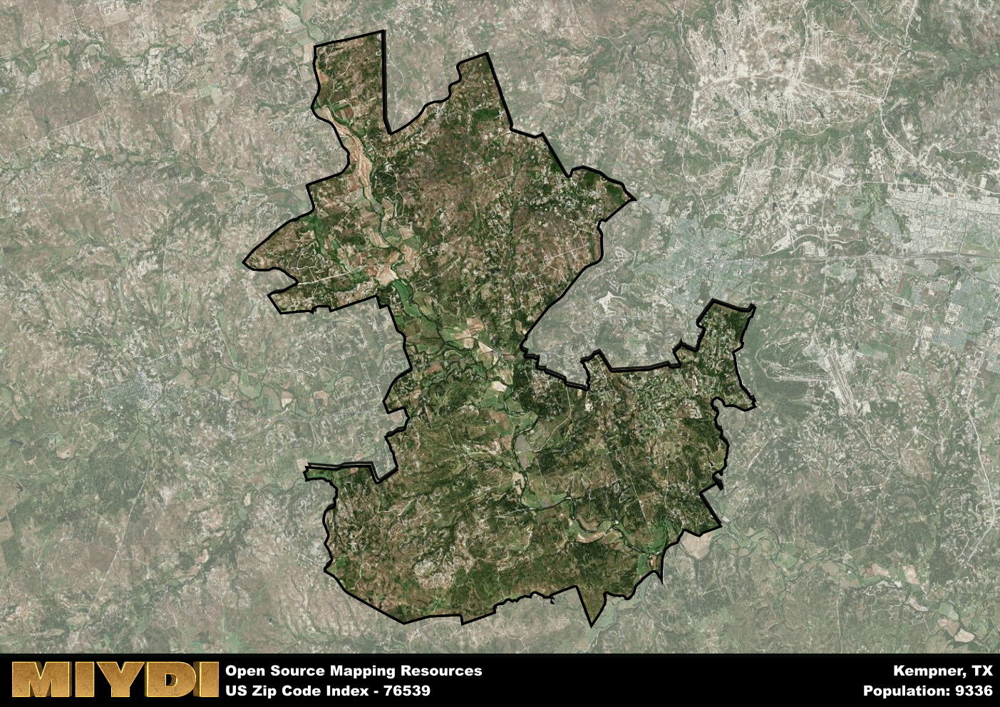

**Area Name:** Kempner

**Zip Code:** 76539

**State:** TX

Kempner is a part of the Killeen-Temple - TX Metro Area, and makes up  of the Metro's population.  

# Kempner, TX (Zip Code 76539): A Charming Community Nestled in Central Texas  

Located in central Texas, Kempner (Zip Code 76539) is a charming community situated in Lampasas County. Bordered by Copperas Cove to the east and Lampasas to the west, Kempner seamlessly integrates with the larger metropolitan areas of Killeen and Austin. This rural neighborhood offers a peaceful retreat from the bustling cities while still providing convenient access to urban amenities and employment opportunities.

Kempner has a rich historical narrative, dating back to its establishment in the late 19th century. Named after Harris Kempner, a Galveston banker, the area saw significant growth during the 20th century with the arrival of the railroad. The community flourished as an agricultural center, with cotton and cattle farming playing a vital role in its economy. Over the years, Kempner has retained its small-town charm and close-knit community spirit, making it an ideal place to live for those seeking a slower pace of life.

Today, Kempner boasts a mix of residential neighborhoods, local businesses, and recreational opportunities. Residents can enjoy the scenic beauty of Mother Neff State Park, explore historic sites like the Kempner Museum, and participate in community events throughout the year. With a focus on preserving its heritage and supporting local businesses, Kempner continues to thrive as a welcoming and vibrant community in central Texas.

# Kempner Demographics

The population of Kempner is 9336.  
Kempner has a population density of 66.86 per square mile.  
The area of Kempner is 139.63 square miles.  

## Kempner Income and Economic Data

These demographic numbers are sourced from IRS return data, providing comprehensive insights into the population dynamics and economic trends within Kempner.

**Breakdown of return types for Kempner**

The table offers insight into the composition of tax returns filed with the IRS, categorizing them into three main types. Single returns represent filings by individuals, joint returns by married couples, and head of household returns by individuals who qualify as heads of households, typically having dependents. This breakdown provides an understanding of the different filing statuses adopted by taxpayers when submitting their tax documentation.

| Return Types filed for Kempner                              | Percentage          |
|----------------------------------------------------------|---------------------|
| Single Returns                                            | 0.37 |
| Joint Returns                                             | 0.51 |
| Head Household Returns                                    | 0.09 |

The income and economic data presented here is sourced from the IRS income brackets, utilized for categorizing tax returns by income levels. This table displays income ranges for both single filers and married couples, along with the corresponding number of returns and the percentage within each bracket, providing valuable insight into the distribution of taxes across various income groups.

| Bracket Name       | Single Filer Income Range | Married Couple Range | Number of Returns | Percentage of Returns |
|--------------------|----------------------------|----------------------|-------------------|-----------------------|
| 10% Bracket        | Up to $10,275              | Up to $20,550        | 1150 | 0.28% |
| 12% Bracket        | $10,276 - $41,775          | $20,551 - $83,550    | 1010 | 0.24% |
| 22% Bracket        | $41,776 - $89,075          | $83,551 - $178,150   | 710 | 0.17% |
| 24% Bracket        | $89,076 - $170,050         | $178,151 - $340,100  | 500 | 0.12% |
| 32% Bracket        | $170,051 - $215,950        | $340,101 - $431,900  | 680 | 0.16% |
| 35% Bracket        | $215,951 - $539,900        | $431,901 - $647,850  | 90 | 0.02% |

### Exploring Taxpayer Diversity: A Breakdown of Different Types of Tax Returns in Kempner

The table offers insights into various types of tax returns filed, reflecting different aspects of taxpayer activities and demographics. Categories include charitable returns for donations, dependent returns for claimed dependents, educator population, elderly population, real estate returns, self-employment returns, student loan returns, and unemployment returns, providing valuable insights into taxpayer behavior and demographics.

| Kempner Filing Types                    | Count | Percentage |
|--------------------------------------|-------|------------|
| Charitable Donations                 | 130 | 0.031% |
| Dependents Claimed                   | 110 | 0.027% |
| Educator Residents                   | 120 | 0.029% |
| Elderly Population                   | 1220 | 0.29% |
| Farming Population                   | 160 | 0.039% |
| Real Estate Transactions             | 150 | 0.036% |
| Self-Employed Individuals            | 450 | 0.109% |
| Student Loan Cases                   | 270 | 0.065% |
| Unemployment Benefit Filings         | 410 | 0.1% |

## Kempner AI and Census Variables

The values presented in this dataset for Kempner are AI-optimized, streamlined, and categorized into relevant buckets for enhanced utility in AI and mapping programs. These simplified values have been optimized to facilitate efficient analysis and integration into various technological applications, offering users accessible and actionable insights into demographics within the Kempner area.

| AI Variables for Kempner | Value |
|-------------|-------|
| Shape Area | 494574124.65625 |
| Shape Length | 178346.708651454 |
| CBSA Federal Processing Standard Code | 28660 |

## How to use this free AI optimized Geo-Spatial Data for Kempner, TX

This data is made freely available under the Creative Commons license, allowing for unrestricted use for any purpose. Users can access static resources directly from GitHub or leverage more advanced functionalities by utilizing the GeoJSON files. All datasets originate from official government or private sector sources and are meticulously compiled into relevant datasets within QGIS. However, the versatility of the data ensures compatibility with any mapping application.

## Data Accuracy Disclaimer
It's important to note that the data provided here may contain errors or discrepancies and should be considered as 'close enough' for business applications and AI rather than a definitive source of truth. This data is aggregated from multiple sources, some of which publish information on wildly different intervals, leading to potential inconsistencies. Additionally, certain data points may not be corrected for Covid-related changes, further impacting accuracy. Moreover, the assumption that demographic trends are consistent throughout a region may lead to discrepancies, as trends often concentrate in areas of highest population density. As a result, dense areas may be slightly underrepresented, while rural areas may be slightly overrepresented, resulting in a more conservative dataset. Furthermore, the focus primarily on areas within US Major and Minor Statistical areas means that approximately 40 million Americans living outside of these areas may not be fully represented. Lastly, the historical background and area descriptions generated using AI are susceptible to potential mistakes, so users should exercise caution when interpreting the information provided.
