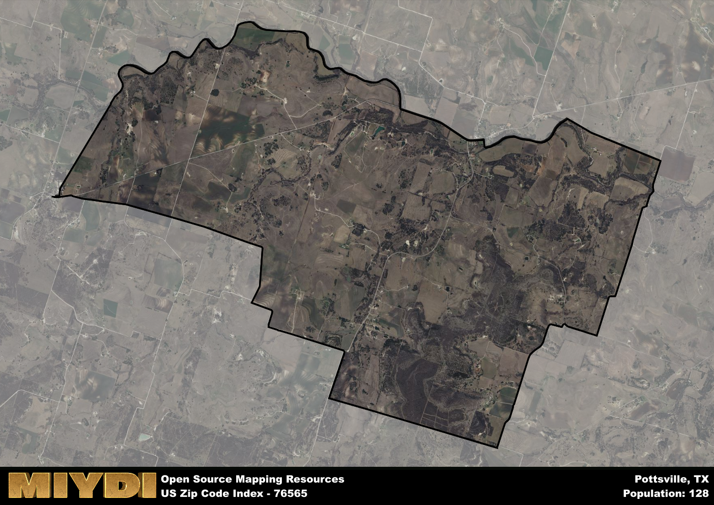

**Area Name:** Pottsville

**Zip Code:** 76565

**State:** TX

# Pottsville: A Historic and Vibrant Community in Zip Code 76565

Located in central Texas, zip code 76565 encompasses the charming neighborhood of Pottsville. Situated within close proximity to larger cities like Austin and Waco, Pottsville offers a peaceful retreat from the hustle and bustle of urban life while still maintaining easy access to major population centers. The area is bordered by scenic countryside and is known for its friendly community atmosphere.

Pottsville has a rich historical narrative dating back to its founding in the 19th century. Originally settled by German immigrants, the area quickly grew into a thriving agricultural hub, known for its fertile soil and abundant crops. The community was officially named Pottsville in honor of a prominent local family who played a key role in the area's development. Throughout the years, Pottsville has maintained its small-town charm and strong sense of heritage.

Today, Pottsville is a flourishing community with a mix of residential, commercial, and agricultural activities. The neighborhood boasts a variety of locally-owned businesses, including quaint shops and eateries that cater to both residents and visitors. Pottsville also offers recreational amenities such as parks, hiking trails, and community events that bring neighbors together. The area's historic sites, including well-preserved buildings from its early days, serve as a reminder of Pottsville's unique past and contribute to its distinctive character within the larger urban fabric.

# Pottsville Demographics

The population of Pottsville is 128.  
Pottsville has a population density of 6.38 per square mile.  
The area of Pottsville is 20.07 square miles.  

## Pottsville AI and Census Variables

The values presented in this dataset for Pottsville are AI-optimized, streamlined, and categorized into relevant buckets for enhanced utility in AI and mapping programs. These simplified values have been optimized to facilitate efficient analysis and integration into various technological applications, offering users accessible and actionable insights into demographics within the Pottsville area.

| AI Variables for Pottsville | Value |
|-------------|-------|
| Shape Area | 71976094.7734375 |
| Shape Length | 42992.8567477796 |

## How to use this free AI optimized Geo-Spatial Data for Pottsville, TX

This data is made freely available under the Creative Commons license, allowing for unrestricted use for any purpose. Users can access static resources directly from GitHub or leverage more advanced functionalities by utilizing the GeoJSON files. All datasets originate from official government or private sector sources and are meticulously compiled into relevant datasets within QGIS. However, the versatility of the data ensures compatibility with any mapping application.

## Data Accuracy Disclaimer
It's important to note that the data provided here may contain errors or discrepancies and should be considered as 'close enough' for business applications and AI rather than a definitive source of truth. This data is aggregated from multiple sources, some of which publish information on wildly different intervals, leading to potential inconsistencies. Additionally, certain data points may not be corrected for Covid-related changes, further impacting accuracy. Moreover, the assumption that demographic trends are consistent throughout a region may lead to discrepancies, as trends often concentrate in areas of highest population density. As a result, dense areas may be slightly underrepresented, while rural areas may be slightly overrepresented, resulting in a more conservative dataset. Furthermore, the focus primarily on areas within US Major and Minor Statistical areas means that approximately 40 million Americans living outside of these areas may not be fully represented. Lastly, the historical background and area descriptions generated using AI are susceptible to potential mistakes, so users should exercise caution when interpreting the information provided.
