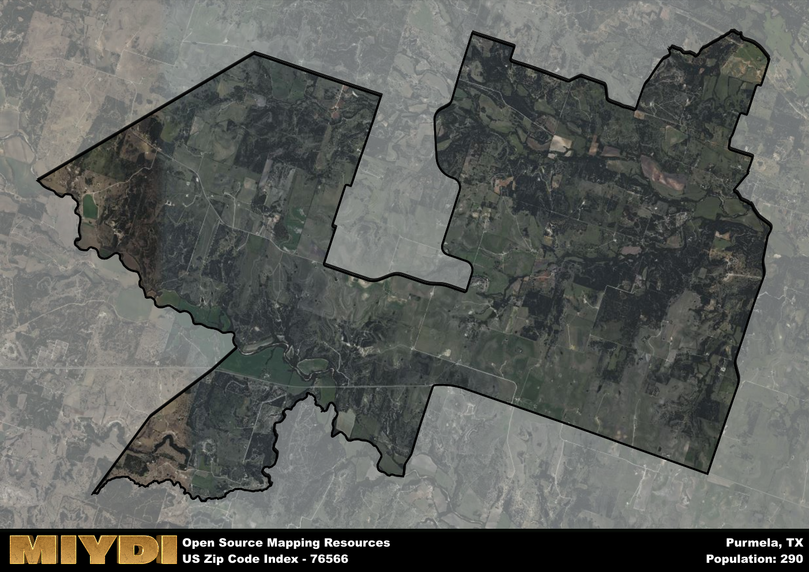

**Area Name:** Purmela

**Zip Code:** 76566

**State:** TX

Purmela is a part of the Killeen-Temple - TX Metro Area, and makes up  of the Metro's population.  

# Purmela: A Rural Oasis in Central Texas  
Purmela, located in the zip code 76566, is a small rural community situated in central Texas. The area is surrounded by rolling hills and farmland, creating a peaceful and picturesque setting for its residents. While Purmela is a relatively isolated pocket, it is in close proximity to larger cities like Killeen and Temple, allowing for easy access to urban amenities and services.

Originally settled in the mid-19th century, Purmela grew as a farming and ranching community. The area was named after a local creek, and its economy was primarily driven by agriculture. Purmela played a role in the cattle industry, with many ranchers using the town as a hub for trading and shipping livestock. Over the years, the community has maintained its rural charm and close-knit atmosphere, with many families tracing their roots back several generations.

Today, Purmela remains a tight-knit community with a focus on agriculture and ranching. The area boasts a number of local farms and ranches, providing fresh produce and meat to residents and surrounding areas. In addition to its agricultural roots, Purmela offers a range of recreational activities such as hiking and fishing in the nearby creeks and streams. The area also features historic sites and buildings that showcase its rich heritage and small-town charm.

# Purmela Demographics

The population of Purmela is 290.  
Purmela has a population density of 5.78 per square mile.  
The area of Purmela is 50.16 square miles.  

## Purmela Income and Economic Data

These demographic numbers are sourced from IRS return data, providing comprehensive insights into the population dynamics and economic trends within Purmela.

**Breakdown of return types for Purmela**

The table offers insight into the composition of tax returns filed with the IRS, categorizing them into three main types. Single returns represent filings by individuals, joint returns by married couples, and head of household returns by individuals who qualify as heads of households, typically having dependents. This breakdown provides an understanding of the different filing statuses adopted by taxpayers when submitting their tax documentation.

| Return Types filed for Purmela                              | Percentage          |
|----------------------------------------------------------|---------------------|
| Single Returns                                            | 0.31 |
| Joint Returns                                             | 0.54 |
| Head Household Returns                                    | 0 |

The income and economic data presented here is sourced from the IRS income brackets, utilized for categorizing tax returns by income levels. This table displays income ranges for both single filers and married couples, along with the corresponding number of returns and the percentage within each bracket, providing valuable insight into the distribution of taxes across various income groups.

| Bracket Name       | Single Filer Income Range | Married Couple Range | Number of Returns | Percentage of Returns |
|--------------------|----------------------------|----------------------|-------------------|-----------------------|
| 10% Bracket        | Up to $10,275              | Up to $20,550        | 40 | 0.31% |
| 12% Bracket        | $10,276 - $41,775          | $20,551 - $83,550    | 40 | 0.31% |
| 22% Bracket        | $41,776 - $89,075          | $83,551 - $178,150   | 30 | 0.23% |
| 24% Bracket        | $89,076 - $170,050         | $178,151 - $340,100  | 0 | 0% |
| 32% Bracket        | $170,051 - $215,950        | $340,101 - $431,900  | 20 | 0.15% |
| 35% Bracket        | $215,951 - $539,900        | $431,901 - $647,850  | 0 | 0% |

### Exploring Taxpayer Diversity: A Breakdown of Different Types of Tax Returns in Purmela

The table offers insights into various types of tax returns filed, reflecting different aspects of taxpayer activities and demographics. Categories include charitable returns for donations, dependent returns for claimed dependents, educator population, elderly population, real estate returns, self-employment returns, student loan returns, and unemployment returns, providing valuable insights into taxpayer behavior and demographics.

| Purmela Filing Types                    | Count | Percentage |
|--------------------------------------|-------|------------|
| Charitable Donations                 | 0 | 0% |
| Dependents Claimed                   | 0 | 0% |
| Educator Residents                   | 0 | 0% |
| Elderly Population                   | 60 | 0.46% |
| Farming Population                   | 40 | 0.308% |
| Real Estate Transactions             | 0 | 0% |
| Self-Employed Individuals            | 0 | 0% |
| Student Loan Cases                   | 0 | 0% |
| Unemployment Benefit Filings         | 0 | 0% |

## Purmela AI and Census Variables

The values presented in this dataset for Purmela are AI-optimized, streamlined, and categorized into relevant buckets for enhanced utility in AI and mapping programs. These simplified values have been optimized to facilitate efficient analysis and integration into various technological applications, offering users accessible and actionable insights into demographics within the Purmela area.

| AI Variables for Purmela | Value |
|-------------|-------|
| Shape Area | 179233644.304688 |
| Shape Length | 99197.9662417835 |
| CBSA Federal Processing Standard Code | 28660 |

## How to use this free AI optimized Geo-Spatial Data for Purmela, TX

This data is made freely available under the Creative Commons license, allowing for unrestricted use for any purpose. Users can access static resources directly from GitHub or leverage more advanced functionalities by utilizing the GeoJSON files. All datasets originate from official government or private sector sources and are meticulously compiled into relevant datasets within QGIS. However, the versatility of the data ensures compatibility with any mapping application.

## Data Accuracy Disclaimer
It's important to note that the data provided here may contain errors or discrepancies and should be considered as 'close enough' for business applications and AI rather than a definitive source of truth. This data is aggregated from multiple sources, some of which publish information on wildly different intervals, leading to potential inconsistencies. Additionally, certain data points may not be corrected for Covid-related changes, further impacting accuracy. Moreover, the assumption that demographic trends are consistent throughout a region may lead to discrepancies, as trends often concentrate in areas of highest population density. As a result, dense areas may be slightly underrepresented, while rural areas may be slightly overrepresented, resulting in a more conservative dataset. Furthermore, the focus primarily on areas within US Major and Minor Statistical areas means that approximately 40 million Americans living outside of these areas may not be fully represented. Lastly, the historical background and area descriptions generated using AI are susceptible to potential mistakes, so users should exercise caution when interpreting the information provided.
