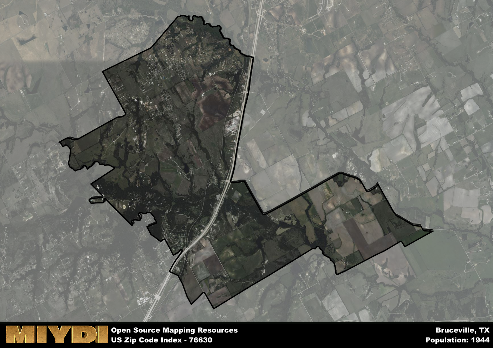

**Area Name:** Bruceville

**Zip Code:** 76630

**State:** TX

Bruceville is a part of the Waco - TX Metro Area, and makes up  of the Metro's population.  

# Bruceville: A Historic and Vibrant Community in Central Texas  

Located in central Texas, the zip code area 76630 corresponds to the charming town of Bruceville. Situated within McLennan County, Bruceville is surrounded by the cities of Waco to the north and Temple to the south. This small town is an integral part of the larger metropolitan area, providing a peaceful retreat for residents while still offering easy access to urban amenities and employment opportunities in nearby cities.

Originally settled in the mid-19th century, Bruceville has a rich history rooted in agriculture and transportation. The town experienced growth with the arrival of the railroad, which brought increased economic activity and development to the area. Over the years, Bruceville has maintained its small-town charm while adapting to modern times, making it a sought-after residential community for those seeking a peaceful lifestyle amidst the scenic central Texas landscape.

Today, Bruceville boasts a thriving economy supported by a mix of local businesses, including shops, restaurants, and service providers. Residents enjoy access to parks, recreational facilities, and community events that contribute to the town's close-knit atmosphere. The area is also home to historic sites that showcase its past, giving visitors a glimpse into Bruceville's heritage and evolution over time. With its blend of history, community spirit, and modern conveniences, Bruceville continues to be a beloved destination for both residents and visitors alike.

# Bruceville Demographics

The population of Bruceville is 1944.  
Bruceville has a population density of 142.63 per square mile.  
The area of Bruceville is 13.63 square miles.  

## Bruceville Income and Economic Data

These demographic numbers are sourced from IRS return data, providing comprehensive insights into the population dynamics and economic trends within Bruceville.

**Breakdown of return types for Bruceville**

The table offers insight into the composition of tax returns filed with the IRS, categorizing them into three main types. Single returns represent filings by individuals, joint returns by married couples, and head of household returns by individuals who qualify as heads of households, typically having dependents. This breakdown provides an understanding of the different filing statuses adopted by taxpayers when submitting their tax documentation.

| Return Types filed for Bruceville                              | Percentage          |
|----------------------------------------------------------|---------------------|
| Single Returns                                            | 0.4 |
| Joint Returns                                             | 0.45 |
| Head Household Returns                                    | 0.12 |

The income and economic data presented here is sourced from the IRS income brackets, utilized for categorizing tax returns by income levels. This table displays income ranges for both single filers and married couples, along with the corresponding number of returns and the percentage within each bracket, providing valuable insight into the distribution of taxes across various income groups.

| Bracket Name       | Single Filer Income Range | Married Couple Range | Number of Returns | Percentage of Returns |
|--------------------|----------------------------|----------------------|-------------------|-----------------------|
| 10% Bracket        | Up to $10,275              | Up to $20,550        | 260 | 0.32% |
| 12% Bracket        | $10,276 - $41,775          | $20,551 - $83,550    | 210 | 0.26% |
| 22% Bracket        | $41,776 - $89,075          | $83,551 - $178,150   | 130 | 0.16% |
| 24% Bracket        | $89,076 - $170,050         | $178,151 - $340,100  | 70 | 0.09% |
| 32% Bracket        | $170,051 - $215,950        | $340,101 - $431,900  | 120 | 0.15% |
| 35% Bracket        | $215,951 - $539,900        | $431,901 - $647,850  | 30 | 0.04% |

### Exploring Taxpayer Diversity: A Breakdown of Different Types of Tax Returns in Bruceville

The table offers insights into various types of tax returns filed, reflecting different aspects of taxpayer activities and demographics. Categories include charitable returns for donations, dependent returns for claimed dependents, educator population, elderly population, real estate returns, self-employment returns, student loan returns, and unemployment returns, providing valuable insights into taxpayer behavior and demographics.

| Bruceville Filing Types                    | Count | Percentage |
|--------------------------------------|-------|------------|
| Charitable Donations                 | 0 | 0% |
| Dependents Claimed                   | 30 | 0.037% |
| Educator Residents                   | 30 | 0.037% |
| Elderly Population                   | 190 | 0.23% |
| Farming Population                   | 20 | 0.024% |
| Real Estate Transactions             | 20 | 0.024% |
| Self-Employed Individuals            | 90 | 0.11% |
| Student Loan Cases                   | 60 | 0.073% |
| Unemployment Benefit Filings         | 90 | 0.11% |

## Bruceville AI and Census Variables

The values presented in this dataset for Bruceville are AI-optimized, streamlined, and categorized into relevant buckets for enhanced utility in AI and mapping programs. These simplified values have been optimized to facilitate efficient analysis and integration into various technological applications, offering users accessible and actionable insights into demographics within the Bruceville area.

| AI Variables for Bruceville | Value |
|-------------|-------|
| Shape Area | 48540178.0820313 |
| Shape Length | 47926.4322816596 |
| CBSA Federal Processing Standard Code | 47380 |

## How to use this free AI optimized Geo-Spatial Data for Bruceville, TX

This data is made freely available under the Creative Commons license, allowing for unrestricted use for any purpose. Users can access static resources directly from GitHub or leverage more advanced functionalities by utilizing the GeoJSON files. All datasets originate from official government or private sector sources and are meticulously compiled into relevant datasets within QGIS. However, the versatility of the data ensures compatibility with any mapping application.

## Data Accuracy Disclaimer
It's important to note that the data provided here may contain errors or discrepancies and should be considered as 'close enough' for business applications and AI rather than a definitive source of truth. This data is aggregated from multiple sources, some of which publish information on wildly different intervals, leading to potential inconsistencies. Additionally, certain data points may not be corrected for Covid-related changes, further impacting accuracy. Moreover, the assumption that demographic trends are consistent throughout a region may lead to discrepancies, as trends often concentrate in areas of highest population density. As a result, dense areas may be slightly underrepresented, while rural areas may be slightly overrepresented, resulting in a more conservative dataset. Furthermore, the focus primarily on areas within US Major and Minor Statistical areas means that approximately 40 million Americans living outside of these areas may not be fully represented. Lastly, the historical background and area descriptions generated using AI are susceptible to potential mistakes, so users should exercise caution when interpreting the information provided.
