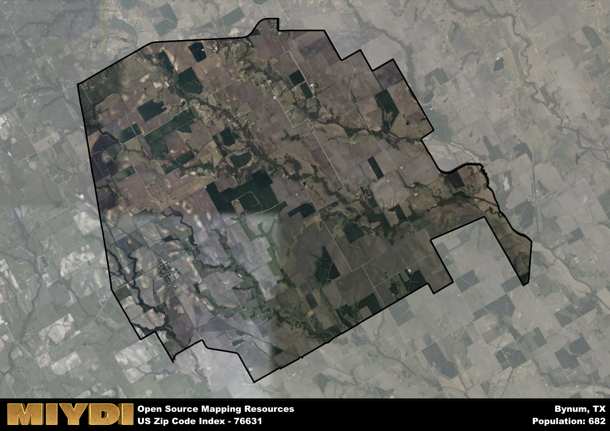

**Area Name:** Bynum

**Zip Code:** 76631

**State:** TX

# Bynum: A Historic and Vibrant Community in Zip Code 76631  

Located in Hill County, Texas, the zip code area 76631 encompasses the charming neighborhood of Bynum. Bynum is situated just south of the city of Hillsboro and is seamlessly integrated into the surrounding rural landscape. It is a small, tight-knit community that offers a peaceful retreat from the hustle and bustle of nearby metropolitan areas. Bynum is known for its picturesque countryside, with rolling hills and open fields defining the landscape.

Originally settled in the late 19th century, Bynum has a rich historical narrative that has shaped its identity today. The area was named after a prominent local landowner, and its growth was fueled by agriculture and farming. Over the years, Bynum has retained its small-town charm while adapting to modern times. The community takes pride in its heritage, with several historic buildings and landmarks serving as reminders of its past.

Today, Bynum is a thriving community with a mix of residential, commercial, and agricultural activities. The area is home to local businesses, including shops, restaurants, and services that cater to the needs of residents and visitors alike. Bynum also boasts recreational amenities such as parks, hiking trails, and community centers, providing opportunities for outdoor leisure and social gatherings. Residents of Bynum enjoy a peaceful quality of life and a strong sense of community that sets it apart from neighboring areas.

# Bynum Demographics

The population of Bynum is 682.  
Bynum has a population density of 15.35 per square mile.  
The area of Bynum is 44.44 square miles.  

## Bynum Income and Economic Data

These demographic numbers are sourced from IRS return data, providing comprehensive insights into the population dynamics and economic trends within Bynum.

**Breakdown of return types for Bynum**

The table offers insight into the composition of tax returns filed with the IRS, categorizing them into three main types. Single returns represent filings by individuals, joint returns by married couples, and head of household returns by individuals who qualify as heads of households, typically having dependents. This breakdown provides an understanding of the different filing statuses adopted by taxpayers when submitting their tax documentation.

| Return Types filed for Bynum                              | Percentage          |
|----------------------------------------------------------|---------------------|
| Single Returns                                            | 0.43 |
| Joint Returns                                             | 0.48 |
| Head Household Returns                                    | 0 |

The income and economic data presented here is sourced from the IRS income brackets, utilized for categorizing tax returns by income levels. This table displays income ranges for both single filers and married couples, along with the corresponding number of returns and the percentage within each bracket, providing valuable insight into the distribution of taxes across various income groups.

| Bracket Name       | Single Filer Income Range | Married Couple Range | Number of Returns | Percentage of Returns |
|--------------------|----------------------------|----------------------|-------------------|-----------------------|
| 10% Bracket        | Up to $10,275              | Up to $20,550        | 70 | 0.3% |
| 12% Bracket        | $10,276 - $41,775          | $20,551 - $83,550    | 60 | 0.26% |
| 22% Bracket        | $41,776 - $89,075          | $83,551 - $178,150   | 40 | 0.17% |
| 24% Bracket        | $89,076 - $170,050         | $178,151 - $340,100  | 20 | 0.09% |
| 32% Bracket        | $170,051 - $215,950        | $340,101 - $431,900  | 40 | 0.17% |
| 35% Bracket        | $215,951 - $539,900        | $431,901 - $647,850  | 0 | 0% |

### Exploring Taxpayer Diversity: A Breakdown of Different Types of Tax Returns in Bynum

The table offers insights into various types of tax returns filed, reflecting different aspects of taxpayer activities and demographics. Categories include charitable returns for donations, dependent returns for claimed dependents, educator population, elderly population, real estate returns, self-employment returns, student loan returns, and unemployment returns, providing valuable insights into taxpayer behavior and demographics.

| Bynum Filing Types                    | Count | Percentage |
|--------------------------------------|-------|------------|
| Charitable Donations                 | 0 | 0% |
| Dependents Claimed                   | 0 | 0% |
| Educator Residents                   | 0 | 0% |
| Elderly Population                   | 70 | 0.3% |
| Farming Population                   | 40 | 0.174% |
| Real Estate Transactions             | 0 | 0% |
| Self-Employed Individuals            | 30 | 0.13% |
| Student Loan Cases                   | 0 | 0% |
| Unemployment Benefit Filings         | 20 | 0.09% |

## Bynum AI and Census Variables

The values presented in this dataset for Bynum are AI-optimized, streamlined, and categorized into relevant buckets for enhanced utility in AI and mapping programs. These simplified values have been optimized to facilitate efficient analysis and integration into various technological applications, offering users accessible and actionable insights into demographics within the Bynum area.

| AI Variables for Bynum | Value |
|-------------|-------|
| Shape Area | 160479553.023438 |
| Shape Length | 62135.4103010299 |

## How to use this free AI optimized Geo-Spatial Data for Bynum, TX

This data is made freely available under the Creative Commons license, allowing for unrestricted use for any purpose. Users can access static resources directly from GitHub or leverage more advanced functionalities by utilizing the GeoJSON files. All datasets originate from official government or private sector sources and are meticulously compiled into relevant datasets within QGIS. However, the versatility of the data ensures compatibility with any mapping application.

## Data Accuracy Disclaimer
It's important to note that the data provided here may contain errors or discrepancies and should be considered as 'close enough' for business applications and AI rather than a definitive source of truth. This data is aggregated from multiple sources, some of which publish information on wildly different intervals, leading to potential inconsistencies. Additionally, certain data points may not be corrected for Covid-related changes, further impacting accuracy. Moreover, the assumption that demographic trends are consistent throughout a region may lead to discrepancies, as trends often concentrate in areas of highest population density. As a result, dense areas may be slightly underrepresented, while rural areas may be slightly overrepresented, resulting in a more conservative dataset. Furthermore, the focus primarily on areas within US Major and Minor Statistical areas means that approximately 40 million Americans living outside of these areas may not be fully represented. Lastly, the historical background and area descriptions generated using AI are susceptible to potential mistakes, so users should exercise caution when interpreting the information provided.
