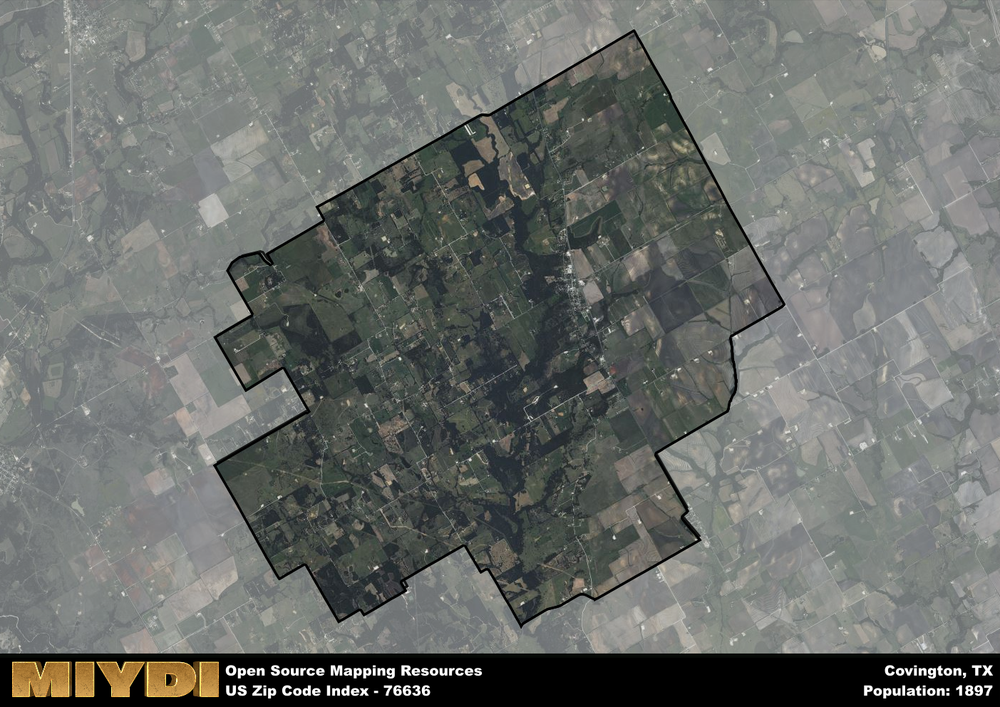

**Area Name:** Covington

**Zip Code:** 76636

**State:** TX

# Covington, TX (Zip Code 76636): A Historic Gem in the Heart of Texas  

Located in the heart of Texas, zip code 76636 encompasses the charming neighborhood of Covington. Situated within Hill County, Covington is surrounded by the towns of Itasca, Hillsboro, and Blum. The area is easily accessible via major highways, making it a convenient hub within the larger metropolitan context of the Dallas-Fort Worth area. Despite its proximity to urban centers, Covington maintains a peaceful and picturesque atmosphere, offering a unique blend of rural tranquility and modern convenience.

Covington has a rich historical narrative that dates back to the mid-19th century when settlers were drawn to the area by fertile land and abundant natural resources. The town was officially established in the late 1800s, named after the city of Covington, Kentucky. Over the years, Covington grew into a thriving agricultural community, known for its cotton production and cattle ranching. The area has preserved its historic charm through well-maintained buildings and landmarks that tell the story of its past.

Today, Covington is a vibrant community that blends its agricultural heritage with modern amenities. The area boasts a variety of local businesses, ranging from family-owned shops to cozy cafes and restaurants. Residents and visitors can enjoy outdoor activities at nearby parks and recreational areas, as well as explore the town's historic sites and museums. Covington's strong sense of community, coupled with its small-town charm, makes it a hidden gem within the bustling Dallas-Fort Worth metropolitan area.

# Covington Demographics

The population of Covington is 1897.  
Covington has a population density of 45.33 per square mile.  
The area of Covington is 41.85 square miles.  

## Covington Income and Economic Data

These demographic numbers are sourced from IRS return data, providing comprehensive insights into the population dynamics and economic trends within Covington.

**Breakdown of return types for Covington**

The table offers insight into the composition of tax returns filed with the IRS, categorizing them into three main types. Single returns represent filings by individuals, joint returns by married couples, and head of household returns by individuals who qualify as heads of households, typically having dependents. This breakdown provides an understanding of the different filing statuses adopted by taxpayers when submitting their tax documentation.

| Return Types filed for Covington                              | Percentage          |
|----------------------------------------------------------|---------------------|
| Single Returns                                            | 0.42 |
| Joint Returns                                             | 0.47 |
| Head Household Returns                                    | 0.1 |

The income and economic data presented here is sourced from the IRS income brackets, utilized for categorizing tax returns by income levels. This table displays income ranges for both single filers and married couples, along with the corresponding number of returns and the percentage within each bracket, providing valuable insight into the distribution of taxes across various income groups.

| Bracket Name       | Single Filer Income Range | Married Couple Range | Number of Returns | Percentage of Returns |
|--------------------|----------------------------|----------------------|-------------------|-----------------------|
| 10% Bracket        | Up to $10,275              | Up to $20,550        | 250 | 0.31% |
| 12% Bracket        | $10,276 - $41,775          | $20,551 - $83,550    | 190 | 0.23% |
| 22% Bracket        | $41,776 - $89,075          | $83,551 - $178,150   | 140 | 0.17% |
| 24% Bracket        | $89,076 - $170,050         | $178,151 - $340,100  | 100 | 0.12% |
| 32% Bracket        | $170,051 - $215,950        | $340,101 - $431,900  | 100 | 0.12% |
| 35% Bracket        | $215,951 - $539,900        | $431,901 - $647,850  | 30 | 0.04% |

### Exploring Taxpayer Diversity: A Breakdown of Different Types of Tax Returns in Covington

The table offers insights into various types of tax returns filed, reflecting different aspects of taxpayer activities and demographics. Categories include charitable returns for donations, dependent returns for claimed dependents, educator population, elderly population, real estate returns, self-employment returns, student loan returns, and unemployment returns, providing valuable insights into taxpayer behavior and demographics.

| Covington Filing Types                    | Count | Percentage |
|--------------------------------------|-------|------------|
| Charitable Donations                 | 30 | 0.037% |
| Dependents Claimed                   | 0 | 0% |
| Educator Residents                   | 0 | 0% |
| Elderly Population                   | 200 | 0.25% |
| Farming Population                   | 120 | 0.148% |
| Real Estate Transactions             | 30 | 0.037% |
| Self-Employed Individuals            | 120 | 0.148% |
| Student Loan Cases                   | 30 | 0.037% |
| Unemployment Benefit Filings         | 80 | 0.1% |

## Covington AI and Census Variables

The values presented in this dataset for Covington are AI-optimized, streamlined, and categorized into relevant buckets for enhanced utility in AI and mapping programs. These simplified values have been optimized to facilitate efficient analysis and integration into various technological applications, offering users accessible and actionable insights into demographics within the Covington area.

| AI Variables for Covington | Value |
|-------------|-------|
| Shape Area | 151690090.632813 |
| Shape Length | 59556.9293817509 |

## How to use this free AI optimized Geo-Spatial Data for Covington, TX

This data is made freely available under the Creative Commons license, allowing for unrestricted use for any purpose. Users can access static resources directly from GitHub or leverage more advanced functionalities by utilizing the GeoJSON files. All datasets originate from official government or private sector sources and are meticulously compiled into relevant datasets within QGIS. However, the versatility of the data ensures compatibility with any mapping application.

## Data Accuracy Disclaimer
It's important to note that the data provided here may contain errors or discrepancies and should be considered as 'close enough' for business applications and AI rather than a definitive source of truth. This data is aggregated from multiple sources, some of which publish information on wildly different intervals, leading to potential inconsistencies. Additionally, certain data points may not be corrected for Covid-related changes, further impacting accuracy. Moreover, the assumption that demographic trends are consistent throughout a region may lead to discrepancies, as trends often concentrate in areas of highest population density. As a result, dense areas may be slightly underrepresented, while rural areas may be slightly overrepresented, resulting in a more conservative dataset. Furthermore, the focus primarily on areas within US Major and Minor Statistical areas means that approximately 40 million Americans living outside of these areas may not be fully represented. Lastly, the historical background and area descriptions generated using AI are susceptible to potential mistakes, so users should exercise caution when interpreting the information provided.
