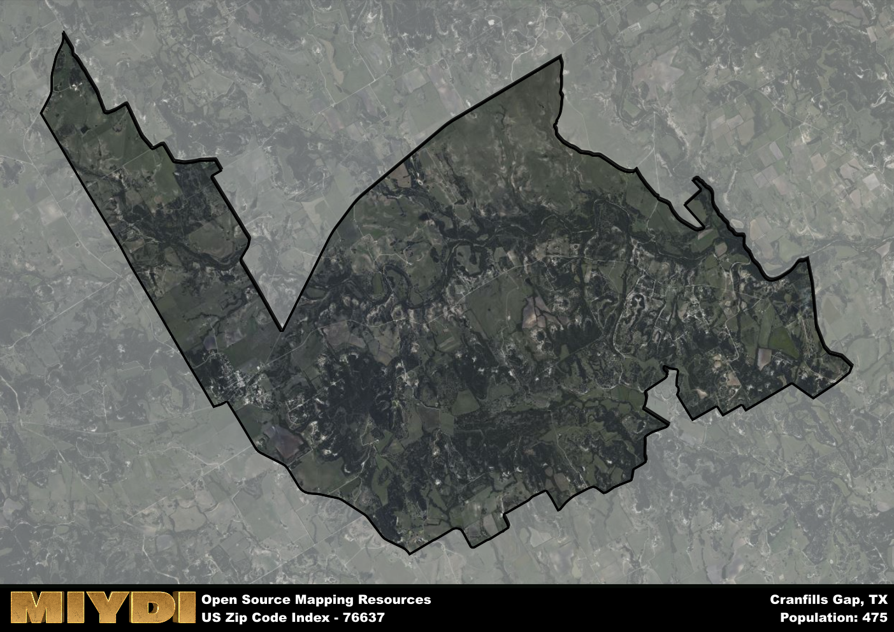

**Area Name:** Cranfills Gap

**Zip Code:** 76637

**State:** TX

# Discover the Charming Community of Cranfills Gap, Zip Code 76637  

Cranfills Gap, located in zip code 76637, is a small community nestled within Bosque County, Texas. Surrounded by rolling hills and beautiful countryside, Cranfills Gap sits just 30 miles northwest of Waco and is easily accessible via State Highway 22. This close proximity to Waco allows residents of Cranfills Gap to enjoy the amenities of a larger city while still experiencing the peace and tranquility of rural living.

Originally settled by Norwegian immigrants in the late 1800s, Cranfills Gap has a rich cultural heritage that is still celebrated today. The town's name is derived from the Norwegian word "kranfjell," meaning "crane's gap," a nod to the large flocks of cranes that once populated the area. Over the years, Cranfills Gap has grown from a small farming community to a vibrant town with a strong sense of community pride.

Today, Cranfills Gap is known for its friendly atmosphere and picturesque landscapes. The town is home to a variety of shops, restaurants, and services, making it a self-sustaining community. Residents and visitors alike can enjoy outdoor activities such as hiking, fishing, and birdwatching in the surrounding countryside. The area is also home to several historic sites, including the Old Rock Church, a Norwegian-style church that dates back to the town's founding. With its unique blend of history, natural beauty, and small-town charm, Cranfills Gap is a hidden gem waiting to be discovered.

# Cranfills Gap Demographics

The population of Cranfills Gap is 475.  
Cranfills Gap has a population density of 12.31 per square mile.  
The area of Cranfills Gap is 38.6 square miles.  

## Cranfills Gap Income and Economic Data

These demographic numbers are sourced from IRS return data, providing comprehensive insights into the population dynamics and economic trends within Cranfills Gap.

**Breakdown of return types for Cranfills Gap**

The table offers insight into the composition of tax returns filed with the IRS, categorizing them into three main types. Single returns represent filings by individuals, joint returns by married couples, and head of household returns by individuals who qualify as heads of households, typically having dependents. This breakdown provides an understanding of the different filing statuses adopted by taxpayers when submitting their tax documentation.

| Return Types filed for Cranfills Gap                              | Percentage          |
|----------------------------------------------------------|---------------------|
| Single Returns                                            | 0.42 |
| Joint Returns                                             | 0.5 |
| Head Household Returns                                    | 0.13 |

The income and economic data presented here is sourced from the IRS income brackets, utilized for categorizing tax returns by income levels. This table displays income ranges for both single filers and married couples, along with the corresponding number of returns and the percentage within each bracket, providing valuable insight into the distribution of taxes across various income groups.

| Bracket Name       | Single Filer Income Range | Married Couple Range | Number of Returns | Percentage of Returns |
|--------------------|----------------------------|----------------------|-------------------|-----------------------|
| 10% Bracket        | Up to $10,275              | Up to $20,550        | 90 | 0.38% |
| 12% Bracket        | $10,276 - $41,775          | $20,551 - $83,550    | 50 | 0.21% |
| 22% Bracket        | $41,776 - $89,075          | $83,551 - $178,150   | 60 | 0.25% |
| 24% Bracket        | $89,076 - $170,050         | $178,151 - $340,100  | 0 | 0% |
| 32% Bracket        | $170,051 - $215,950        | $340,101 - $431,900  | 40 | 0.17% |
| 35% Bracket        | $215,951 - $539,900        | $431,901 - $647,850  | 0 | 0% |

### Exploring Taxpayer Diversity: A Breakdown of Different Types of Tax Returns in Cranfills Gap

The table offers insights into various types of tax returns filed, reflecting different aspects of taxpayer activities and demographics. Categories include charitable returns for donations, dependent returns for claimed dependents, educator population, elderly population, real estate returns, self-employment returns, student loan returns, and unemployment returns, providing valuable insights into taxpayer behavior and demographics.

| Cranfills Gap Filing Types                    | Count | Percentage |
|--------------------------------------|-------|------------|
| Charitable Donations                 | 0 | 0% |
| Dependents Claimed                   | 0 | 0% |
| Educator Residents                   | 0 | 0% |
| Elderly Population                   | 110 | 0.46% |
| Farming Population                   | 60 | 0.25% |
| Real Estate Transactions             | 0 | 0% |
| Self-Employed Individuals            | 40 | 0.167% |
| Student Loan Cases                   | 0 | 0% |
| Unemployment Benefit Filings         | 0 | 0% |

## Cranfills Gap AI and Census Variables

The values presented in this dataset for Cranfills Gap are AI-optimized, streamlined, and categorized into relevant buckets for enhanced utility in AI and mapping programs. These simplified values have been optimized to facilitate efficient analysis and integration into various technological applications, offering users accessible and actionable insights into demographics within the Cranfills Gap area.

| AI Variables for Cranfills Gap | Value |
|-------------|-------|
| Shape Area | 138791504.332031 |
| Shape Length | 77660.7850670089 |

## How to use this free AI optimized Geo-Spatial Data for Cranfills Gap, TX

This data is made freely available under the Creative Commons license, allowing for unrestricted use for any purpose. Users can access static resources directly from GitHub or leverage more advanced functionalities by utilizing the GeoJSON files. All datasets originate from official government or private sector sources and are meticulously compiled into relevant datasets within QGIS. However, the versatility of the data ensures compatibility with any mapping application.

## Data Accuracy Disclaimer
It's important to note that the data provided here may contain errors or discrepancies and should be considered as 'close enough' for business applications and AI rather than a definitive source of truth. This data is aggregated from multiple sources, some of which publish information on wildly different intervals, leading to potential inconsistencies. Additionally, certain data points may not be corrected for Covid-related changes, further impacting accuracy. Moreover, the assumption that demographic trends are consistent throughout a region may lead to discrepancies, as trends often concentrate in areas of highest population density. As a result, dense areas may be slightly underrepresented, while rural areas may be slightly overrepresented, resulting in a more conservative dataset. Furthermore, the focus primarily on areas within US Major and Minor Statistical areas means that approximately 40 million Americans living outside of these areas may not be fully represented. Lastly, the historical background and area descriptions generated using AI are susceptible to potential mistakes, so users should exercise caution when interpreting the information provided.
