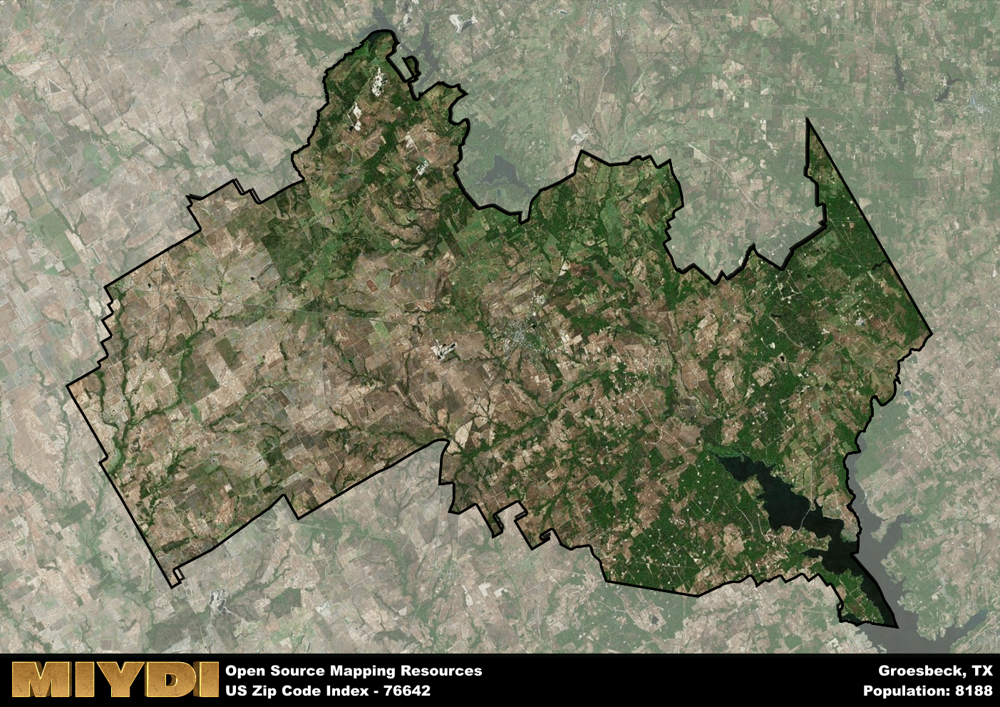

**Area Name:** Groesbeck

**Zip Code:** 76642

**State:** TX

# Groesbeck, TX (Zip Code: 76642)

**Location**: The zip code 76642 corresponds to the charming town of Groesbeck, located in Limestone County, Texas. Situated in the heart of the state, Groesbeck is surrounded by rolling hills and lush greenery, providing a picturesque backdrop for its residents. It is conveniently located near major highways, allowing for easy access to nearby cities such as Waco and Dallas, making it a desirable place to live for those seeking a peaceful small-town atmosphere with close proximity to urban amenities.

**History**: Groesbeck was founded in the 1860s and named after Abraham Groesbeeck, a railroad executive. The town grew rapidly due to its strategic location along the International-Great Northern Railroad. Over the years, Groesbeck has retained its historic charm with well-preserved Victorian architecture and a strong sense of community pride. The town played a significant role in Texas history, serving as a hub for agriculture and commerce in the region.

**Current Status**: Today, Groesbeck is a vibrant community with a mix of residential neighborhoods, local businesses, and recreational opportunities. The town's economy is supported by agriculture, oil production, and tourism, with visitors drawn to its historic downtown area and annual events. Residents enjoy access to parks, lakes, and cultural attractions, including the Limestone County Historical Museum and the Old Fort Parker State Park. Groesbeck's small-town charm, rich history, and close-knit community make it a unique and welcoming place to call home in the heart of Texas.

# Groesbeck Demographics

The population of Groesbeck is 8188.  
Groesbeck has a population density of 28.79 per square mile.  
The area of Groesbeck is 284.39 square miles.  

## Groesbeck Income and Economic Data

These demographic numbers are sourced from IRS return data, providing comprehensive insights into the population dynamics and economic trends within Groesbeck.

**Breakdown of return types for Groesbeck**

The table offers insight into the composition of tax returns filed with the IRS, categorizing them into three main types. Single returns represent filings by individuals, joint returns by married couples, and head of household returns by individuals who qualify as heads of households, typically having dependents. This breakdown provides an understanding of the different filing statuses adopted by taxpayers when submitting their tax documentation.

| Return Types filed for Groesbeck                              | Percentage          |
|----------------------------------------------------------|---------------------|
| Single Returns                                            | 0.44 |
| Joint Returns                                             | 0.39 |
| Head Household Returns                                    | 0.16 |

The income and economic data presented here is sourced from the IRS income brackets, utilized for categorizing tax returns by income levels. This table displays income ranges for both single filers and married couples, along with the corresponding number of returns and the percentage within each bracket, providing valuable insight into the distribution of taxes across various income groups.

| Bracket Name       | Single Filer Income Range | Married Couple Range | Number of Returns | Percentage of Returns |
|--------------------|----------------------------|----------------------|-------------------|-----------------------|
| 10% Bracket        | Up to $10,275              | Up to $20,550        | 970 | 0.36% |
| 12% Bracket        | $10,276 - $41,775          | $20,551 - $83,550    | 730 | 0.27% |
| 22% Bracket        | $41,776 - $89,075          | $83,551 - $178,150   | 370 | 0.14% |
| 24% Bracket        | $89,076 - $170,050         | $178,151 - $340,100  | 230 | 0.08% |
| 32% Bracket        | $170,051 - $215,950        | $340,101 - $431,900  | 340 | 0.13% |
| 35% Bracket        | $215,951 - $539,900        | $431,901 - $647,850  | 70 | 0.03% |

### Exploring Taxpayer Diversity: A Breakdown of Different Types of Tax Returns in Groesbeck

The table offers insights into various types of tax returns filed, reflecting different aspects of taxpayer activities and demographics. Categories include charitable returns for donations, dependent returns for claimed dependents, educator population, elderly population, real estate returns, self-employment returns, student loan returns, and unemployment returns, providing valuable insights into taxpayer behavior and demographics.

| Groesbeck Filing Types                    | Count | Percentage |
|--------------------------------------|-------|------------|
| Charitable Donations                 | 90 | 0.033% |
| Dependents Claimed                   | 60 | 0.022% |
| Educator Residents                   | 80 | 0.03% |
| Elderly Population                   | 790 | 0.29% |
| Farming Population                   | 290 | 0.107% |
| Real Estate Transactions             | 90 | 0.033% |
| Self-Employed Individuals            | 320 | 0.118% |
| Student Loan Cases                   | 140 | 0.052% |
| Unemployment Benefit Filings         | 280 | 0.1% |

## Groesbeck AI and Census Variables

The values presented in this dataset for Groesbeck are AI-optimized, streamlined, and categorized into relevant buckets for enhanced utility in AI and mapping programs. These simplified values have been optimized to facilitate efficient analysis and integration into various technological applications, offering users accessible and actionable insights into demographics within the Groesbeck area.

| AI Variables for Groesbeck | Value |
|-------------|-------|
| Shape Area | 1016538993.30078 |
| Shape Length | 234457.464704378 |

## How to use this free AI optimized Geo-Spatial Data for Groesbeck, TX

This data is made freely available under the Creative Commons license, allowing for unrestricted use for any purpose. Users can access static resources directly from GitHub or leverage more advanced functionalities by utilizing the GeoJSON files. All datasets originate from official government or private sector sources and are meticulously compiled into relevant datasets within QGIS. However, the versatility of the data ensures compatibility with any mapping application.

## Data Accuracy Disclaimer
It's important to note that the data provided here may contain errors or discrepancies and should be considered as 'close enough' for business applications and AI rather than a definitive source of truth. This data is aggregated from multiple sources, some of which publish information on wildly different intervals, leading to potential inconsistencies. Additionally, certain data points may not be corrected for Covid-related changes, further impacting accuracy. Moreover, the assumption that demographic trends are consistent throughout a region may lead to discrepancies, as trends often concentrate in areas of highest population density. As a result, dense areas may be slightly underrepresented, while rural areas may be slightly overrepresented, resulting in a more conservative dataset. Furthermore, the focus primarily on areas within US Major and Minor Statistical areas means that approximately 40 million Americans living outside of these areas may not be fully represented. Lastly, the historical background and area descriptions generated using AI are susceptible to potential mistakes, so users should exercise caution when interpreting the information provided.
