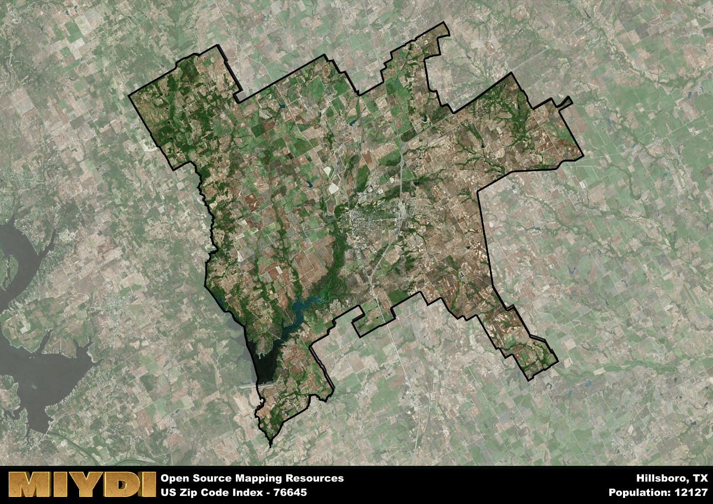

**Area Name:** Hillsboro

**Zip Code:** 76645

**State:** TX

# Hillsboro, TX 76645: A Historic Gem in Central Texas

Located in the heart of Hill County, Hillsboro, TX 76645 is a charming neighborhood that forms an integral part of the larger city of Hillsboro. Situated just 50 miles south of Dallas and 35 miles north of Waco, this zip code area serves as a vibrant suburban community within the Dallas-Fort Worth metropolitan area. With easy access to major highways such as Interstate 35, residents enjoy a convenient commute to neighboring cities while still relishing in the close-knit community atmosphere of Hillsboro.

Hillsboro, TX 76645 has a rich historical background dating back to the mid-19th century when it was established as a trading post along the Chisholm Trail. Over the years, the area flourished as a center for agriculture and commerce, attracting settlers and businesses seeking opportunities in the fertile lands of Central Texas. The neighborhood's name pays homage to its hilly terrain and picturesque landscapes, which have remained a defining feature of the area throughout its development.

Today, Hillsboro, TX 76645 boasts a diverse economy supported by industries such as manufacturing, healthcare, and retail. Residents have access to a range of local businesses, schools, and recreational facilities, making it an ideal place to live, work, and play. The area is also home to several historic sites, including the Hill County Courthouse and the Hill County Cell Block Museum, which offer glimpses into the neighborhood's past. With its blend of small-town charm and modern conveniences, Hillsboro, TX 76645 continues to thrive as a hidden gem in Central Texas.

# Hillsboro Demographics

The population of Hillsboro is 12127.  
Hillsboro has a population density of 65.44 per square mile.  
The area of Hillsboro is 185.31 square miles.  

## Hillsboro Income and Economic Data

These demographic numbers are sourced from IRS return data, providing comprehensive insights into the population dynamics and economic trends within Hillsboro.

**Breakdown of return types for Hillsboro**

The table offers insight into the composition of tax returns filed with the IRS, categorizing them into three main types. Single returns represent filings by individuals, joint returns by married couples, and head of household returns by individuals who qualify as heads of households, typically having dependents. This breakdown provides an understanding of the different filing statuses adopted by taxpayers when submitting their tax documentation.

| Return Types filed for Hillsboro                              | Percentage          |
|----------------------------------------------------------|---------------------|
| Single Returns                                            | 0.45 |
| Joint Returns                                             | 0.36 |
| Head Household Returns                                    | 0.18 |

The income and economic data presented here is sourced from the IRS income brackets, utilized for categorizing tax returns by income levels. This table displays income ranges for both single filers and married couples, along with the corresponding number of returns and the percentage within each bracket, providing valuable insight into the distribution of taxes across various income groups.

| Bracket Name       | Single Filer Income Range | Married Couple Range | Number of Returns | Percentage of Returns |
|--------------------|----------------------------|----------------------|-------------------|-----------------------|
| 10% Bracket        | Up to $10,275              | Up to $20,550        | 2010 | 0.4% |
| 12% Bracket        | $10,276 - $41,775          | $20,551 - $83,550    | 1500 | 0.3% |
| 22% Bracket        | $41,776 - $89,075          | $83,551 - $178,150   | 730 | 0.14% |
| 24% Bracket        | $89,076 - $170,050         | $178,151 - $340,100  | 350 | 0.07% |
| 32% Bracket        | $170,051 - $215,950        | $340,101 - $431,900  | 390 | 0.08% |
| 35% Bracket        | $215,951 - $539,900        | $431,901 - $647,850  | 100 | 0.02% |

### Exploring Taxpayer Diversity: A Breakdown of Different Types of Tax Returns in Hillsboro

The table offers insights into various types of tax returns filed, reflecting different aspects of taxpayer activities and demographics. Categories include charitable returns for donations, dependent returns for claimed dependents, educator population, elderly population, real estate returns, self-employment returns, student loan returns, and unemployment returns, providing valuable insights into taxpayer behavior and demographics.

| Hillsboro Filing Types                    | Count | Percentage |
|--------------------------------------|-------|------------|
| Charitable Donations                 | 120 | 0.024% |
| Dependents Claimed                   | 100 | 0.02% |
| Educator Residents                   | 110 | 0.022% |
| Elderly Population                   | 1200 | 0.24% |
| Farming Population                   | 250 | 0.049% |
| Real Estate Transactions             | 110 | 0.022% |
| Self-Employed Individuals            | 630 | 0.124% |
| Student Loan Cases                   | 210 | 0.041% |
| Unemployment Benefit Filings         | 590 | 0.12% |

## Hillsboro AI and Census Variables

The values presented in this dataset for Hillsboro are AI-optimized, streamlined, and categorized into relevant buckets for enhanced utility in AI and mapping programs. These simplified values have been optimized to facilitate efficient analysis and integration into various technological applications, offering users accessible and actionable insights into demographics within the Hillsboro area.

| AI Variables for Hillsboro | Value |
|-------------|-------|
| Shape Area | 669591761.824219 |
| Shape Length | 194462.138238243 |

## How to use this free AI optimized Geo-Spatial Data for Hillsboro, TX

This data is made freely available under the Creative Commons license, allowing for unrestricted use for any purpose. Users can access static resources directly from GitHub or leverage more advanced functionalities by utilizing the GeoJSON files. All datasets originate from official government or private sector sources and are meticulously compiled into relevant datasets within QGIS. However, the versatility of the data ensures compatibility with any mapping application.

## Data Accuracy Disclaimer
It's important to note that the data provided here may contain errors or discrepancies and should be considered as 'close enough' for business applications and AI rather than a definitive source of truth. This data is aggregated from multiple sources, some of which publish information on wildly different intervals, leading to potential inconsistencies. Additionally, certain data points may not be corrected for Covid-related changes, further impacting accuracy. Moreover, the assumption that demographic trends are consistent throughout a region may lead to discrepancies, as trends often concentrate in areas of highest population density. As a result, dense areas may be slightly underrepresented, while rural areas may be slightly overrepresented, resulting in a more conservative dataset. Furthermore, the focus primarily on areas within US Major and Minor Statistical areas means that approximately 40 million Americans living outside of these areas may not be fully represented. Lastly, the historical background and area descriptions generated using AI are susceptible to potential mistakes, so users should exercise caution when interpreting the information provided.
