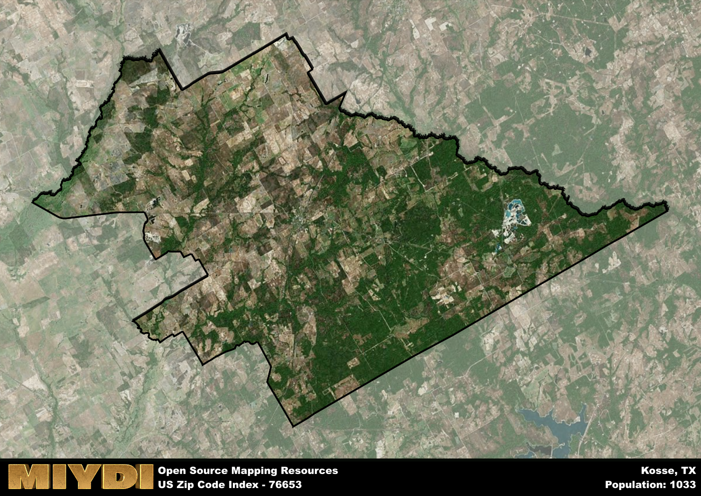

**Area Name:** Kosse

**Zip Code:** 76653

**State:** TX

Kosse is a part of the Waco - TX Metro Area, and makes up  of the Metro's population.  

# Kosse: A Historic Gem in Central Texas

Located in Central Texas, the zip code area 76653 encompasses the charming town of Kosse. Situated within Limestone County, Kosse is surrounded by the cities of Groesbeck, Mexia, and Marlin. It serves as a gateway to the larger metropolitan area of Waco, providing a tranquil escape from the bustling urban environment while still maintaining close ties to regional hubs.

Kosse has a rich historical heritage dating back to its establishment in the mid-19th century. Originally known as Eutaw, the town was renamed Kosse in honor of a chief engineer of the Houston and Texas Central Railway. The town flourished as a railroad stop and agricultural center, attracting settlers with its fertile land and promising economic opportunities. Over the years, Kosse has preserved its small-town charm and historic architecture, offering visitors a glimpse into its past.

Today, Kosse continues to thrive as a close-knit community with a focus on agriculture and small businesses. The town boasts a variety of local shops, restaurants, and services catering to residents and visitors alike. Outdoor enthusiasts can explore the nearby parks and recreational areas, while history buffs can visit landmarks such as the Kosse Heritage House Museum. With its blend of historic charm and modern amenities, Kosse remains a hidden gem in the heart of Central Texas.

# Kosse Demographics

The population of Kosse is 1033.  
Kosse has a population density of 7.63 per square mile.  
The area of Kosse is 135.47 square miles.  

## Kosse Income and Economic Data

These demographic numbers are sourced from IRS return data, providing comprehensive insights into the population dynamics and economic trends within Kosse.

**Breakdown of return types for Kosse**

The table offers insight into the composition of tax returns filed with the IRS, categorizing them into three main types. Single returns represent filings by individuals, joint returns by married couples, and head of household returns by individuals who qualify as heads of households, typically having dependents. This breakdown provides an understanding of the different filing statuses adopted by taxpayers when submitting their tax documentation.

| Return Types filed for Kosse                              | Percentage          |
|----------------------------------------------------------|---------------------|
| Single Returns                                            | 0.41 |
| Joint Returns                                             | 0.49 |
| Head Household Returns                                    | 0.1 |

The income and economic data presented here is sourced from the IRS income brackets, utilized for categorizing tax returns by income levels. This table displays income ranges for both single filers and married couples, along with the corresponding number of returns and the percentage within each bracket, providing valuable insight into the distribution of taxes across various income groups.

| Bracket Name       | Single Filer Income Range | Married Couple Range | Number of Returns | Percentage of Returns |
|--------------------|----------------------------|----------------------|-------------------|-----------------------|
| 10% Bracket        | Up to $10,275              | Up to $20,550        | 170 | 0.33% |
| 12% Bracket        | $10,276 - $41,775          | $20,551 - $83,550    | 130 | 0.25% |
| 22% Bracket        | $41,776 - $89,075          | $83,551 - $178,150   | 70 | 0.14% |
| 24% Bracket        | $89,076 - $170,050         | $178,151 - $340,100  | 50 | 0.1% |
| 32% Bracket        | $170,051 - $215,950        | $340,101 - $431,900  | 90 | 0.18% |
| 35% Bracket        | $215,951 - $539,900        | $431,901 - $647,850  | 0 | 0% |

### Exploring Taxpayer Diversity: A Breakdown of Different Types of Tax Returns in Kosse

The table offers insights into various types of tax returns filed, reflecting different aspects of taxpayer activities and demographics. Categories include charitable returns for donations, dependent returns for claimed dependents, educator population, elderly population, real estate returns, self-employment returns, student loan returns, and unemployment returns, providing valuable insights into taxpayer behavior and demographics.

| Kosse Filing Types                    | Count | Percentage |
|--------------------------------------|-------|------------|
| Charitable Donations                 | 0 | 0% |
| Dependents Claimed                   | 0 | 0% |
| Educator Residents                   | 0 | 0% |
| Elderly Population                   | 180 | 0.35% |
| Farming Population                   | 130 | 0.255% |
| Real Estate Transactions             | 0 | 0% |
| Self-Employed Individuals            | 80 | 0.157% |
| Student Loan Cases                   | 20 | 0.039% |
| Unemployment Benefit Filings         | 40 | 0.08% |

## Kosse AI and Census Variables

The values presented in this dataset for Kosse are AI-optimized, streamlined, and categorized into relevant buckets for enhanced utility in AI and mapping programs. These simplified values have been optimized to facilitate efficient analysis and integration into various technological applications, offering users accessible and actionable insights into demographics within the Kosse area.

| AI Variables for Kosse | Value |
|-------------|-------|
| Shape Area | 482114767.472656 |
| Shape Length | 147551.354139904 |
| CBSA Federal Processing Standard Code | 47380 |

## How to use this free AI optimized Geo-Spatial Data for Kosse, TX

This data is made freely available under the Creative Commons license, allowing for unrestricted use for any purpose. Users can access static resources directly from GitHub or leverage more advanced functionalities by utilizing the GeoJSON files. All datasets originate from official government or private sector sources and are meticulously compiled into relevant datasets within QGIS. However, the versatility of the data ensures compatibility with any mapping application.

## Data Accuracy Disclaimer
It's important to note that the data provided here may contain errors or discrepancies and should be considered as 'close enough' for business applications and AI rather than a definitive source of truth. This data is aggregated from multiple sources, some of which publish information on wildly different intervals, leading to potential inconsistencies. Additionally, certain data points may not be corrected for Covid-related changes, further impacting accuracy. Moreover, the assumption that demographic trends are consistent throughout a region may lead to discrepancies, as trends often concentrate in areas of highest population density. As a result, dense areas may be slightly underrepresented, while rural areas may be slightly overrepresented, resulting in a more conservative dataset. Furthermore, the focus primarily on areas within US Major and Minor Statistical areas means that approximately 40 million Americans living outside of these areas may not be fully represented. Lastly, the historical background and area descriptions generated using AI are susceptible to potential mistakes, so users should exercise caution when interpreting the information provided.
