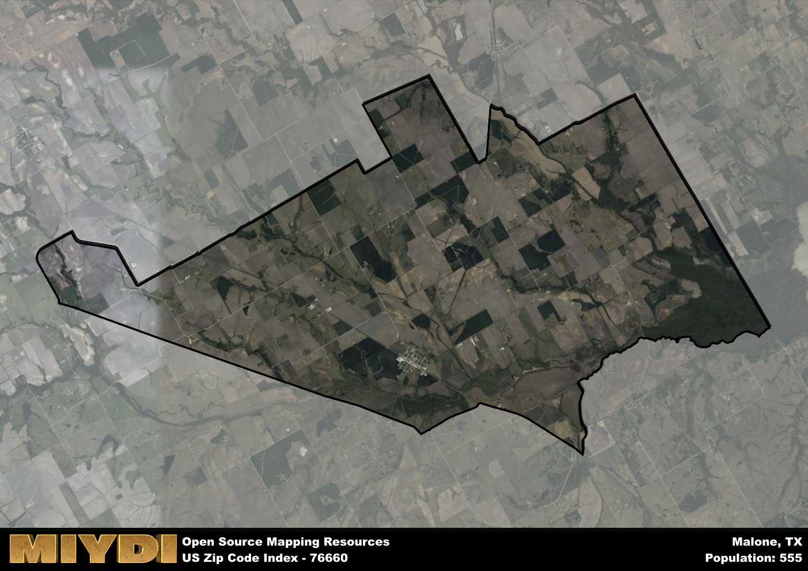

**Area Name:** Malone

**Zip Code:** 76660

**State:** TX

# Malone, TX 76660: A Quaint Neighborhood in Central Texas  

Located in the heart of Central Texas, Malone is a small community that falls under the zip code 76660. Bordered by the larger cities of Waco to the north and Hillsboro to the south, Malone is nestled in between vast stretches of farmland and ranches. Despite its rural surroundings, Malone is well-connected to major highways, making it a convenient stop for travelers passing through the area.

Originally settled in the late 19th century, Malone was named after an early pioneer in the region. The town saw steady growth with the arrival of the railroad in the early 1900s, attracting farmers and merchants to set up shop in the area. Over the years, Malone has maintained its small-town charm, with a close-knit community that values its rich history and heritage.

Today, Malone boasts a mix of agricultural and residential properties, with a few local businesses serving the needs of its residents. The town is known for its annual community events, such as the Malone Rodeo and Harvest Festival, which draw visitors from neighboring towns. Outdoor enthusiasts can enjoy the surrounding countryside for hiking and fishing, while history buffs can explore the local museum showcasing artifacts from Malone's past. Overall, Malone offers a peaceful retreat from the hustle and bustle of city life, with a strong sense of community that defines its character.

# Malone Demographics

The population of Malone is 555.  
Malone has a population density of 14.93 per square mile.  
The area of Malone is 37.17 square miles.  

## Malone Income and Economic Data

These demographic numbers are sourced from IRS return data, providing comprehensive insights into the population dynamics and economic trends within Malone.

**Breakdown of return types for Malone**

The table offers insight into the composition of tax returns filed with the IRS, categorizing them into three main types. Single returns represent filings by individuals, joint returns by married couples, and head of household returns by individuals who qualify as heads of households, typically having dependents. This breakdown provides an understanding of the different filing statuses adopted by taxpayers when submitting their tax documentation.

| Return Types filed for Malone                              | Percentage          |
|----------------------------------------------------------|---------------------|
| Single Returns                                            | 0.4 |
| Joint Returns                                             | 0.4 |
| Head Household Returns                                    | 0.15 |

The income and economic data presented here is sourced from the IRS income brackets, utilized for categorizing tax returns by income levels. This table displays income ranges for both single filers and married couples, along with the corresponding number of returns and the percentage within each bracket, providing valuable insight into the distribution of taxes across various income groups.

| Bracket Name       | Single Filer Income Range | Married Couple Range | Number of Returns | Percentage of Returns |
|--------------------|----------------------------|----------------------|-------------------|-----------------------|
| 10% Bracket        | Up to $10,275              | Up to $20,550        | 80 | 0.4% |
| 12% Bracket        | $10,276 - $41,775          | $20,551 - $83,550    | 60 | 0.3% |
| 22% Bracket        | $41,776 - $89,075          | $83,551 - $178,150   | 30 | 0.15% |
| 24% Bracket        | $89,076 - $170,050         | $178,151 - $340,100  | 30 | 0.15% |
| 32% Bracket        | $170,051 - $215,950        | $340,101 - $431,900  | 0 | 0% |
| 35% Bracket        | $215,951 - $539,900        | $431,901 - $647,850  | 0 | 0% |

### Exploring Taxpayer Diversity: A Breakdown of Different Types of Tax Returns in Malone

The table offers insights into various types of tax returns filed, reflecting different aspects of taxpayer activities and demographics. Categories include charitable returns for donations, dependent returns for claimed dependents, educator population, elderly population, real estate returns, self-employment returns, student loan returns, and unemployment returns, providing valuable insights into taxpayer behavior and demographics.

| Malone Filing Types                    | Count | Percentage |
|--------------------------------------|-------|------------|
| Charitable Donations                 | 0 | 0% |
| Dependents Claimed                   | 0 | 0% |
| Educator Residents                   | 0 | 0% |
| Elderly Population                   | 50 | 0.25% |
| Farming Population                   | 30 | 0.15% |
| Real Estate Transactions             | 0 | 0% |
| Self-Employed Individuals            | 30 | 0.15% |
| Student Loan Cases                   | 0 | 0% |
| Unemployment Benefit Filings         | 20 | 0.1% |

## Malone AI and Census Variables

The values presented in this dataset for Malone are AI-optimized, streamlined, and categorized into relevant buckets for enhanced utility in AI and mapping programs. These simplified values have been optimized to facilitate efficient analysis and integration into various technological applications, offering users accessible and actionable insights into demographics within the Malone area.

| AI Variables for Malone | Value |
|-------------|-------|
| Shape Area | 134083630.210938 |
| Shape Length | 66714.2317045598 |

## How to use this free AI optimized Geo-Spatial Data for Malone, TX

This data is made freely available under the Creative Commons license, allowing for unrestricted use for any purpose. Users can access static resources directly from GitHub or leverage more advanced functionalities by utilizing the GeoJSON files. All datasets originate from official government or private sector sources and are meticulously compiled into relevant datasets within QGIS. However, the versatility of the data ensures compatibility with any mapping application.

## Data Accuracy Disclaimer
It's important to note that the data provided here may contain errors or discrepancies and should be considered as 'close enough' for business applications and AI rather than a definitive source of truth. This data is aggregated from multiple sources, some of which publish information on wildly different intervals, leading to potential inconsistencies. Additionally, certain data points may not be corrected for Covid-related changes, further impacting accuracy. Moreover, the assumption that demographic trends are consistent throughout a region may lead to discrepancies, as trends often concentrate in areas of highest population density. As a result, dense areas may be slightly underrepresented, while rural areas may be slightly overrepresented, resulting in a more conservative dataset. Furthermore, the focus primarily on areas within US Major and Minor Statistical areas means that approximately 40 million Americans living outside of these areas may not be fully represented. Lastly, the historical background and area descriptions generated using AI are susceptible to potential mistakes, so users should exercise caution when interpreting the information provided.
