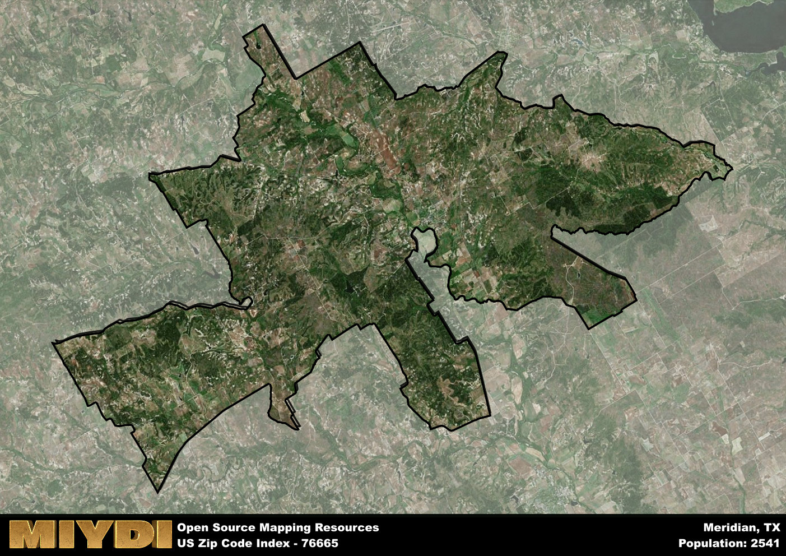

**Area Name:** Meridian

**Zip Code:** 76665

**State:** TX

# Meridian: A Historic Gem in Central Texas

Located in Central Texas, zip code 76665 encompasses the charming town of Meridian. Situated within Bosque County, Meridian is surrounded by rolling hills, lush forests, and picturesque countryside. The town is conveniently located near major highways, making it easily accessible from nearby cities such as Waco and Dallas. Despite its rural setting, Meridian is a vibrant community that serves as a hub for the surrounding area.

Founded in the mid-19th century, Meridian has a rich history rooted in agriculture and ranching. The town's growth was spurred by the construction of the Texas Central Railroad in the late 1800s, which connected Meridian to larger markets and facilitated trade. Over the years, Meridian has evolved into a thriving community known for its historic downtown district, Victorian-era architecture, and friendly atmosphere. The town's name reflects its location at the midpoint between the Brazos and Trinity Rivers.

Today, Meridian boasts a diverse economy that includes agriculture, tourism, and small businesses. The town is home to a variety of shops, restaurants, and services that cater to both residents and visitors. Outdoor enthusiasts can explore the nearby Meridian State Park, which offers hiking trails, fishing opportunities, and scenic picnic spots. Cultural attractions such as the Bosque Museum and the Meridian Opera House provide insight into the town's heritage and offer a glimpse into its vibrant arts scene. With its blend of history, natural beauty, and community spirit, Meridian continues to thrive as a hidden gem in Central Texas.

# Meridian Demographics

The population of Meridian is 2541.  
Meridian has a population density of 15.52 per square mile.  
The area of Meridian is 163.75 square miles.  

## Meridian Income and Economic Data

These demographic numbers are sourced from IRS return data, providing comprehensive insights into the population dynamics and economic trends within Meridian.

**Breakdown of return types for Meridian**

The table offers insight into the composition of tax returns filed with the IRS, categorizing them into three main types. Single returns represent filings by individuals, joint returns by married couples, and head of household returns by individuals who qualify as heads of households, typically having dependents. This breakdown provides an understanding of the different filing statuses adopted by taxpayers when submitting their tax documentation.

| Return Types filed for Meridian                              | Percentage          |
|----------------------------------------------------------|---------------------|
| Single Returns                                            | 0.44 |
| Joint Returns                                             | 0.42 |
| Head Household Returns                                    | 0.13 |

The income and economic data presented here is sourced from the IRS income brackets, utilized for categorizing tax returns by income levels. This table displays income ranges for both single filers and married couples, along with the corresponding number of returns and the percentage within each bracket, providing valuable insight into the distribution of taxes across various income groups.

| Bracket Name       | Single Filer Income Range | Married Couple Range | Number of Returns | Percentage of Returns |
|--------------------|----------------------------|----------------------|-------------------|-----------------------|
| 10% Bracket        | Up to $10,275              | Up to $20,550        | 390 | 0.36% |
| 12% Bracket        | $10,276 - $41,775          | $20,551 - $83,550    | 290 | 0.27% |
| 22% Bracket        | $41,776 - $89,075          | $83,551 - $178,150   | 150 | 0.14% |
| 24% Bracket        | $89,076 - $170,050         | $178,151 - $340,100  | 90 | 0.08% |
| 32% Bracket        | $170,051 - $215,950        | $340,101 - $431,900  | 130 | 0.12% |
| 35% Bracket        | $215,951 - $539,900        | $431,901 - $647,850  | 30 | 0.03% |

### Exploring Taxpayer Diversity: A Breakdown of Different Types of Tax Returns in Meridian

The table offers insights into various types of tax returns filed, reflecting different aspects of taxpayer activities and demographics. Categories include charitable returns for donations, dependent returns for claimed dependents, educator population, elderly population, real estate returns, self-employment returns, student loan returns, and unemployment returns, providing valuable insights into taxpayer behavior and demographics.

| Meridian Filing Types                    | Count | Percentage |
|--------------------------------------|-------|------------|
| Charitable Donations                 | 40 | 0.037% |
| Dependents Claimed                   | 20 | 0.019% |
| Educator Residents                   | 30 | 0.028% |
| Elderly Population                   | 390 | 0.36% |
| Farming Population                   | 120 | 0.111% |
| Real Estate Transactions             | 40 | 0.037% |
| Self-Employed Individuals            | 170 | 0.157% |
| Student Loan Cases                   | 40 | 0.037% |
| Unemployment Benefit Filings         | 110 | 0.1% |

## Meridian AI and Census Variables

The values presented in this dataset for Meridian are AI-optimized, streamlined, and categorized into relevant buckets for enhanced utility in AI and mapping programs. These simplified values have been optimized to facilitate efficient analysis and integration into various technological applications, offering users accessible and actionable insights into demographics within the Meridian area.

| AI Variables for Meridian | Value |
|-------------|-------|
| Shape Area | 590350549.972656 |
| Shape Length | 213214.214886939 |

## How to use this free AI optimized Geo-Spatial Data for Meridian, TX

This data is made freely available under the Creative Commons license, allowing for unrestricted use for any purpose. Users can access static resources directly from GitHub or leverage more advanced functionalities by utilizing the GeoJSON files. All datasets originate from official government or private sector sources and are meticulously compiled into relevant datasets within QGIS. However, the versatility of the data ensures compatibility with any mapping application.

## Data Accuracy Disclaimer
It's important to note that the data provided here may contain errors or discrepancies and should be considered as 'close enough' for business applications and AI rather than a definitive source of truth. This data is aggregated from multiple sources, some of which publish information on wildly different intervals, leading to potential inconsistencies. Additionally, certain data points may not be corrected for Covid-related changes, further impacting accuracy. Moreover, the assumption that demographic trends are consistent throughout a region may lead to discrepancies, as trends often concentrate in areas of highest population density. As a result, dense areas may be slightly underrepresented, while rural areas may be slightly overrepresented, resulting in a more conservative dataset. Furthermore, the focus primarily on areas within US Major and Minor Statistical areas means that approximately 40 million Americans living outside of these areas may not be fully represented. Lastly, the historical background and area descriptions generated using AI are susceptible to potential mistakes, so users should exercise caution when interpreting the information provided.
