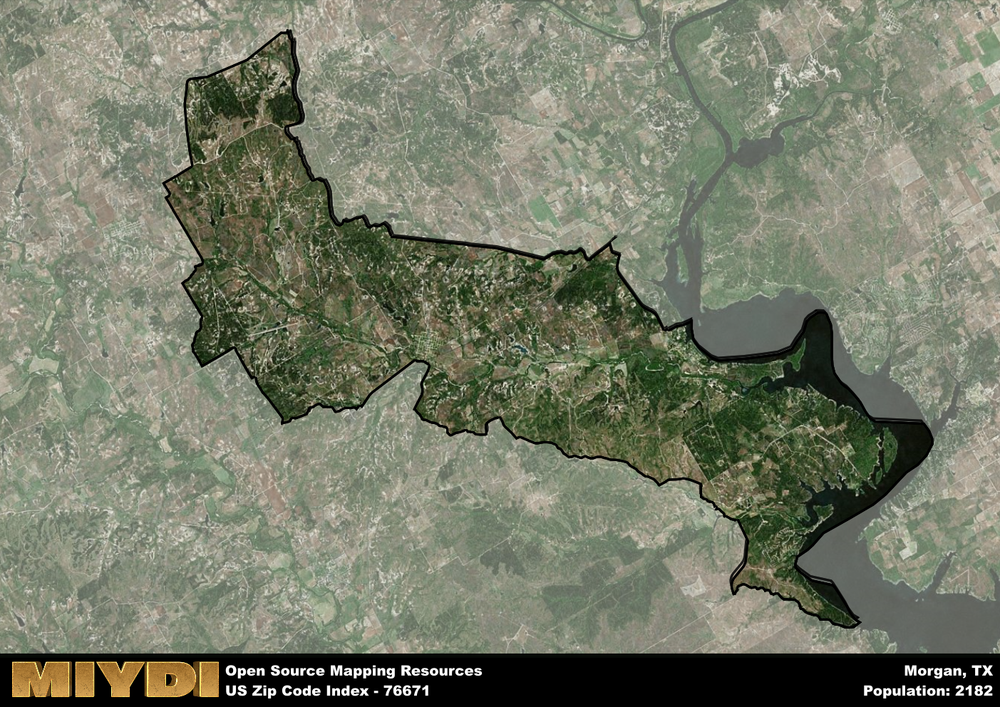

**Area Name:** Morgan

**Zip Code:** 76671

**State:** TX

# Discover the Charming Neighborhood of Morgan, Zip Code 76671  

Located in the heart of Texas, the zip code area 76671 encompasses the quaint neighborhood of Morgan. Situated within close proximity to larger cities like Waco and Dallas, Morgan enjoys the peaceful ambiance of a small community while benefiting from its integration into the bustling urban fabric of the region. Bordered by scenic countryside and rolling hills, the area offers a serene retreat from the hustle and bustle of city life.

Morgan has a rich historical narrative dating back to its early settlement in the 19th century. Originally established as a trading post along the Chisholm Trail, the area flourished as a hub for cattle ranching and farming. Over the years, Morgan has evolved into a tight-knit community known for its friendly residents and strong sense of community pride. The neighborhood's name pays homage to an influential local figure, highlighting its deep connection to the region's past.

Today, Morgan is a vibrant community with a thriving economy supported by agriculture, small businesses, and tourism. Residents and visitors alike can enjoy a range of recreational amenities, including parks, hiking trails, and local shops. The neighborhood is also home to several historic sites, such as the Morgan County Courthouse, which offer a glimpse into the area's storied past. With its picturesque surroundings and welcoming atmosphere, Morgan continues to attract those seeking a peaceful escape in the heart of Texas.

# Morgan Demographics

The population of Morgan is 2182.  
Morgan has a population density of 20.72 per square mile.  
The area of Morgan is 105.33 square miles.  

## Morgan Income and Economic Data

These demographic numbers are sourced from IRS return data, providing comprehensive insights into the population dynamics and economic trends within Morgan.

**Breakdown of return types for Morgan**

The table offers insight into the composition of tax returns filed with the IRS, categorizing them into three main types. Single returns represent filings by individuals, joint returns by married couples, and head of household returns by individuals who qualify as heads of households, typically having dependents. This breakdown provides an understanding of the different filing statuses adopted by taxpayers when submitting their tax documentation.

| Return Types filed for Morgan                              | Percentage          |
|----------------------------------------------------------|---------------------|
| Single Returns                                            | 0.38 |
| Joint Returns                                             | 0.49 |
| Head Household Returns                                    | 0.11 |

The income and economic data presented here is sourced from the IRS income brackets, utilized for categorizing tax returns by income levels. This table displays income ranges for both single filers and married couples, along with the corresponding number of returns and the percentage within each bracket, providing valuable insight into the distribution of taxes across various income groups.

| Bracket Name       | Single Filer Income Range | Married Couple Range | Number of Returns | Percentage of Returns |
|--------------------|----------------------------|----------------------|-------------------|-----------------------|
| 10% Bracket        | Up to $10,275              | Up to $20,550        | 280 | 0.35% |
| 12% Bracket        | $10,276 - $41,775          | $20,551 - $83,550    | 190 | 0.24% |
| 22% Bracket        | $41,776 - $89,075          | $83,551 - $178,150   | 120 | 0.15% |
| 24% Bracket        | $89,076 - $170,050         | $178,151 - $340,100  | 80 | 0.1% |
| 32% Bracket        | $170,051 - $215,950        | $340,101 - $431,900  | 120 | 0.15% |
| 35% Bracket        | $215,951 - $539,900        | $431,901 - $647,850  | 0 | 0% |

### Exploring Taxpayer Diversity: A Breakdown of Different Types of Tax Returns in Morgan

The table offers insights into various types of tax returns filed, reflecting different aspects of taxpayer activities and demographics. Categories include charitable returns for donations, dependent returns for claimed dependents, educator population, elderly population, real estate returns, self-employment returns, student loan returns, and unemployment returns, providing valuable insights into taxpayer behavior and demographics.

| Morgan Filing Types                    | Count | Percentage |
|--------------------------------------|-------|------------|
| Charitable Donations                 | 0 | 0% |
| Dependents Claimed                   | 0 | 0% |
| Educator Residents                   | 0 | 0% |
| Elderly Population                   | 290 | 0.37% |
| Farming Population                   | 40 | 0.051% |
| Real Estate Transactions             | 0 | 0% |
| Self-Employed Individuals            | 110 | 0.139% |
| Student Loan Cases                   | 40 | 0.051% |
| Unemployment Benefit Filings         | 100 | 0.13% |

## Morgan AI and Census Variables

The values presented in this dataset for Morgan are AI-optimized, streamlined, and categorized into relevant buckets for enhanced utility in AI and mapping programs. These simplified values have been optimized to facilitate efficient analysis and integration into various technological applications, offering users accessible and actionable insights into demographics within the Morgan area.

| AI Variables for Morgan | Value |
|-------------|-------|
| Shape Area | 380567902.34375 |
| Shape Length | 144851.501512639 |

## How to use this free AI optimized Geo-Spatial Data for Morgan, TX

This data is made freely available under the Creative Commons license, allowing for unrestricted use for any purpose. Users can access static resources directly from GitHub or leverage more advanced functionalities by utilizing the GeoJSON files. All datasets originate from official government or private sector sources and are meticulously compiled into relevant datasets within QGIS. However, the versatility of the data ensures compatibility with any mapping application.

## Data Accuracy Disclaimer
It's important to note that the data provided here may contain errors or discrepancies and should be considered as 'close enough' for business applications and AI rather than a definitive source of truth. This data is aggregated from multiple sources, some of which publish information on wildly different intervals, leading to potential inconsistencies. Additionally, certain data points may not be corrected for Covid-related changes, further impacting accuracy. Moreover, the assumption that demographic trends are consistent throughout a region may lead to discrepancies, as trends often concentrate in areas of highest population density. As a result, dense areas may be slightly underrepresented, while rural areas may be slightly overrepresented, resulting in a more conservative dataset. Furthermore, the focus primarily on areas within US Major and Minor Statistical areas means that approximately 40 million Americans living outside of these areas may not be fully represented. Lastly, the historical background and area descriptions generated using AI are susceptible to potential mistakes, so users should exercise caution when interpreting the information provided.
