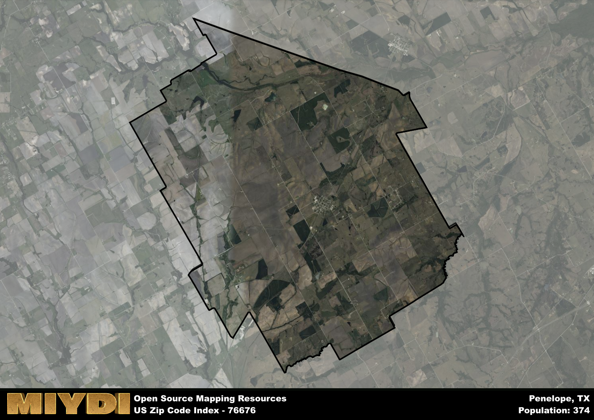

**Area Name:** Penelope

**Zip Code:** 76676

**State:** TX

# Penelope: A Charming Community in Central Texas  
Located in central Texas, the zip code 76676 area corresponds to the small community of Penelope. Situated within Hill County, Penelope is surrounded by rural farmland and is approximately 70 miles south of the major city of Fort Worth. The area maintains a close-knit atmosphere, with neighboring towns such as Malone and Bynum contributing to the rural landscape and sense of community.

Penelope has a rich historical narrative, dating back to its establishment in the late 1800s. Named after the wife of a Santa Fe Railroad executive, the town experienced growth with the arrival of the railroad, becoming a key hub for shipping agricultural goods. Over the years, Penelope has maintained its small-town charm while adapting to modern times, preserving its historic buildings and landmarks that speak to its past.

Today, Penelope is a peaceful retreat from the hustle and bustle of larger cities, offering a slower pace of life for its residents. The economy is primarily driven by agriculture, with farms and ranches dotting the landscape. The community has a strong sense of pride in its heritage, with local events and festivals celebrating the town's history. Residents enjoy access to outdoor recreational activities such as fishing and hiking, as well as local services including schools, churches, and small businesses that contribute to the area's unique character.

# Penelope Demographics

The population of Penelope is 374.  
Penelope has a population density of 8.49 per square mile.  
The area of Penelope is 44.05 square miles.  

## Penelope Income and Economic Data

These demographic numbers are sourced from IRS return data, providing comprehensive insights into the population dynamics and economic trends within Penelope.

**Breakdown of return types for Penelope**

The table offers insight into the composition of tax returns filed with the IRS, categorizing them into three main types. Single returns represent filings by individuals, joint returns by married couples, and head of household returns by individuals who qualify as heads of households, typically having dependents. This breakdown provides an understanding of the different filing statuses adopted by taxpayers when submitting their tax documentation.

| Return Types filed for Penelope                              | Percentage          |
|----------------------------------------------------------|---------------------|
| Single Returns                                            | 0.39 |
| Joint Returns                                             | 0.39 |
| Head Household Returns                                    | 0.11 |

The income and economic data presented here is sourced from the IRS income brackets, utilized for categorizing tax returns by income levels. This table displays income ranges for both single filers and married couples, along with the corresponding number of returns and the percentage within each bracket, providing valuable insight into the distribution of taxes across various income groups.

| Bracket Name       | Single Filer Income Range | Married Couple Range | Number of Returns | Percentage of Returns |
|--------------------|----------------------------|----------------------|-------------------|-----------------------|
| 10% Bracket        | Up to $10,275              | Up to $20,550        | 60 | 0.33% |
| 12% Bracket        | $10,276 - $41,775          | $20,551 - $83,550    | 50 | 0.28% |
| 22% Bracket        | $41,776 - $89,075          | $83,551 - $178,150   | 30 | 0.17% |
| 24% Bracket        | $89,076 - $170,050         | $178,151 - $340,100  | 40 | 0.22% |
| 32% Bracket        | $170,051 - $215,950        | $340,101 - $431,900  | 0 | 0% |
| 35% Bracket        | $215,951 - $539,900        | $431,901 - $647,850  | 0 | 0% |

### Exploring Taxpayer Diversity: A Breakdown of Different Types of Tax Returns in Penelope

The table offers insights into various types of tax returns filed, reflecting different aspects of taxpayer activities and demographics. Categories include charitable returns for donations, dependent returns for claimed dependents, educator population, elderly population, real estate returns, self-employment returns, student loan returns, and unemployment returns, providing valuable insights into taxpayer behavior and demographics.

| Penelope Filing Types                    | Count | Percentage |
|--------------------------------------|-------|------------|
| Charitable Donations                 | 0 | 0% |
| Dependents Claimed                   | 0 | 0% |
| Educator Residents                   | 0 | 0% |
| Elderly Population                   | 50 | 0.28% |
| Farming Population                   | 0 | 0% |
| Real Estate Transactions             | 0 | 0% |
| Self-Employed Individuals            | 20 | 0.111% |
| Student Loan Cases                   | 0 | 0% |
| Unemployment Benefit Filings         | 0 | 0% |

## Penelope AI and Census Variables

The values presented in this dataset for Penelope are AI-optimized, streamlined, and categorized into relevant buckets for enhanced utility in AI and mapping programs. These simplified values have been optimized to facilitate efficient analysis and integration into various technological applications, offering users accessible and actionable insights into demographics within the Penelope area.

| AI Variables for Penelope | Value |
|-------------|-------|
| Shape Area | 158646117.613281 |
| Shape Length | 61166.7581755686 |

## How to use this free AI optimized Geo-Spatial Data for Penelope, TX

This data is made freely available under the Creative Commons license, allowing for unrestricted use for any purpose. Users can access static resources directly from GitHub or leverage more advanced functionalities by utilizing the GeoJSON files. All datasets originate from official government or private sector sources and are meticulously compiled into relevant datasets within QGIS. However, the versatility of the data ensures compatibility with any mapping application.

## Data Accuracy Disclaimer
It's important to note that the data provided here may contain errors or discrepancies and should be considered as 'close enough' for business applications and AI rather than a definitive source of truth. This data is aggregated from multiple sources, some of which publish information on wildly different intervals, leading to potential inconsistencies. Additionally, certain data points may not be corrected for Covid-related changes, further impacting accuracy. Moreover, the assumption that demographic trends are consistent throughout a region may lead to discrepancies, as trends often concentrate in areas of highest population density. As a result, dense areas may be slightly underrepresented, while rural areas may be slightly overrepresented, resulting in a more conservative dataset. Furthermore, the focus primarily on areas within US Major and Minor Statistical areas means that approximately 40 million Americans living outside of these areas may not be fully represented. Lastly, the historical background and area descriptions generated using AI are susceptible to potential mistakes, so users should exercise caution when interpreting the information provided.
