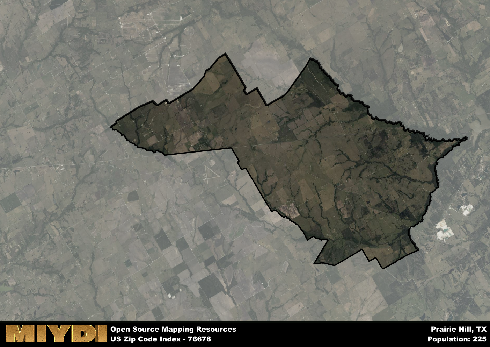

**Area Name:** Prairie Hill

**Zip Code:** 76678

**State:** TX

# Prairie Hill: A Tranquil Neighborhood in Central Texas  
Located within the zip code 76678, Prairie Hill is a small rural community situated in Hill County, Texas. The area is bordered by the towns of Hubbard to the west and Mount Calm to the east. Prairie Hill is approximately 20 miles southeast of the city of Waco, making it a part of the greater Waco metropolitan area. This zip code area is characterized by vast open fields and a peaceful countryside setting, offering residents a quiet retreat from the hustle and bustle of urban life.

Prairie Hill has a rich history dating back to the late 1800s when it was originally settled by pioneers drawn to the fertile land for farming and ranching. The area experienced significant growth during the early 20th century with the arrival of the railroad, which facilitated trade and commerce in the region. The community was named after the picturesque prairies that dominate the landscape, attracting settlers seeking a tranquil and idyllic way of life. Today, Prairie Hill maintains its rural charm while embracing modern amenities to cater to its residents and visitors.

Presently, Prairie Hill is a close-knit community known for its agricultural heritage and friendly atmosphere. The area is primarily residential, with a mix of single-family homes and ranch-style properties. Residents can enjoy local parks, community events, and nearby recreational activities such as fishing and hiking. Prairie Hill also boasts a few local businesses, including small shops and family-owned restaurants, providing essential services to the neighborhood. Visitors can explore the historic sites and landmarks that showcase the area's past, offering a glimpse into Prairie Hill's enduring legacy.

# Prairie Hill Demographics

The population of Prairie Hill is 225.  
Prairie Hill has a population density of 4.47 per square mile.  
The area of Prairie Hill is 50.35 square miles.  

## Prairie Hill AI and Census Variables

The values presented in this dataset for Prairie Hill are AI-optimized, streamlined, and categorized into relevant buckets for enhanced utility in AI and mapping programs. These simplified values have been optimized to facilitate efficient analysis and integration into various technological applications, offering users accessible and actionable insights into demographics within the Prairie Hill area.

| AI Variables for Prairie Hill | Value |
|-------------|-------|
| Shape Area | 180479724.148438 |
| Shape Length | 85733.9697249861 |

## How to use this free AI optimized Geo-Spatial Data for Prairie Hill, TX

This data is made freely available under the Creative Commons license, allowing for unrestricted use for any purpose. Users can access static resources directly from GitHub or leverage more advanced functionalities by utilizing the GeoJSON files. All datasets originate from official government or private sector sources and are meticulously compiled into relevant datasets within QGIS. However, the versatility of the data ensures compatibility with any mapping application.

## Data Accuracy Disclaimer
It's important to note that the data provided here may contain errors or discrepancies and should be considered as 'close enough' for business applications and AI rather than a definitive source of truth. This data is aggregated from multiple sources, some of which publish information on wildly different intervals, leading to potential inconsistencies. Additionally, certain data points may not be corrected for Covid-related changes, further impacting accuracy. Moreover, the assumption that demographic trends are consistent throughout a region may lead to discrepancies, as trends often concentrate in areas of highest population density. As a result, dense areas may be slightly underrepresented, while rural areas may be slightly overrepresented, resulting in a more conservative dataset. Furthermore, the focus primarily on areas within US Major and Minor Statistical areas means that approximately 40 million Americans living outside of these areas may not be fully represented. Lastly, the historical background and area descriptions generated using AI are susceptible to potential mistakes, so users should exercise caution when interpreting the information provided.
