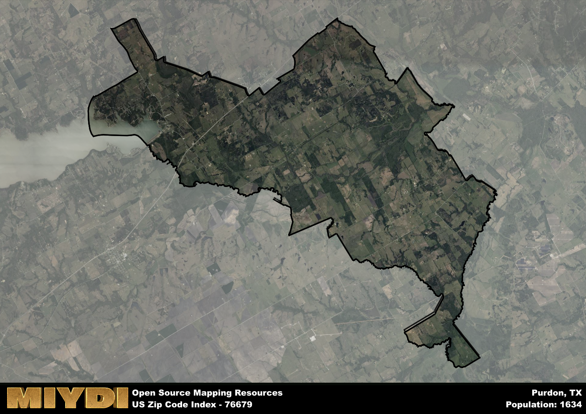

**Area Name:** Purdon

**Zip Code:** 76679

**State:** TX

Purdon is a part of the Corsicana - TX Micro Area, and makes up  of the Metro's population.  

# Purdon: A Historic Community in Navarro County

Purdon, located in zip code 76679, is a quaint community nestled in Navarro County, Texas. The area is bordered by rural farmland to the west and north, while to the south and east, it seamlessly integrates with the larger town of Corsicana. As part of the Dallas-Fort Worth metropolitan area, Purdon serves as a peaceful retreat from the bustling city life while still providing easy access to urban amenities and opportunities.

The history of Purdon dates back to the late 19th century when it was established as a farming community along the Houston and Texas Central Railway. Named after a railroad executive, Purdon quickly grew into a thriving agricultural hub, attracting settlers with its fertile land and ample opportunities for trade. Over the years, the community has preserved its rich heritage, with many historic buildings and landmarks still standing as a testament to its past.

Today, Purdon continues to thrive as a close-knit community with a strong agricultural economy. Local businesses cater to the needs of residents and visitors alike, offering everything from farm-fresh produce to unique handmade crafts. The area also boasts several parks and recreational facilities, providing ample opportunities for outdoor activities and relaxation. With its blend of history, charm, and modern conveniences, Purdon remains a hidden gem in the heart of Navarro County.

# Purdon Demographics

The population of Purdon is 1634.  
Purdon has a population density of 26.33 per square mile.  
The area of Purdon is 62.05 square miles.  

## Purdon Income and Economic Data

These demographic numbers are sourced from IRS return data, providing comprehensive insights into the population dynamics and economic trends within Purdon.

**Breakdown of return types for Purdon**

The table offers insight into the composition of tax returns filed with the IRS, categorizing them into three main types. Single returns represent filings by individuals, joint returns by married couples, and head of household returns by individuals who qualify as heads of households, typically having dependents. This breakdown provides an understanding of the different filing statuses adopted by taxpayers when submitting their tax documentation.

| Return Types filed for Purdon                              | Percentage          |
|----------------------------------------------------------|---------------------|
| Single Returns                                            | 0.42 |
| Joint Returns                                             | 0.43 |
| Head Household Returns                                    | 0.14 |

The income and economic data presented here is sourced from the IRS income brackets, utilized for categorizing tax returns by income levels. This table displays income ranges for both single filers and married couples, along with the corresponding number of returns and the percentage within each bracket, providing valuable insight into the distribution of taxes across various income groups.

| Bracket Name       | Single Filer Income Range | Married Couple Range | Number of Returns | Percentage of Returns |
|--------------------|----------------------------|----------------------|-------------------|-----------------------|
| 10% Bracket        | Up to $10,275              | Up to $20,550        | 250 | 0.38% |
| 12% Bracket        | $10,276 - $41,775          | $20,551 - $83,550    | 160 | 0.25% |
| 22% Bracket        | $41,776 - $89,075          | $83,551 - $178,150   | 100 | 0.15% |
| 24% Bracket        | $89,076 - $170,050         | $178,151 - $340,100  | 60 | 0.09% |
| 32% Bracket        | $170,051 - $215,950        | $340,101 - $431,900  | 80 | 0.12% |
| 35% Bracket        | $215,951 - $539,900        | $431,901 - $647,850  | 0 | 0% |

### Exploring Taxpayer Diversity: A Breakdown of Different Types of Tax Returns in Purdon

The table offers insights into various types of tax returns filed, reflecting different aspects of taxpayer activities and demographics. Categories include charitable returns for donations, dependent returns for claimed dependents, educator population, elderly population, real estate returns, self-employment returns, student loan returns, and unemployment returns, providing valuable insights into taxpayer behavior and demographics.

| Purdon Filing Types                    | Count | Percentage |
|--------------------------------------|-------|------------|
| Charitable Donations                 | 0 | 0% |
| Dependents Claimed                   | 0 | 0% |
| Educator Residents                   | 0 | 0% |
| Elderly Population                   | 170 | 0.26% |
| Farming Population                   | 80 | 0.123% |
| Real Estate Transactions             | 0 | 0% |
| Self-Employed Individuals            | 100 | 0.154% |
| Student Loan Cases                   | 0 | 0% |
| Unemployment Benefit Filings         | 70 | 0.11% |

## Purdon AI and Census Variables

The values presented in this dataset for Purdon are AI-optimized, streamlined, and categorized into relevant buckets for enhanced utility in AI and mapping programs. These simplified values have been optimized to facilitate efficient analysis and integration into various technological applications, offering users accessible and actionable insights into demographics within the Purdon area.

| AI Variables for Purdon | Value |
|-------------|-------|
| Shape Area | 223846040.191406 |
| Shape Length | 117741.009587077 |
| CBSA Federal Processing Standard Code | 18620 |

## How to use this free AI optimized Geo-Spatial Data for Purdon, TX

This data is made freely available under the Creative Commons license, allowing for unrestricted use for any purpose. Users can access static resources directly from GitHub or leverage more advanced functionalities by utilizing the GeoJSON files. All datasets originate from official government or private sector sources and are meticulously compiled into relevant datasets within QGIS. However, the versatility of the data ensures compatibility with any mapping application.

## Data Accuracy Disclaimer
It's important to note that the data provided here may contain errors or discrepancies and should be considered as 'close enough' for business applications and AI rather than a definitive source of truth. This data is aggregated from multiple sources, some of which publish information on wildly different intervals, leading to potential inconsistencies. Additionally, certain data points may not be corrected for Covid-related changes, further impacting accuracy. Moreover, the assumption that demographic trends are consistent throughout a region may lead to discrepancies, as trends often concentrate in areas of highest population density. As a result, dense areas may be slightly underrepresented, while rural areas may be slightly overrepresented, resulting in a more conservative dataset. Furthermore, the focus primarily on areas within US Major and Minor Statistical areas means that approximately 40 million Americans living outside of these areas may not be fully represented. Lastly, the historical background and area descriptions generated using AI are susceptible to potential mistakes, so users should exercise caution when interpreting the information provided.
