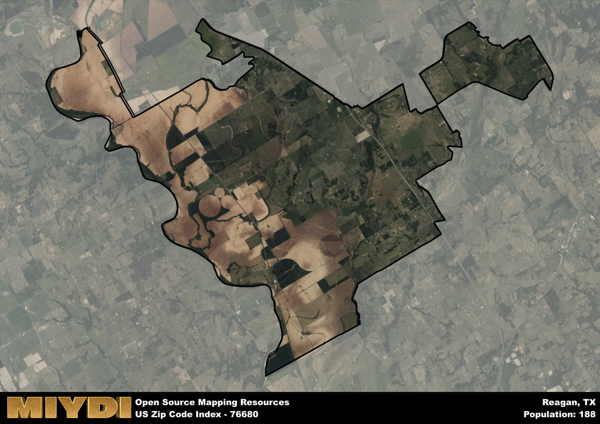

**Area Name:** Reagan

**Zip Code:** 76680

**State:** TX

Reagan is a part of the Waco - TX Metro Area, and makes up  of the Metro's population.  

# Hidden Gem in Central Texas: Discover the Charming Community of Reagan

Located within zip code 76680, Reagan is a quaint neighborhood situated in Central Texas, nestled between the cities of Marlin and Kosse. This rural area is characterized by vast farmlands and rolling hills, offering a peaceful retreat from the hustle and bustle of nearby urban centers. Reagan is a prime example of small-town charm, with a close-knit community and easy access to major transportation routes connecting it to larger metropolitan areas like Waco and Bryan.

Founded in the late 19th century, Reagan has a rich history rooted in agriculture and ranching. The area was named after John H. Reagan, a prominent Texan politician and Postmaster General of the Confederacy. Over the years, Reagan has grown into a thriving community, attracting residents who appreciate its serene surroundings and friendly atmosphere. The neighborhood has preserved its historical landmarks, such as the Reagan Schoolhouse, which serves as a reminder of its past and heritage.

Today, Reagan maintains its agricultural heritage while embracing modern amenities and services. Local residents enjoy a range of recreational activities, including fishing at nearby Lake Limestone and hiking along scenic trails. The area is home to family-owned businesses, charming bed and breakfasts, and community events that celebrate its unique character. Reagan continues to be a hidden gem in Central Texas, offering a peaceful and picturesque setting for those seeking a slower pace of life amidst the beauty of the Lone Star State.

# Reagan Demographics

The population of Reagan is 188.  
Reagan has a population density of 3.13 per square mile.  
The area of Reagan is 60.02 square miles.  

## Reagan AI and Census Variables

The values presented in this dataset for Reagan are AI-optimized, streamlined, and categorized into relevant buckets for enhanced utility in AI and mapping programs. These simplified values have been optimized to facilitate efficient analysis and integration into various technological applications, offering users accessible and actionable insights into demographics within the Reagan area.

| AI Variables for Reagan | Value |
|-------------|-------|
| Shape Area | 213090602.539063 |
| Shape Length | 116828.398343761 |
| CBSA Federal Processing Standard Code | 47380 |

## How to use this free AI optimized Geo-Spatial Data for Reagan, TX

This data is made freely available under the Creative Commons license, allowing for unrestricted use for any purpose. Users can access static resources directly from GitHub or leverage more advanced functionalities by utilizing the GeoJSON files. All datasets originate from official government or private sector sources and are meticulously compiled into relevant datasets within QGIS. However, the versatility of the data ensures compatibility with any mapping application.

## Data Accuracy Disclaimer
It's important to note that the data provided here may contain errors or discrepancies and should be considered as 'close enough' for business applications and AI rather than a definitive source of truth. This data is aggregated from multiple sources, some of which publish information on wildly different intervals, leading to potential inconsistencies. Additionally, certain data points may not be corrected for Covid-related changes, further impacting accuracy. Moreover, the assumption that demographic trends are consistent throughout a region may lead to discrepancies, as trends often concentrate in areas of highest population density. As a result, dense areas may be slightly underrepresented, while rural areas may be slightly overrepresented, resulting in a more conservative dataset. Furthermore, the focus primarily on areas within US Major and Minor Statistical areas means that approximately 40 million Americans living outside of these areas may not be fully represented. Lastly, the historical background and area descriptions generated using AI are susceptible to potential mistakes, so users should exercise caution when interpreting the information provided.
