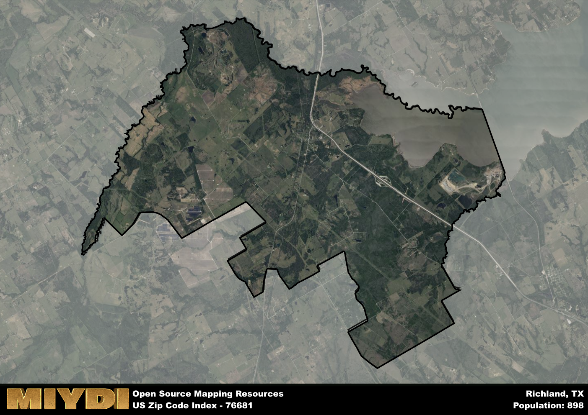

**Area Name:** Richland

**Zip Code:** 76681

**State:** TX

Richland is a part of the Corsicana - TX Micro Area, and makes up  of the Metro's population.  

# Richland: A Charming Neighborhood in Central Texas

Located in the heart of Central Texas, zip code 76681 encompasses the cozy neighborhood of Richland. Bordered by rolling hills and lush farmland, Richland seamlessly integrates with nearby towns such as Hillsboro and Whitney, providing residents with a peaceful retreat while still being within reach of major urban centers like Waco. The area is known for its scenic beauty and small-town charm, making it a desirable place to live for those seeking a tranquil environment.

Richland has a rich historical narrative, tracing its roots back to the mid-19th century when settlers were drawn to the fertile land and abundant natural resources. The community flourished with the establishment of farms and ranches, becoming a hub for agriculture and trade in the region. Over the years, Richland has maintained its close-knit community spirit, preserving its heritage through local events and historical landmarks. The name "Richland" reflects the area's prosperous past and abundant natural resources that have sustained generations of residents.

Today, Richland continues to thrive as a vibrant community with a mix of residential, commercial, and agricultural activities. The neighborhood boasts a range of amenities, including family-owned businesses, local shops, and recreational facilities that cater to residents' needs. Outdoor enthusiasts can explore the nearby lakes and parks, while history buffs can visit historic sites that offer a glimpse into Richland's storied past. With a strong sense of community pride and a welcoming atmosphere, Richland remains a hidden gem in Central Texas.

# Richland Demographics

The population of Richland is 898.  
Richland has a population density of 20.58 per square mile.  
The area of Richland is 43.63 square miles.  

## Richland Income and Economic Data

These demographic numbers are sourced from IRS return data, providing comprehensive insights into the population dynamics and economic trends within Richland.

**Breakdown of return types for Richland**

The table offers insight into the composition of tax returns filed with the IRS, categorizing them into three main types. Single returns represent filings by individuals, joint returns by married couples, and head of household returns by individuals who qualify as heads of households, typically having dependents. This breakdown provides an understanding of the different filing statuses adopted by taxpayers when submitting their tax documentation.

| Return Types filed for Richland                              | Percentage          |
|----------------------------------------------------------|---------------------|
| Single Returns                                            | 0.43 |
| Joint Returns                                             | 0.38 |
| Head Household Returns                                    | 0.19 |

The income and economic data presented here is sourced from the IRS income brackets, utilized for categorizing tax returns by income levels. This table displays income ranges for both single filers and married couples, along with the corresponding number of returns and the percentage within each bracket, providing valuable insight into the distribution of taxes across various income groups.

| Bracket Name       | Single Filer Income Range | Married Couple Range | Number of Returns | Percentage of Returns |
|--------------------|----------------------------|----------------------|-------------------|-----------------------|
| 10% Bracket        | Up to $10,275              | Up to $20,550        | 80 | 0.38% |
| 12% Bracket        | $10,276 - $41,775          | $20,551 - $83,550    | 70 | 0.33% |
| 22% Bracket        | $41,776 - $89,075          | $83,551 - $178,150   | 30 | 0.14% |
| 24% Bracket        | $89,076 - $170,050         | $178,151 - $340,100  | 30 | 0.14% |
| 32% Bracket        | $170,051 - $215,950        | $340,101 - $431,900  | 0 | 0% |
| 35% Bracket        | $215,951 - $539,900        | $431,901 - $647,850  | 0 | 0% |

### Exploring Taxpayer Diversity: A Breakdown of Different Types of Tax Returns in Richland

The table offers insights into various types of tax returns filed, reflecting different aspects of taxpayer activities and demographics. Categories include charitable returns for donations, dependent returns for claimed dependents, educator population, elderly population, real estate returns, self-employment returns, student loan returns, and unemployment returns, providing valuable insights into taxpayer behavior and demographics.

| Richland Filing Types                    | Count | Percentage |
|--------------------------------------|-------|------------|
| Charitable Donations                 | 0 | 0% |
| Dependents Claimed                   | 0 | 0% |
| Educator Residents                   | 0 | 0% |
| Elderly Population                   | 50 | 0.24% |
| Farming Population                   | 30 | 0.143% |
| Real Estate Transactions             | 0 | 0% |
| Self-Employed Individuals            | 30 | 0.143% |
| Student Loan Cases                   | 0 | 0% |
| Unemployment Benefit Filings         | 30 | 0.14% |

## Richland AI and Census Variables

The values presented in this dataset for Richland are AI-optimized, streamlined, and categorized into relevant buckets for enhanced utility in AI and mapping programs. These simplified values have been optimized to facilitate efficient analysis and integration into various technological applications, offering users accessible and actionable insights into demographics within the Richland area.

| AI Variables for Richland | Value |
|-------------|-------|
| Shape Area | 157298931.339844 |
| Shape Length | 91276.2245920465 |
| CBSA Federal Processing Standard Code | 18620 |

## How to use this free AI optimized Geo-Spatial Data for Richland, TX

This data is made freely available under the Creative Commons license, allowing for unrestricted use for any purpose. Users can access static resources directly from GitHub or leverage more advanced functionalities by utilizing the GeoJSON files. All datasets originate from official government or private sector sources and are meticulously compiled into relevant datasets within QGIS. However, the versatility of the data ensures compatibility with any mapping application.

## Data Accuracy Disclaimer
It's important to note that the data provided here may contain errors or discrepancies and should be considered as 'close enough' for business applications and AI rather than a definitive source of truth. This data is aggregated from multiple sources, some of which publish information on wildly different intervals, leading to potential inconsistencies. Additionally, certain data points may not be corrected for Covid-related changes, further impacting accuracy. Moreover, the assumption that demographic trends are consistent throughout a region may lead to discrepancies, as trends often concentrate in areas of highest population density. As a result, dense areas may be slightly underrepresented, while rural areas may be slightly overrepresented, resulting in a more conservative dataset. Furthermore, the focus primarily on areas within US Major and Minor Statistical areas means that approximately 40 million Americans living outside of these areas may not be fully represented. Lastly, the historical background and area descriptions generated using AI are susceptible to potential mistakes, so users should exercise caution when interpreting the information provided.
