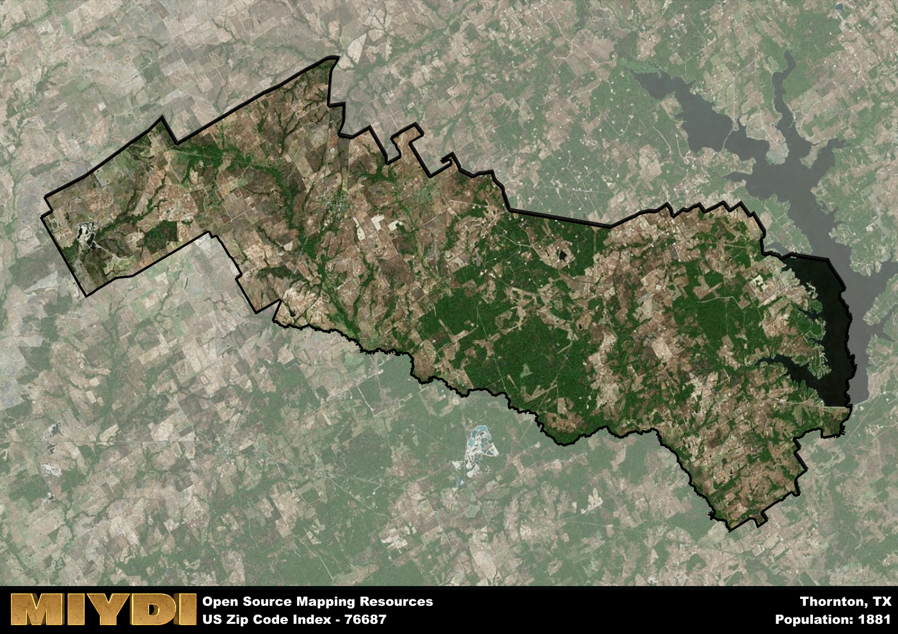

**Area Name:** Thornton

**Zip Code:** 76687

**State:** TX

Thornton is a part of the College Station-Bryan - TX Metro Area, and makes up  of the Metro's population.  

# Thornton: A Charming Community in Central Texas  

Located in central Texas, the zip code 76687 area of Thornton is situated in Limestone County. The boundaries of Thornton extend to the east of Groesbeck and west of the Navasota River. This small community is part of the larger metropolitan area that includes cities like Waco and Dallas, providing residents with access to urban amenities while still maintaining a quaint, rural atmosphere.

Thornton has a rich historical narrative, with roots dating back to the late 19th century when it was established as a farming community. Named after an early settler, William H. Thornton, the area grew steadily due to its fertile land and proximity to transportation routes. Over the years, Thornton has evolved into a tight-knit community known for its friendly residents and strong sense of local pride.

Today, Thornton continues to thrive as a peaceful residential area with a focus on agriculture and small businesses. The community offers essential services such as schools, churches, and local shops, creating a welcoming environment for residents and visitors alike. Outdoor enthusiasts can enjoy recreational activities at nearby parks and nature reserves, while history buffs can explore historic sites that showcase Thornton's unique heritage. With its blend of rural charm and modern conveniences, Thornton remains a hidden gem in central Texas.

# Thornton Demographics

The population of Thornton is 1881.  
Thornton has a population density of 13.37 per square mile.  
The area of Thornton is 140.72 square miles.  

## Thornton Income and Economic Data

These demographic numbers are sourced from IRS return data, providing comprehensive insights into the population dynamics and economic trends within Thornton.

**Breakdown of return types for Thornton**

The table offers insight into the composition of tax returns filed with the IRS, categorizing them into three main types. Single returns represent filings by individuals, joint returns by married couples, and head of household returns by individuals who qualify as heads of households, typically having dependents. This breakdown provides an understanding of the different filing statuses adopted by taxpayers when submitting their tax documentation.

| Return Types filed for Thornton                              | Percentage          |
|----------------------------------------------------------|---------------------|
| Single Returns                                            | 0.41 |
| Joint Returns                                             | 0.5 |
| Head Household Returns                                    | 0.08 |

The income and economic data presented here is sourced from the IRS income brackets, utilized for categorizing tax returns by income levels. This table displays income ranges for both single filers and married couples, along with the corresponding number of returns and the percentage within each bracket, providing valuable insight into the distribution of taxes across various income groups.

| Bracket Name       | Single Filer Income Range | Married Couple Range | Number of Returns | Percentage of Returns |
|--------------------|----------------------------|----------------------|-------------------|-----------------------|
| 10% Bracket        | Up to $10,275              | Up to $20,550        | 200 | 0.31% |
| 12% Bracket        | $10,276 - $41,775          | $20,551 - $83,550    | 160 | 0.25% |
| 22% Bracket        | $41,776 - $89,075          | $83,551 - $178,150   | 90 | 0.14% |
| 24% Bracket        | $89,076 - $170,050         | $178,151 - $340,100  | 60 | 0.09% |
| 32% Bracket        | $170,051 - $215,950        | $340,101 - $431,900  | 100 | 0.16% |
| 35% Bracket        | $215,951 - $539,900        | $431,901 - $647,850  | 30 | 0.05% |

### Exploring Taxpayer Diversity: A Breakdown of Different Types of Tax Returns in Thornton

The table offers insights into various types of tax returns filed, reflecting different aspects of taxpayer activities and demographics. Categories include charitable returns for donations, dependent returns for claimed dependents, educator population, elderly population, real estate returns, self-employment returns, student loan returns, and unemployment returns, providing valuable insights into taxpayer behavior and demographics.

| Thornton Filing Types                    | Count | Percentage |
|--------------------------------------|-------|------------|
| Charitable Donations                 | 0 | 0% |
| Dependents Claimed                   | 0 | 0% |
| Educator Residents                   | 0 | 0% |
| Elderly Population                   | 270 | 0.42% |
| Farming Population                   | 120 | 0.188% |
| Real Estate Transactions             | 0 | 0% |
| Self-Employed Individuals            | 70 | 0.109% |
| Student Loan Cases                   | 30 | 0.047% |
| Unemployment Benefit Filings         | 60 | 0.09% |

## Thornton AI and Census Variables

The values presented in this dataset for Thornton are AI-optimized, streamlined, and categorized into relevant buckets for enhanced utility in AI and mapping programs. These simplified values have been optimized to facilitate efficient analysis and integration into various technological applications, offering users accessible and actionable insights into demographics within the Thornton area.

| AI Variables for Thornton | Value |
|-------------|-------|
| Shape Area | 501541609.855469 |
| Shape Length | 164181.779157516 |
| CBSA Federal Processing Standard Code | 17780 |

## How to use this free AI optimized Geo-Spatial Data for Thornton, TX

This data is made freely available under the Creative Commons license, allowing for unrestricted use for any purpose. Users can access static resources directly from GitHub or leverage more advanced functionalities by utilizing the GeoJSON files. All datasets originate from official government or private sector sources and are meticulously compiled into relevant datasets within QGIS. However, the versatility of the data ensures compatibility with any mapping application.

## Data Accuracy Disclaimer
It's important to note that the data provided here may contain errors or discrepancies and should be considered as 'close enough' for business applications and AI rather than a definitive source of truth. This data is aggregated from multiple sources, some of which publish information on wildly different intervals, leading to potential inconsistencies. Additionally, certain data points may not be corrected for Covid-related changes, further impacting accuracy. Moreover, the assumption that demographic trends are consistent throughout a region may lead to discrepancies, as trends often concentrate in areas of highest population density. As a result, dense areas may be slightly underrepresented, while rural areas may be slightly overrepresented, resulting in a more conservative dataset. Furthermore, the focus primarily on areas within US Major and Minor Statistical areas means that approximately 40 million Americans living outside of these areas may not be fully represented. Lastly, the historical background and area descriptions generated using AI are susceptible to potential mistakes, so users should exercise caution when interpreting the information provided.
