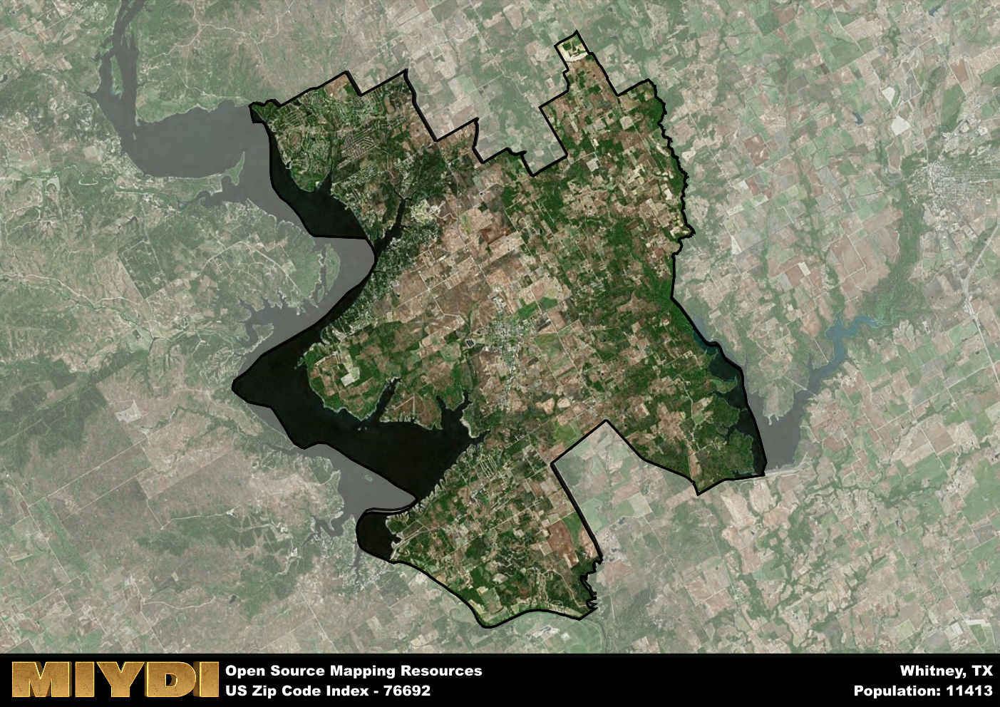

**Area Name:** Whitney

**Zip Code:** 76692

**State:** TX

# A Gem in Central Texas: Discovering Whitney, TX (Zip Code 76692)

Whitney, Texas, located in zip code 76692, is a charming neighborhood nestled in central Texas. Surrounded by the cities of Hillsboro, Cleburne, and Waco, Whitney is an integral part of the larger metropolitan area. Known for its proximity to Lake Whitney, the neighborhood offers residents and visitors alike a peaceful retreat with stunning natural beauty.

Originally settled in the 1850s, Whitney has a rich history tied to its founding as a railroad town. Over the years, the area grew into a thriving community, attracting settlers and businesses looking to take advantage of its prime location. The neighborhood's name pays homage to the railroad investor and developer, Eli Whitney, who played a significant role in its early development.

Today, Whitney continues to thrive as a hub of economic activity in central Texas. With a mix of small businesses, restaurants, and recreational opportunities, the neighborhood offers residents a high quality of life. From boating and fishing on Lake Whitney to exploring the historic downtown district, there is no shortage of things to see and do in this vibrant area. Additionally, Whitney boasts a strong sense of community, with neighborhood-specific services and events that bring residents together.

# Whitney Demographics

The population of Whitney is 11413.  
Whitney has a population density of 99.81 per square mile.  
The area of Whitney is 114.35 square miles.  

## Whitney Income and Economic Data

These demographic numbers are sourced from IRS return data, providing comprehensive insights into the population dynamics and economic trends within Whitney.

**Breakdown of return types for Whitney**

The table offers insight into the composition of tax returns filed with the IRS, categorizing them into three main types. Single returns represent filings by individuals, joint returns by married couples, and head of household returns by individuals who qualify as heads of households, typically having dependents. This breakdown provides an understanding of the different filing statuses adopted by taxpayers when submitting their tax documentation.

| Return Types filed for Whitney                              | Percentage          |
|----------------------------------------------------------|---------------------|
| Single Returns                                            | 0.41 |
| Joint Returns                                             | 0.45 |
| Head Household Returns                                    | 0.12 |

The income and economic data presented here is sourced from the IRS income brackets, utilized for categorizing tax returns by income levels. This table displays income ranges for both single filers and married couples, along with the corresponding number of returns and the percentage within each bracket, providing valuable insight into the distribution of taxes across various income groups.

| Bracket Name       | Single Filer Income Range | Married Couple Range | Number of Returns | Percentage of Returns |
|--------------------|----------------------------|----------------------|-------------------|-----------------------|
| 10% Bracket        | Up to $10,275              | Up to $20,550        | 1820 | 0.38% |
| 12% Bracket        | $10,276 - $41,775          | $20,551 - $83,550    | 1150 | 0.24% |
| 22% Bracket        | $41,776 - $89,075          | $83,551 - $178,150   | 660 | 0.14% |
| 24% Bracket        | $89,076 - $170,050         | $178,151 - $340,100  | 450 | 0.09% |
| 32% Bracket        | $170,051 - $215,950        | $340,101 - $431,900  | 590 | 0.12% |
| 35% Bracket        | $215,951 - $539,900        | $431,901 - $647,850  | 140 | 0.03% |

### Exploring Taxpayer Diversity: A Breakdown of Different Types of Tax Returns in Whitney

The table offers insights into various types of tax returns filed, reflecting different aspects of taxpayer activities and demographics. Categories include charitable returns for donations, dependent returns for claimed dependents, educator population, elderly population, real estate returns, self-employment returns, student loan returns, and unemployment returns, providing valuable insights into taxpayer behavior and demographics.

| Whitney Filing Types                    | Count | Percentage |
|--------------------------------------|-------|------------|
| Charitable Donations                 | 160 | 0.033% |
| Dependents Claimed                   | 90 | 0.019% |
| Educator Residents                   | 90 | 0.019% |
| Elderly Population                   | 1690 | 0.35% |
| Farming Population                   | 200 | 0.042% |
| Real Estate Transactions             | 170 | 0.035% |
| Self-Employed Individuals            | 730 | 0.152% |
| Student Loan Cases                   | 180 | 0.037% |
| Unemployment Benefit Filings         | 620 | 0.13% |

## Whitney AI and Census Variables

The values presented in this dataset for Whitney are AI-optimized, streamlined, and categorized into relevant buckets for enhanced utility in AI and mapping programs. These simplified values have been optimized to facilitate efficient analysis and integration into various technological applications, offering users accessible and actionable insights into demographics within the Whitney area.

| AI Variables for Whitney | Value |
|-------------|-------|
| Shape Area | 412613253.386719 |
| Shape Length | 136714.409135503 |

## How to use this free AI optimized Geo-Spatial Data for Whitney, TX

This data is made freely available under the Creative Commons license, allowing for unrestricted use for any purpose. Users can access static resources directly from GitHub or leverage more advanced functionalities by utilizing the GeoJSON files. All datasets originate from official government or private sector sources and are meticulously compiled into relevant datasets within QGIS. However, the versatility of the data ensures compatibility with any mapping application.

## Data Accuracy Disclaimer
It's important to note that the data provided here may contain errors or discrepancies and should be considered as 'close enough' for business applications and AI rather than a definitive source of truth. This data is aggregated from multiple sources, some of which publish information on wildly different intervals, leading to potential inconsistencies. Additionally, certain data points may not be corrected for Covid-related changes, further impacting accuracy. Moreover, the assumption that demographic trends are consistent throughout a region may lead to discrepancies, as trends often concentrate in areas of highest population density. As a result, dense areas may be slightly underrepresented, while rural areas may be slightly overrepresented, resulting in a more conservative dataset. Furthermore, the focus primarily on areas within US Major and Minor Statistical areas means that approximately 40 million Americans living outside of these areas may not be fully represented. Lastly, the historical background and area descriptions generated using AI are susceptible to potential mistakes, so users should exercise caution when interpreting the information provided.
