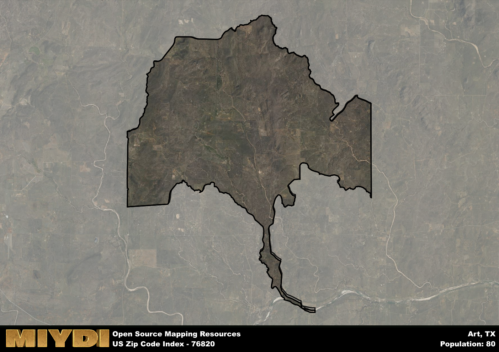

**Area Name:** Art

**Zip Code:** 76820

**State:** TX

# Art, TX (Zip Code: 76820)

Located in the heart of central Texas, the zip code area of 76820 is situated within the city of Art. Art is a small, close-knit community that is part of the larger metropolitan area of San Angelo. The area is characterized by its peaceful, rural surroundings and is bordered by other residential neighborhoods and farmland.

Art has a rich historical narrative, dating back to its founding in the late 19th century. Originally established as a farming community, Art grew steadily over the years due to its strategic location along a major trade route. The area experienced a boom in the mid-20th century with the discovery of oil, bringing in new residents and businesses. Today, Art retains its small-town charm while embracing modern developments.

Currently, Art is a thriving community with a mix of residential and commercial properties. The area is known for its agricultural industry, with many residents involved in farming and ranching. Art also offers a range of services to its residents, including local shops, schools, and healthcare facilities. Additionally, the area boasts several parks and recreational facilities, making it a desirable place to live for those seeking a peaceful, rural lifestyle.

# Art Demographics

The population of Art is 80.  
Art has a population density of 1.85 per square mile.  
The area of Art is 43.28 square miles.  

## Art AI and Census Variables

The values presented in this dataset for Art are AI-optimized, streamlined, and categorized into relevant buckets for enhanced utility in AI and mapping programs. These simplified values have been optimized to facilitate efficient analysis and integration into various technological applications, offering users accessible and actionable insights into demographics within the Art area.

| AI Variables for Art | Value |
|-------------|-------|
| Shape Area | 152394295.910156 |
| Shape Length | 86098.9451184496 |

## How to use this free AI optimized Geo-Spatial Data for Art, TX

This data is made freely available under the Creative Commons license, allowing for unrestricted use for any purpose. Users can access static resources directly from GitHub or leverage more advanced functionalities by utilizing the GeoJSON files. All datasets originate from official government or private sector sources and are meticulously compiled into relevant datasets within QGIS. However, the versatility of the data ensures compatibility with any mapping application.

## Data Accuracy Disclaimer
It's important to note that the data provided here may contain errors or discrepancies and should be considered as 'close enough' for business applications and AI rather than a definitive source of truth. This data is aggregated from multiple sources, some of which publish information on wildly different intervals, leading to potential inconsistencies. Additionally, certain data points may not be corrected for Covid-related changes, further impacting accuracy. Moreover, the assumption that demographic trends are consistent throughout a region may lead to discrepancies, as trends often concentrate in areas of highest population density. As a result, dense areas may be slightly underrepresented, while rural areas may be slightly overrepresented, resulting in a more conservative dataset. Furthermore, the focus primarily on areas within US Major and Minor Statistical areas means that approximately 40 million Americans living outside of these areas may not be fully represented. Lastly, the historical background and area descriptions generated using AI are susceptible to potential mistakes, so users should exercise caution when interpreting the information provided.
