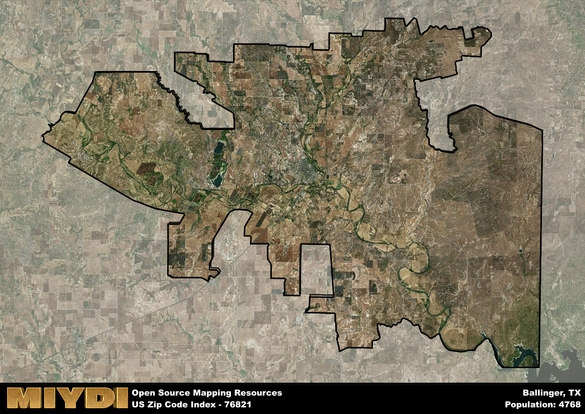

**Area Name:** Ballinger

**Zip Code:** 76821

**State:** TX

# Ballinger, TX 76821: A Historic Neighborhood in West Texas

Located in the heart of West Texas, the zip code 76821 corresponds to the quaint neighborhood of Ballinger. Situated within Runnels County, Ballinger is surrounded by the cities of Winters, Rowena, and Miles. The area is an integral part of the larger metropolitan area of San Angelo, with easy access to major highways connecting it to nearby urban centers.

Ballinger has a rich historical narrative dating back to its founding in the late 19th century. Originally settled as a farming community, the area experienced a boom with the arrival of the railroad, leading to its incorporation in 1888. The neighborhood's growth was further propelled by the discovery of oil in the early 20th century, solidifying its place as a vital hub in West Texas.

Today, Ballinger boasts a mix of agricultural and industrial economic activities, with a focus on cotton farming and manufacturing. The neighborhood offers a range of essential services, including schools, healthcare facilities, and local businesses. Residents and visitors alike can enjoy recreational amenities such as parks, sports facilities, and historic sites like the Carnegie Library. Ballinger's unique blend of history, economy, and culture makes it a distinctive neighborhood in the West Texas landscape.

# Ballinger Demographics

The population of Ballinger is 4768.  
Ballinger has a population density of 13.68 per square mile.  
The area of Ballinger is 348.62 square miles.  

## Ballinger Income and Economic Data

These demographic numbers are sourced from IRS return data, providing comprehensive insights into the population dynamics and economic trends within Ballinger.

**Breakdown of return types for Ballinger**

The table offers insight into the composition of tax returns filed with the IRS, categorizing them into three main types. Single returns represent filings by individuals, joint returns by married couples, and head of household returns by individuals who qualify as heads of households, typically having dependents. This breakdown provides an understanding of the different filing statuses adopted by taxpayers when submitting their tax documentation.

| Return Types filed for Ballinger                              | Percentage          |
|----------------------------------------------------------|---------------------|
| Single Returns                                            | 0.46 |
| Joint Returns                                             | 0.4 |
| Head Household Returns                                    | 0.13 |

The income and economic data presented here is sourced from the IRS income brackets, utilized for categorizing tax returns by income levels. This table displays income ranges for both single filers and married couples, along with the corresponding number of returns and the percentage within each bracket, providing valuable insight into the distribution of taxes across various income groups.

| Bracket Name       | Single Filer Income Range | Married Couple Range | Number of Returns | Percentage of Returns |
|--------------------|----------------------------|----------------------|-------------------|-----------------------|
| 10% Bracket        | Up to $10,275              | Up to $20,550        | 830 | 0.4% |
| 12% Bracket        | $10,276 - $41,775          | $20,551 - $83,550    | 550 | 0.26% |
| 22% Bracket        | $41,776 - $89,075          | $83,551 - $178,150   | 290 | 0.14% |
| 24% Bracket        | $89,076 - $170,050         | $178,151 - $340,100  | 160 | 0.08% |
| 32% Bracket        | $170,051 - $215,950        | $340,101 - $431,900  | 210 | 0.1% |
| 35% Bracket        | $215,951 - $539,900        | $431,901 - $647,850  | 40 | 0.02% |

### Exploring Taxpayer Diversity: A Breakdown of Different Types of Tax Returns in Ballinger

The table offers insights into various types of tax returns filed, reflecting different aspects of taxpayer activities and demographics. Categories include charitable returns for donations, dependent returns for claimed dependents, educator population, elderly population, real estate returns, self-employment returns, student loan returns, and unemployment returns, providing valuable insights into taxpayer behavior and demographics.

| Ballinger Filing Types                    | Count | Percentage |
|--------------------------------------|-------|------------|
| Charitable Donations                 | 40 | 0.019% |
| Dependents Claimed                   | 40 | 0.019% |
| Educator Residents                   | 40 | 0.019% |
| Elderly Population                   | 620 | 0.3% |
| Farming Population                   | 180 | 0.087% |
| Real Estate Transactions             | 40 | 0.019% |
| Self-Employed Individuals            | 320 | 0.154% |
| Student Loan Cases                   | 100 | 0.048% |
| Unemployment Benefit Filings         | 160 | 0.08% |

## Ballinger AI and Census Variables

The values presented in this dataset for Ballinger are AI-optimized, streamlined, and categorized into relevant buckets for enhanced utility in AI and mapping programs. These simplified values have been optimized to facilitate efficient analysis and integration into various technological applications, offering users accessible and actionable insights into demographics within the Ballinger area.

| AI Variables for Ballinger | Value |
|-------------|-------|
| Shape Area | 1252051108.5 |
| Shape Length | 284499.434131422 |

## How to use this free AI optimized Geo-Spatial Data for Ballinger, TX

This data is made freely available under the Creative Commons license, allowing for unrestricted use for any purpose. Users can access static resources directly from GitHub or leverage more advanced functionalities by utilizing the GeoJSON files. All datasets originate from official government or private sector sources and are meticulously compiled into relevant datasets within QGIS. However, the versatility of the data ensures compatibility with any mapping application.

## Data Accuracy Disclaimer
It's important to note that the data provided here may contain errors or discrepancies and should be considered as 'close enough' for business applications and AI rather than a definitive source of truth. This data is aggregated from multiple sources, some of which publish information on wildly different intervals, leading to potential inconsistencies. Additionally, certain data points may not be corrected for Covid-related changes, further impacting accuracy. Moreover, the assumption that demographic trends are consistent throughout a region may lead to discrepancies, as trends often concentrate in areas of highest population density. As a result, dense areas may be slightly underrepresented, while rural areas may be slightly overrepresented, resulting in a more conservative dataset. Furthermore, the focus primarily on areas within US Major and Minor Statistical areas means that approximately 40 million Americans living outside of these areas may not be fully represented. Lastly, the historical background and area descriptions generated using AI are susceptible to potential mistakes, so users should exercise caution when interpreting the information provided.
