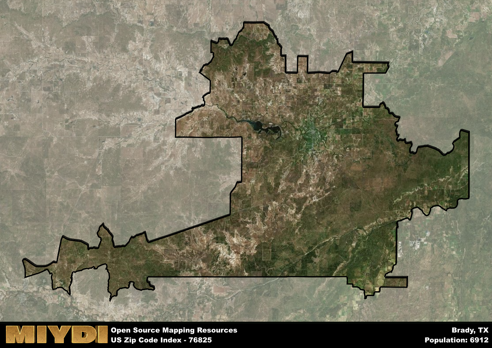

**Area Name:** Brady

**Zip Code:** 76825

**State:** TX

# Discover the Charming Neighborhood of Brady in Zip Code 76825

Nestled in the heart of Texas, the zip code 76825 corresponds to the delightful neighborhood of Brady. Bordered by the Colorado River to the south and rolling hills to the north, Brady seamlessly integrates with surrounding areas such as San Angelo to the west and Austin to the east. As part of the larger metropolitan context, Brady serves as a hub for agriculture and ranching activities, contributing to the vibrant economy of the region.

Brady has a rich historical narrative that dates back to the mid-19th century when settlers were drawn to the area by its fertile land and abundant natural resources. Originally named Brady City after a prominent Texas ranger, the neighborhood grew rapidly with the arrival of the railroad in the late 1800s. Over the years, Brady has evolved into a charming community known for its friendly residents and strong sense of community spirit.

Today, Brady boasts a diverse economy that includes agriculture, manufacturing, and tourism. The neighborhood is home to a variety of local businesses, restaurants, and shops that cater to both residents and visitors alike. Outdoor enthusiasts can explore the nearby state parks, while history buffs can visit the historic sites such as the McCulloch County Courthouse. With its unique blend of small-town charm and modern amenities, Brady in zip code 76825 offers a welcoming environment for all who call it home.

# Brady Demographics

The population of Brady is 6912.  
Brady has a population density of 15.64 per square mile.  
The area of Brady is 442.02 square miles.  

## Brady Income and Economic Data

These demographic numbers are sourced from IRS return data, providing comprehensive insights into the population dynamics and economic trends within Brady.

**Breakdown of return types for Brady**

The table offers insight into the composition of tax returns filed with the IRS, categorizing them into three main types. Single returns represent filings by individuals, joint returns by married couples, and head of household returns by individuals who qualify as heads of households, typically having dependents. This breakdown provides an understanding of the different filing statuses adopted by taxpayers when submitting their tax documentation.

| Return Types filed for Brady                              | Percentage          |
|----------------------------------------------------------|---------------------|
| Single Returns                                            | 0.46 |
| Joint Returns                                             | 0.38 |
| Head Household Returns                                    | 0.15 |

The income and economic data presented here is sourced from the IRS income brackets, utilized for categorizing tax returns by income levels. This table displays income ranges for both single filers and married couples, along with the corresponding number of returns and the percentage within each bracket, providing valuable insight into the distribution of taxes across various income groups.

| Bracket Name       | Single Filer Income Range | Married Couple Range | Number of Returns | Percentage of Returns |
|--------------------|----------------------------|----------------------|-------------------|-----------------------|
| 10% Bracket        | Up to $10,275              | Up to $20,550        | 1320 | 0.43% |
| 12% Bracket        | $10,276 - $41,775          | $20,551 - $83,550    | 750 | 0.25% |
| 22% Bracket        | $41,776 - $89,075          | $83,551 - $178,150   | 440 | 0.14% |
| 24% Bracket        | $89,076 - $170,050         | $178,151 - $340,100  | 220 | 0.07% |
| 32% Bracket        | $170,051 - $215,950        | $340,101 - $431,900  | 250 | 0.08% |
| 35% Bracket        | $215,951 - $539,900        | $431,901 - $647,850  | 60 | 0.02% |

### Exploring Taxpayer Diversity: A Breakdown of Different Types of Tax Returns in Brady

The table offers insights into various types of tax returns filed, reflecting different aspects of taxpayer activities and demographics. Categories include charitable returns for donations, dependent returns for claimed dependents, educator population, elderly population, real estate returns, self-employment returns, student loan returns, and unemployment returns, providing valuable insights into taxpayer behavior and demographics.

| Brady Filing Types                    | Count | Percentage |
|--------------------------------------|-------|------------|
| Charitable Donations                 | 60 | 0.02% |
| Dependents Claimed                   | 50 | 0.016% |
| Educator Residents                   | 40 | 0.013% |
| Elderly Population                   | 900 | 0.3% |
| Farming Population                   | 250 | 0.082% |
| Real Estate Transactions             | 60 | 0.02% |
| Self-Employed Individuals            | 520 | 0.171% |
| Student Loan Cases                   | 130 | 0.043% |
| Unemployment Benefit Filings         | 350 | 0.12% |

## Brady AI and Census Variables

The values presented in this dataset for Brady are AI-optimized, streamlined, and categorized into relevant buckets for enhanced utility in AI and mapping programs. These simplified values have been optimized to facilitate efficient analysis and integration into various technological applications, offering users accessible and actionable insights into demographics within the Brady area.

| AI Variables for Brady | Value |
|-------------|-------|
| Shape Area | 1565349619.66016 |
| Shape Length | 345857.80799162 |

## How to use this free AI optimized Geo-Spatial Data for Brady, TX

This data is made freely available under the Creative Commons license, allowing for unrestricted use for any purpose. Users can access static resources directly from GitHub or leverage more advanced functionalities by utilizing the GeoJSON files. All datasets originate from official government or private sector sources and are meticulously compiled into relevant datasets within QGIS. However, the versatility of the data ensures compatibility with any mapping application.

## Data Accuracy Disclaimer
It's important to note that the data provided here may contain errors or discrepancies and should be considered as 'close enough' for business applications and AI rather than a definitive source of truth. This data is aggregated from multiple sources, some of which publish information on wildly different intervals, leading to potential inconsistencies. Additionally, certain data points may not be corrected for Covid-related changes, further impacting accuracy. Moreover, the assumption that demographic trends are consistent throughout a region may lead to discrepancies, as trends often concentrate in areas of highest population density. As a result, dense areas may be slightly underrepresented, while rural areas may be slightly overrepresented, resulting in a more conservative dataset. Furthermore, the focus primarily on areas within US Major and Minor Statistical areas means that approximately 40 million Americans living outside of these areas may not be fully represented. Lastly, the historical background and area descriptions generated using AI are susceptible to potential mistakes, so users should exercise caution when interpreting the information provided.
