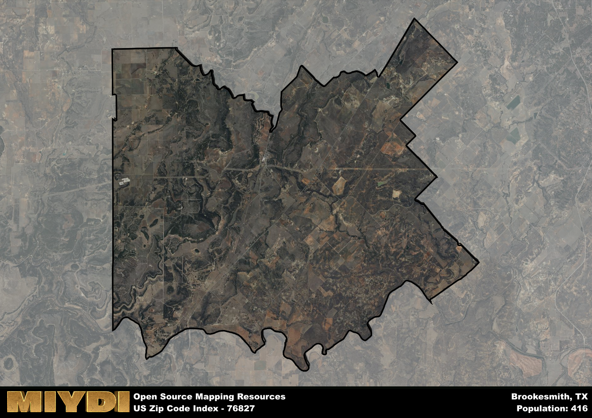

**Area Name:** Brookesmith

**Zip Code:** 76827

**State:** TX

Brookesmith is a part of the Brownwood - TX Micro Area, and makes up  of the Metro's population.  

# Brookesmith: A Historic and Vibrant Neighborhood in Central Texas

Located in Central Texas, zip code 76827 encompasses the charming neighborhood of Brookesmith. Bordered by rolling hills and lush greenery, Brookesmith seamlessly integrates with the nearby cities of Brownwood and Bangs, serving as a peaceful residential enclave within a larger metropolitan area. The zip code area is easily accessible via major highways, providing residents with convenient connections to urban centers and recreational destinations in the region.

Brookesmith has a rich historical narrative dating back to its establishment in the late 19th century. Named after an early settler, the neighborhood flourished as a hub for agriculture and ranching, attracting a diverse population seeking opportunities in the growing community. Over the years, Brookesmith has retained its small-town charm while embracing modern amenities, making it a desirable place to live for families and retirees alike.

Today, Brookesmith boasts a thriving economy supported by local businesses, including family-owned shops and restaurants. Residents enjoy a close-knit community atmosphere with access to neighborhood-specific services such as schools, parks, and churches. The area is also home to cultural and historic sites that showcase its heritage, inviting visitors to explore the unique character of Brookesmith. With a range of recreational amenities nearby, including hiking trails and fishing spots, the neighborhood offers a peaceful retreat for those looking to escape the hustle and bustle of city life.

# Brookesmith Demographics

The population of Brookesmith is 416.  
Brookesmith has a population density of 4.66 per square mile.  
The area of Brookesmith is 89.24 square miles.  

## Brookesmith Income and Economic Data

These demographic numbers are sourced from IRS return data, providing comprehensive insights into the population dynamics and economic trends within Brookesmith.

**Breakdown of return types for Brookesmith**

The table offers insight into the composition of tax returns filed with the IRS, categorizing them into three main types. Single returns represent filings by individuals, joint returns by married couples, and head of household returns by individuals who qualify as heads of households, typically having dependents. This breakdown provides an understanding of the different filing statuses adopted by taxpayers when submitting their tax documentation.

| Return Types filed for Brookesmith                              | Percentage          |
|----------------------------------------------------------|---------------------|
| Single Returns                                            | 0.42 |
| Joint Returns                                             | 0.47 |
| Head Household Returns                                    | 0 |

The income and economic data presented here is sourced from the IRS income brackets, utilized for categorizing tax returns by income levels. This table displays income ranges for both single filers and married couples, along with the corresponding number of returns and the percentage within each bracket, providing valuable insight into the distribution of taxes across various income groups.

| Bracket Name       | Single Filer Income Range | Married Couple Range | Number of Returns | Percentage of Returns |
|--------------------|----------------------------|----------------------|-------------------|-----------------------|
| 10% Bracket        | Up to $10,275              | Up to $20,550        | 50 | 0.26% |
| 12% Bracket        | $10,276 - $41,775          | $20,551 - $83,550    | 50 | 0.26% |
| 22% Bracket        | $41,776 - $89,075          | $83,551 - $178,150   | 30 | 0.16% |
| 24% Bracket        | $89,076 - $170,050         | $178,151 - $340,100  | 30 | 0.16% |
| 32% Bracket        | $170,051 - $215,950        | $340,101 - $431,900  | 30 | 0.16% |
| 35% Bracket        | $215,951 - $539,900        | $431,901 - $647,850  | 0 | 0% |

### Exploring Taxpayer Diversity: A Breakdown of Different Types of Tax Returns in Brookesmith

The table offers insights into various types of tax returns filed, reflecting different aspects of taxpayer activities and demographics. Categories include charitable returns for donations, dependent returns for claimed dependents, educator population, elderly population, real estate returns, self-employment returns, student loan returns, and unemployment returns, providing valuable insights into taxpayer behavior and demographics.

| Brookesmith Filing Types                    | Count | Percentage |
|--------------------------------------|-------|------------|
| Charitable Donations                 | 0 | 0% |
| Dependents Claimed                   | 0 | 0% |
| Educator Residents                   | 0 | 0% |
| Elderly Population                   | 70 | 0.37% |
| Farming Population                   | 40 | 0.211% |
| Real Estate Transactions             | 0 | 0% |
| Self-Employed Individuals            | 0 | 0% |
| Student Loan Cases                   | 0 | 0% |
| Unemployment Benefit Filings         | 20 | 0.11% |

## Brookesmith AI and Census Variables

The values presented in this dataset for Brookesmith are AI-optimized, streamlined, and categorized into relevant buckets for enhanced utility in AI and mapping programs. These simplified values have been optimized to facilitate efficient analysis and integration into various technological applications, offering users accessible and actionable insights into demographics within the Brookesmith area.

| AI Variables for Brookesmith | Value |
|-------------|-------|
| Shape Area | 319086022.335938 |
| Shape Length | 106110.787290219 |
| CBSA Federal Processing Standard Code | 15220 |

## How to use this free AI optimized Geo-Spatial Data for Brookesmith, TX

This data is made freely available under the Creative Commons license, allowing for unrestricted use for any purpose. Users can access static resources directly from GitHub or leverage more advanced functionalities by utilizing the GeoJSON files. All datasets originate from official government or private sector sources and are meticulously compiled into relevant datasets within QGIS. However, the versatility of the data ensures compatibility with any mapping application.

## Data Accuracy Disclaimer
It's important to note that the data provided here may contain errors or discrepancies and should be considered as 'close enough' for business applications and AI rather than a definitive source of truth. This data is aggregated from multiple sources, some of which publish information on wildly different intervals, leading to potential inconsistencies. Additionally, certain data points may not be corrected for Covid-related changes, further impacting accuracy. Moreover, the assumption that demographic trends are consistent throughout a region may lead to discrepancies, as trends often concentrate in areas of highest population density. As a result, dense areas may be slightly underrepresented, while rural areas may be slightly overrepresented, resulting in a more conservative dataset. Furthermore, the focus primarily on areas within US Major and Minor Statistical areas means that approximately 40 million Americans living outside of these areas may not be fully represented. Lastly, the historical background and area descriptions generated using AI are susceptible to potential mistakes, so users should exercise caution when interpreting the information provided.
