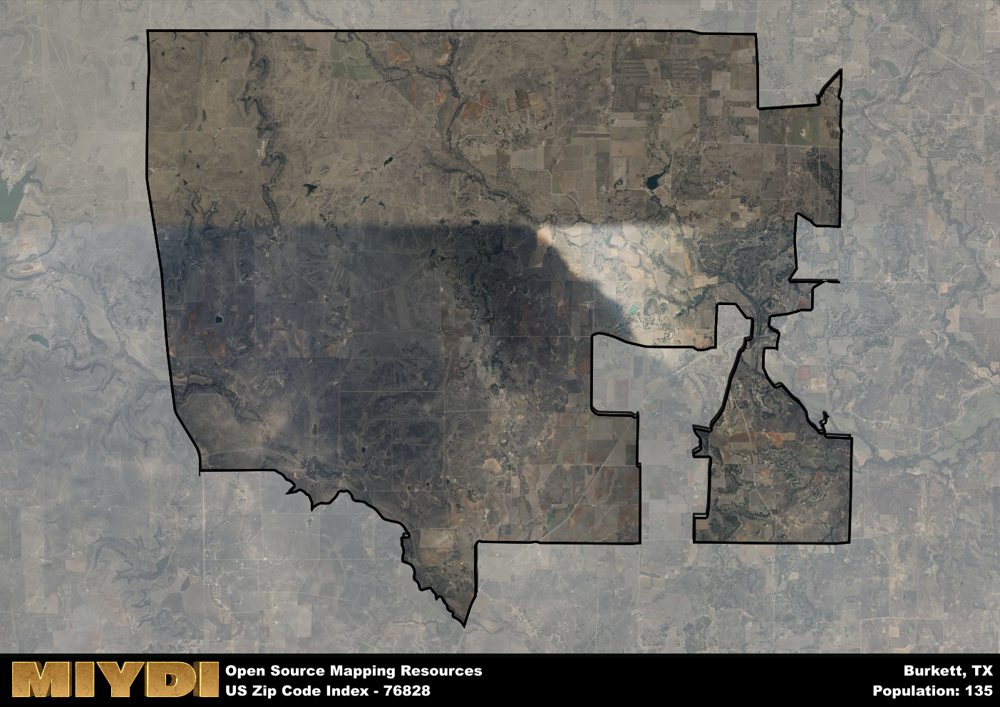

**Area Name:** Burkett

**Zip Code:** 76828

**State:** TX

Burkett is a part of the Abilene - TX Metro Area, and makes up  of the Metro's population.  

# Discover the Quaint Neighborhood of Burkett (Zip Code 76828)

Located in central Texas, the area corresponding to zip code 76828 is nestled within the larger region of Burkett. Bordered by scenic countryside and rolling hills, Burkett is a charming rural community that is a short drive away from major cities such as Abilene and San Angelo. Despite its tranquil setting, Burkett is well-connected by highways and roads, allowing residents to easily access urban amenities while enjoying the peaceful ambiance of small-town living.

Founded in the late 19th century, Burkett has a rich history rooted in agriculture and ranching. Originally established as a trading post for local farmers, the area quickly grew into a bustling community with its own school, churches, and businesses. The name "Burkett" is said to have been inspired by an early settler who played a significant role in the development of the town. Over the years, Burkett has maintained its close-knit community spirit and proud heritage, making it a truly special place to call home.

Today, Burkett continues to thrive as a close community that values its rural roots. The area is known for its agricultural industry, with many residents working in farming and ranching. In addition to its strong agricultural presence, Burkett offers residents access to essential services such as schools, grocery stores, and healthcare facilities. Outdoor enthusiasts can enjoy the natural beauty of the area through parks, hiking trails, and fishing spots, while history buffs can explore local museums and historic sites that showcase Burkett's past. With its blend of small-town charm and modern conveniences, Burkett remains a hidden gem in the heart of Texas.

# Burkett Demographics

The population of Burkett is 135.  
Burkett has a population density of 1.27 per square mile.  
The area of Burkett is 106.04 square miles.  

## Burkett AI and Census Variables

The values presented in this dataset for Burkett are AI-optimized, streamlined, and categorized into relevant buckets for enhanced utility in AI and mapping programs. These simplified values have been optimized to facilitate efficient analysis and integration into various technological applications, offering users accessible and actionable insights into demographics within the Burkett area.

| AI Variables for Burkett | Value |
|-------------|-------|
| Shape Area | 383120553.136719 |
| Shape Length | 128001.331204524 |
| CBSA Federal Processing Standard Code | 10180 |

## How to use this free AI optimized Geo-Spatial Data for Burkett, TX

This data is made freely available under the Creative Commons license, allowing for unrestricted use for any purpose. Users can access static resources directly from GitHub or leverage more advanced functionalities by utilizing the GeoJSON files. All datasets originate from official government or private sector sources and are meticulously compiled into relevant datasets within QGIS. However, the versatility of the data ensures compatibility with any mapping application.

## Data Accuracy Disclaimer
It's important to note that the data provided here may contain errors or discrepancies and should be considered as 'close enough' for business applications and AI rather than a definitive source of truth. This data is aggregated from multiple sources, some of which publish information on wildly different intervals, leading to potential inconsistencies. Additionally, certain data points may not be corrected for Covid-related changes, further impacting accuracy. Moreover, the assumption that demographic trends are consistent throughout a region may lead to discrepancies, as trends often concentrate in areas of highest population density. As a result, dense areas may be slightly underrepresented, while rural areas may be slightly overrepresented, resulting in a more conservative dataset. Furthermore, the focus primarily on areas within US Major and Minor Statistical areas means that approximately 40 million Americans living outside of these areas may not be fully represented. Lastly, the historical background and area descriptions generated using AI are susceptible to potential mistakes, so users should exercise caution when interpreting the information provided.
